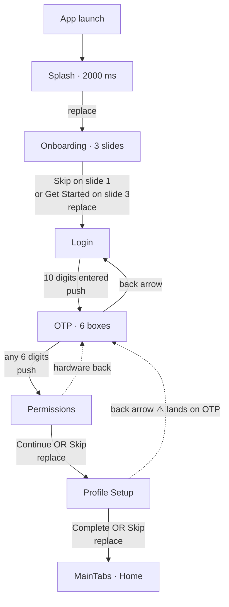
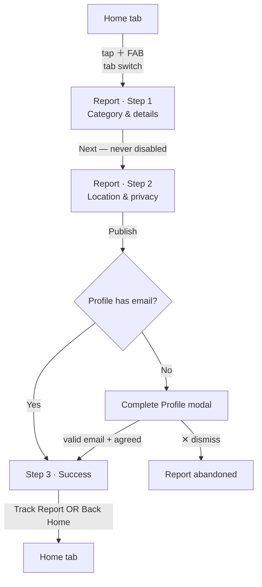
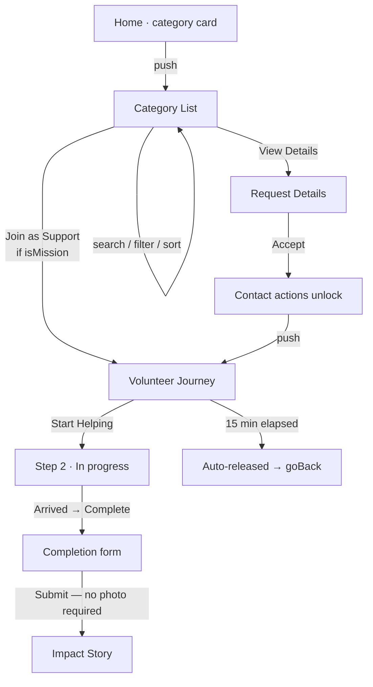
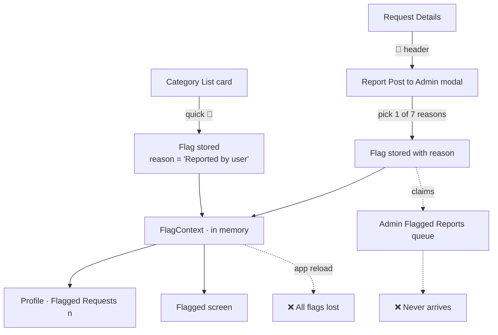
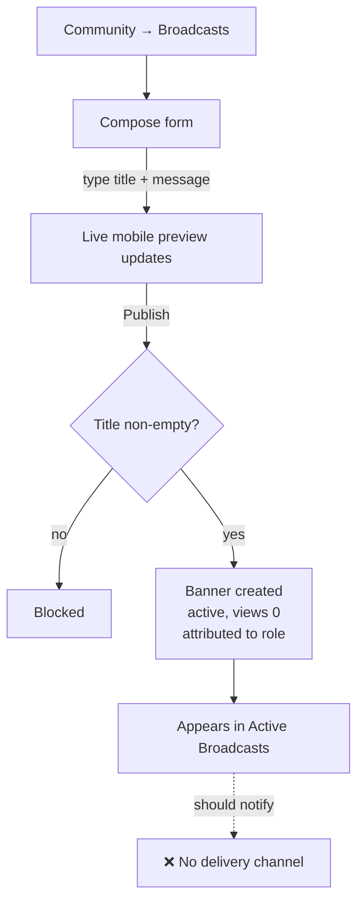
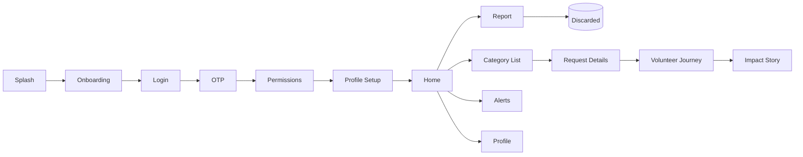

# User journeys, navigation & business logic

> ⚠️ **Not actually verified — see `docs/README.md` for the full correction.** No prototype code
> exists anywhere. These flows are a plausible *draft* generated by an earlier agent run, useful
> as a starting spec, but not extracted from any real navigation code.

> **Update 2026-08-27.** A real backend now exists (`apps/api`) and parts of this document are
> demonstrably wrong about it, not merely unverified — the "nothing is saved on publish" row in
> Journey 2 is corrected inline below. Treat the *flows* as spec and every *technical* statement
> as unchecked until someone reads the code. Ground truth for the backend lives in
> [`architecture/`](./architecture/).

End-to-end flows for both products, with the conditional logic at each decision point and
the navigation type of every transition.

**~~Verified as of~~ Drafted:** 2026-08-18 (never verified — see above)

## Navigation types used in this document

| Type | Meaning | Back behaviour |
|---|---|---|
| **replace** | Previous screen removed from the stack | Cannot return |
| **push** | Screen added on top | Back returns |
| **tab** | Bottom-tab switch, not a stack change | Tab history |
| **modal** | Overlay above the current screen | Dismiss closes |
| **redirect** | Hard `window.location` change (web) | Full page load |

---

# 📱 Mobile app

## Journey 1 — First launch to the main app



### Step by step — First launch to the main app

| # | Screen | Action | Condition | Result |
|---|---|---|---|---|
| 1 | Splash | *(none — no tap targets)* | Always | After 2000 ms → **replace** Onboarding |
| 2 | Onboarding | Next ×2 → Get Started | Any | **replace** Login |
| 2a | Onboarding | Skip | Slide 1 only | **replace** Login |
| 3 | Login | Enter phone | `phone.length >= 10` | Continue enables |
| 3a | Login | Continue | Always on valid | **push** OTP — ⚠️ **no OTP sent, phone not passed** |
| 4 | OTP | Enter 6 digits | All boxes non-empty | Verify enables |
| 4a | OTP | Verify | **No code check** | **push** Permissions |
| 5 | Permissions | Continue **or** Skip | Identical handlers | **replace** Profile Setup |
| 6 | Profile Setup | Complete Profile | **No validation** | Saves 9 fields → **replace** MainTabs |
| 6a | Profile Setup | Skip | — | **Writes blanks over the profile** → **replace** MainTabs |

### Business logic — First launch to the main app

| Condition | Actual behaviour |
|---|---|
| Returning user (profile already stored) | ❌ **Still sees Splash → Onboarding → Login → OTP.** No session check exists |
| Phone < 10 digits | Continue is grey and `disabled` |
| Non-digits typed | Stripped on every keystroke |
| Wrong OTP entered | ✅ **Accepted** — no verification |
| OTP resend tapped | Timer resets to 30. **No code sent** |
| Location permission denied | ❌ Cannot happen — the OS is never asked |
| Profile Setup left empty | ✅ Accepted — lands on Home with a blank profile |
| Android back on Onboarding | ❌ **Exits the app** (unhandled) |
| Back on Profile Setup | ⚠️ Lands on **OTP**, not Permissions |

### States

| State | Present? |
|---|---|
| Loading | ❌ None on any auth screen |
| Error | ⚠️ OTP shows no error; Login shows none; Profile Setup shows none |
| Empty | n/a |
| Disabled | ✅ Login Continue, OTP Verify |
| Permission denied | ❌ Not reachable |
| Offline | ❌ Not handled |

---

## Journey 2 — Report a help request

**The core action of the product.**



### Step by step — Report a help request

| # | Step | Action | Validation | Result |
|---|---|---|---|---|
| 1 | Step 1 | Pick category | None enforced | Resets the expiry window to that category's max |
| 2 | Step 1 | Title, description | ❌ **Neither validated** | — |
| 3 | Step 1 | Take Photo / Upload | — | ❌ **No handler — nothing happens** |
| 4 | Step 1 | Urgency | Defaults `Medium` | — |
| 5 | Step 1 | **Next** | ❌ **Never disabled** | → Step 2 with an empty form |
| 6 | Step 2 | Landmark | — | ⚠️ **Input discarded** (no `value`/`onChangeText`) |
| 7 | Step 2 | Expiry window | ✅ **The only gate** | Blocks publish if missing/invalid **and** a category is set |
| 8 | Step 2 | Privacy toggles | Anonymous force-disables phone sharing | — |
| 9 | Step 2 | **Publish** | `canPublish` — expiry only | → email modal or Step 3 |
| 10 | Step 3 | Track Report / Back Home | — | Both **tab** to Home |

### Business logic — Report a help request

| Condition | Actual behaviour |
|---|---|
| No category selected | ✅ **Publish succeeds** — `expiryMissing` short-circuits on `!!category` |
| Empty title and description | ✅ Publish succeeds |
| Disaster Relief chosen | Expiry is admin-managed; no window choice, never blocks |
| Category switched | Window resets to the new category's max — a longer window can't carry over |
| Profile has no email | Modal appears; email saved to the **profile**, not the report |
| Email invalid | Inline error shown |
| Agreement box unchecked | ⚠️ **Silent no-op** — button dimmed but not `disabled` |
| User taps another tab mid-wizard | ⚠️ All progress lost, no warning |
| **On publish** | ❌ ~~**Nothing is saved.** No API, no context, no storage~~ — **this claim is false.** `POST /reports` persists a `reports` row plus its `report_photos` (`apps/api/src/reports/reports.service.ts:82-103`), and photos are uploaded first via `POST /uploads`. Corrected 2026-08-27 against commit `84a20d3`; see [`architecture/system.md`](./architecture/system.md#how-a-row-travels-mobile-write--admin-read). |

---

## Journey 3 — Discover and accept a mission



### Business logic — Discover and accept a mission

| Condition | Actual behaviour |
|---|---|
| Category has no mock data | ⚠️ Falls back to **animal rescue** — 4 of 8 categories show wrong content |
| Search text entered | ✅ Filters live on title only |
| "Urgent" filter | ✅ Keeps `CRITICAL` only — **HIGH is excluded** |
| "Newest" sort | ❌ Returns 0 — does nothing |
| Quick radius chip tapped | ⚠️ Highlights but **does not filter** (different state than the sheet) |
| Request expired (`minutesLeft === 0`) | ✅ `ExpiredNotice` replaces the actions |
| Volunteer hasn't accepted | ✅ Phone and call button hidden |
| Volunteer accepts | ✅ `tel:` link appears |
| 15 min without "Start Helping" | ✅ Alert → request released → `goBack()` |
| "I cannot continue" tapped | ⚠️ Only `goBack()` — **the request is not released** |
| Completion submitted | ⚠️ No photo required, despite Rule 1 |
| Opened with no `request` param | ⚠️ Renders a **hardcoded dog-rescue mission** |

---

## Journey 4 — Report abusive content



| Condition | Actual behaviour |
|---|---|
| Flagged from a list card | Reason defaults to `'Reported by user'` — **the choice is lost** |
| Flagged from Request Details | ✅ One of 7 reasons is captured |
| After flagging | ✅ Profile menu count increments; Flagged screen lists it |
| App reloaded | ❌ **All flags erased** — `FlagContext` is memory-only |
| The confirmation says | *"Uthavu Admins will review this report in the Flagged Reports queue"* — ❌ **untrue** |
| Reporting a **user** | ❌ **Not possible** — no report-user or block action exists |

---

# 🖥️ Web admin

## Journey 5 — Login to moderation action

```mermaid
flowchart TD
    A[/admin] --> B{Credentials}
    B -->|admin@uthavu.org<br/>Admin@123| C[redirect ?role=super]
    B -->|ops@uthavu.org<br/>Ops@123| D[redirect ?role=ops]
    B -->|wrong| E[Inline error]
    F[Direct URL<br/>/admin/dashboard] -.->|no guard| G
    C --> G[Dashboard]
    D --> G
    G -->|sidebar| H[Reports → All Reports]
    H -->|row click| I[Report detail]
    I -->|Mark Fake| J[Status updated<br/>list + panel + badge]
    I -->|Issue warning| K[❌ alert only]
    G -->|Logout| A
```

### Business logic — Login to moderation action

| Condition | Actual behaviour |
|---|---|
| Correct credentials | 600 ms fake delay → **redirect** with `?role=` |
| Wrong credentials | Inline error, button re-enabled |
| Empty / malformed email | ✅ Blocked by native HTML validation |
| **No `role` param** | ⚠️ **Super Admin** — `isSuperAdmin = roleParam !== 'ops'` |
| `?role=ops` | Ops Moderator — the only restricted state |
| Ops tries to delete a user | ✅ Blocked — the only enforced permission |
| Ops opens Admins tab | ⚠️ **Can create a Super Admin** — no guard |
| Logout | Navigates to `/admin`; **clears nothing** |
| Browser refresh | ⚠️ All state lost, returns to Dashboard tab |

## Journey 6 — Publish an emergency broadcast



| Condition | Actual behaviour |
|---|---|
| Empty title | ✅ Blocked by `if (!bannerTitle.trim()) return` |
| Type contains "Flood" | Category derived as `Emergency`, else `General` |
| Published by Ops | ✅ `publishedBy: 'Ops Admin'` |
| After publish | Form resets; banner prepended |
| **Delivery to users** | ❌ **None** — no push, no in-app surface, no API |

---

# Complete end-to-end flow — as actually implemented



Written out, with what survives each step:

```
Splash → Onboarding → Login → OTP → Permissions → Profile Setup → Home
  ✓        ✓          ✗ no    ✗ no   ✗ nothing     ✓ saves 9      ✓
                      account  check   requested     fields
                                                     ↓
Home → Report → Publish → Success screen → Home
                  ✗ report discarded — nothing saved

Home → Category List → Request Details → Accept → Volunteer Journey → Complete → Impact Story
         ✓ filters      ✓ gated contact   ✓ local   ✓ 15-min rule    ✗ no photo   ✓ renders
```

**A user can complete the entire journey end to end and leave no trace** — no account, no
report, no mission record. The only data that survives an app restart is the profile and
email in AsyncStorage.

---

## Role-based behaviour

### Mobile — single role

The app has **no roles**. Every user sees the same screens. The distinction between
"reporter" and "volunteer" is contextual, not enforced: the same person can post a request
and accept someone else's.

| Capability | Any user |
|---|---|
| Post a help request | ✅ (discarded) |
| Accept a mission | ✅ (local only) |
| Flag content | ✅ (memory only) |
| Report a **user** | ❌ Not possible |
| Moderate anything | ❌ |

### Admin — two roles, one enforced rule

| Capability | Super Admin | Ops Moderator | Enforced? |
|---|---|---|---|
| View all 18 sidebar tabs | ✅ | ✅ | — |
| Suspend / reactivate a user | ✅ | ✅ | ❌ Not gated |
| **Delete a user** | ✅ | ❌ | ✅ **The only enforced rule** |
| Dismiss flags, delete comments | ✅ | ✅ | ❌ |
| Change the 35 stateful settings | ✅ | ✅ | ❌ |
| Toggle `maintenanceMode` | ✅ | ✅ | ❌ |
| **Create / delete admin accounts** | ✅ | ✅ | ❌ **Ops can create a Super Admin** |
| Publish broadcasts | ✅ | ✅ | ❌ (attribution only) |

The `AdminRecord.permissions` matrix defines six flags — `users`, `reports`, `comments`,
`analytics`, `settings`, `deleteAll` — and **none is ever read**.

---

## Related

- [Implementation status](./IMPLEMENTATION-STATUS.md)
- [API contract](./API-CONTRACT.md)
- [Mobile per-screen docs](./mobile/README.md) · [Admin per-tab docs](./webadmin/README.md)
