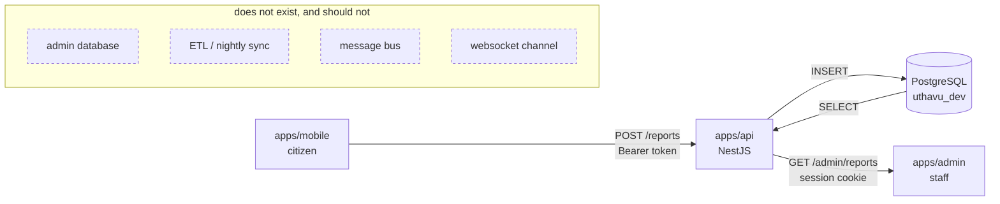

# Admin console ↔ mobile app: how the data connects

> **The question this answers:** *"the admin console needs to show the mobile app's data — how does
> that connect?"*
>
> **The answer:** it's the same database and the same API. There is nothing to connect. What's
> missing isn't a pipe — it's roughly two dozen admin-scoped endpoints. This document lists them.

**Written 2026-08-27 against commit `84a20d3`, by reading code — not by reading `docs/`.** Every
`path:line` here was opened and confirmed.

**Revised 2026-08-28.** Admin RBAC, the audit trail, account suspension and the `apps/admin`
application have all landed since the first pass. §3's blocking list is updated, and the `ops_admin`
/ `moderator` role-key seam defect is fixed. Two of §6's blocking questions are now answered by
[ADR 0010](../decisions/0010-mission-chat-is-not-readable-by-admins.md) and
[ADR 0011](../decisions/0011-user-suspension-blocks-login-not-content.md).

> ## ⚠️ Re-audited 2026-08-28 — most of this document's gap analysis is now WRONG
>
> **Read this before trusting any "Build" / "not built" / "no table" verdict below.** The 2026-08-28
> revision updated §3's *ranked* list but left §2's entity matrix, §3's *per-section* tables and §5's
> write-path table describing a backend that no longer exists. The admin API was committed as
> `177100c` and the console as `0227403` — **both after the commit carrying this document**.
>
> What actually shipped: **8 admin controllers, 29 routes (16 GET, 13 mutating)**, and every one of
> the 13 mutating routes writes an `admin_audit_logs` row in the same transaction as its change.
> Concretely, these verdicts below are **false as written** and are corrected inline:
>
> | Said | Actually |
> |---|---|
> | **R-1** no cross-user report listing | `GET /admin/reports` + `/:id` shipped |
> | **U-1 / U-2** Users has no endpoints, no suspend column | `GET /admin/users`, `/:id`, `POST /:id/suspend`, `/:id/reactivate` shipped |
> | **P-5** audit logs: "no table" | three tables, seeded, 26 rows written |
> | Close / hide a report: citizen-only, 403s for staff | four dedicated admin routes: close / reopen / hide / reinstate |
> | Categories: "no mutation endpoint" | full CRUD shipped |
> | Support: "no status-transition endpoint" | `PATCH /admin/support-tickets/:id/status` shipped |
> | Analytics / system health: "no endpoint" | `GET /admin/analytics`, `GET /admin/system-health` shipped |
> | Comments moderation: "❌ write side" | remove / restore / resolve-flag shipped |
>
> **Still genuinely absent:** report-level flagging (no table), Community Updates, Broadcasts (no
> table *and* no FCM send path), App Settings, Monetization, and admin-user provisioning (**AD-1** —
> `AdminService` still has no write methods). Those six are the honest remainder.

---

## 1. System context and data flow

### There is no sync layer, and there was never going to be one



A citizen publishes a report → `ReportsService.create()` inserts one `reports` row
(`apps/api/src/reports/reports.service.ts:82-99`) → that row **is** the data. An admin later
`SELECT`s the same row. Latency between "citizen posts" and "admin can see it" is one database
round-trip. There is no replication lag because there is no replica.

The full step-by-step trace lives in [`system.md`](./system.md#how-a-row-travels-mobile-write--admin-read).

### Why there is no realtime, and what that means for admin

The App Profile pins `realtime: none` ([ADR 0005](../decisions/0005-no-realtime-transport-yet.md)).
Concretely:

- **Citizen notifications** are rows in `alerts`, written by `AlertsService.create()`
  (`apps/api/src/alerts/alerts.service.ts:21-33`) and read by polling `GET /users/me/alerts`
  (`apps/api/src/alerts/alerts.controller.ts:12-15`, capped at 50 rows —
  `alerts.service.ts:41`).
- **Push is not wired.** `devices` stores FCM tokens (`apps/api/src/db/schema/devices-schema.ts:9-21`)
  and **nothing sends anything**. A repo-wide grep for `firebase` / `messaging` in `apps/api/src`
  returns only comments saying the send path doesn't exist. `libs-mobile/lib/push.ts:1-5` says the
  same from the other side.
- **The admin console has no live feed.** Every admin screen is request/response. Counters are
  computed per request (`apps/api/src/admin/admin-dashboard.service.ts:50-121`), not streamed.

The practical consequence is in §5: **when an admin moderates something, the citizen does not find
out until their app next polls.**

### Two session flavours, one `session` table

| | Mobile | Admin |
|---|---|---|
| Sign-in | Phone + OTP (msg91, dev fallback) | Email + password |
| Credential | `Authorization: Bearer <token>` | Session cookie |
| Mechanism | better-auth `bearer()` plugin, `apps/api/src/auth/auth.ts:256` | better-auth `emailAndPassword`, `apps/api/src/auth/auth.ts:85-89` |
| Self-registration | Yes — verified phone creates a user | **No** — `disableSignUp: true` (`auth.ts:87`) |
| Storage | `expo-secure-store` (`libs-mobile/lib/api.ts:50-53`) | Browser cookie, `credentials: 'include'` |

Both produce an ordinary better-auth session row, so **one guard resolves either**. An admin is not
a different kind of account — it's a `user` row that also has an `admin_users` row
(`apps/api/src/db/schema/admin-schema.ts:75-88`). There is deliberately no `role` column on `user`,
so no default value can ever mean "admin" (`admin-schema.ts:11-17`).

---

## 2. Entity → admin section matrix

The eight sections are `apps/admin/src/config/nav.ts:49-131`. For each: the real tables behind it,
and the operations it needs.

### 2.1 Dashboard — `/dashboard`

| Needs | Table(s) | Evidence |
|---|---|---|
| Total platform users (excluding staff) | `user`, `admin_users` | `admin-dashboard.service.ts:70-73` |
| Today's reports | `reports.created_at`, `deleted_at` | `admin-dashboard.service.ts:77-80` |
| Active missions | `missions` ⋈ `mission_volunteers` ⋈ `mission_volunteer_statuses.key='active'` ⋈ open, non-deleted `reports` | `admin-dashboard.service.ts:88-101` |
| Completed today | `mission_completions.submitted_at` | `admin-dashboard.service.ts:108-111` |
| Flagged comments pending | `report_comment_flags` ⋈ `flag_statuses.key IN ('submitted','under_review')` | `admin-dashboard.service.ts:116-120` |
| "Fake reports" tile | **no source** — returns `null`, deliberately not `0` | `admin-dashboard.service.ts:22-35` |

**Read-only.** `GET /admin/dashboard?timeZone=Asia/Kolkata` exists
(`apps/api/src/admin/admin.controller.ts:44-47`).

> The `null`-not-`0` choice at `admin-dashboard.service.ts:29-33` is the right pattern for this
> whole console and worth copying: where the design asks for a number the schema can't produce,
> return `null` and render an em dash. A fabricated `0` is exactly what made the old `docs/` untrustworthy.

### 2.2 Users — `/users`

| Needs | Table(s) / columns | Evidence |
|---|---|---|
| List/search citizens | `user.id, name, phone_number, city, district, created_at, avatar_url, profile_completed_at` | `auth-schema.ts:20-56` |
| Volunteer history for a user | `mission_volunteers` (`volunteer_id`, `status_id`, `joined_at`, progress timestamps) | `missions-schema.ts:44-87` |
| Reports posted by a user | `reports.reporter_id` | `reports-schema.ts:44` |
| Completion count ("trust = verification + history") | `mission_completions.completed_by_id` | `missions-schema.ts:127` |
| ~~Suspend / block~~ **SHIPPED** | `user_statuses` + `user_account_status` (migration 0019) | `user-status-schema.ts:42-53, 65-94`; routes `admin-users.controller.ts:63-64, 75-76` |
| Contact | `user.phone_number`, `user.contact_email` | `auth-schema.ts:31, 39` — privacy-sensitive, §4 |

~~**Reads + one write (suspend) that has nowhere to go.**~~ **Corrected 2026-08-28:** all of it
shipped. `GET /admin/users`, `GET /admin/users/:id`, `POST /admin/users/:id/suspend` and
`POST /admin/users/:id/reactivate`, all gated on `users:manage`, both writes audit-logged. See
[ADR 0011](../decisions/0011-user-suspension-blocks-login-not-content.md).

### 2.3 Reports — `/reports`, `/reports/flagged`, `/reports/comments`

| Needs | Table(s) / columns | Evidence |
|---|---|---|
| Cross-user, cross-category report list | `reports` ⋈ `report_categories` ⋈ `report_statuses`, `LEFT JOIN user` | `reports-schema.ts:33-92` |
| Real "active vs expired" | `reports.status_id` + `reports.expiry_at` — **must be derived**, see **R-3** | `reports-schema.ts:65`, `seed.ts:33` |
| Report detail incl. photos | `report_photos` | `reports-schema.ts:94-109` |
| Volunteer roster on a report | `missions` ⟶ `mission_volunteers` (LEFT JOIN — a report may have no mission) | `missions-schema.ts:11-18, 44-87` |
| Flagged **reports** tab | **no table** — flagging is comment-only, see **R-2** | `comments-schema.ts:6-13` |
| Comments tab + flag queue | `report_comments`, `report_comment_flags`, `flag_statuses` | `comments-schema.ts:22-78` |
| Close / moderate a report | `reports.status_id`, `closed_at`, `deleted_at`, `deleted_by` | `reports-schema.ts:66-83` |

**The heaviest section, and the one with the least reusable surface.**

### 2.4 Community — `/community/impact-stories`, `/updates`, `/broadcasts`

| Needs | Table(s) | Evidence |
|---|---|---|
| Impact stories | `reports` with `status='completed'` + `mission_completions` (photo, note, `completed_by_id`) | `impact-stories.service.ts:21-62`, `missions-schema.ts:118-135` |
| "Pending" impact stories (nav badge `impactStoriesPending`) | **no such state** — a completion is `verified` in the same request that creates it | `missions.service.ts:523-537` |
| Community updates | **no table** | — |
| Broadcasts | **no table, and no send path** — `alerts` is per-user; `devices` has no sender | `alerts-schema.ts:16-18`, `devices-schema.ts:1-4` |

### 2.5 Analytics — `/analytics`

| Needs | Table(s) | Evidence |
|---|---|---|
| Reports over time, by category, by district | `reports.created_at, category_id`, `user.district` | `reports-schema.ts:45, 84`; `auth-schema.ts:34` |
| Response time (report → first accept) | `reports.created_at` vs `mission_volunteers.joined_at` | `missions-schema.ts:62` |
| Completion rate | `mission_completions` vs `missions` | `missions-schema.ts:118-135` |

Every number is computable from existing columns. **No aggregate endpoint exists.** Note that
`reports` has no district column — geography is `lat`/`lng` only (`reports-schema.ts:54-55`), so
"by district" means either joining through the reporter's `user.district` (which is the *reporter's*
district, not the report's) or reverse-geocoding. That is a product question, not a technical one.

### 2.6 Platform — `/platform/categories`, `/settings`, `/support`, `/system-health`, `/audit-logs`

| Needs | Table(s) | Evidence |
|---|---|---|
| Categories CRUD | `report_categories` — incl. `default_expiry_minutes`, `citizen_selectable` | `reports-schema.ts:10-23` |
| App settings | **no table** | — |
| Support queue | `support_tickets` ⋈ `ticket_categories` ⋈ `ticket_statuses` | `tickets-schema.ts:11-42` |
| System health | **no table** — would be process/infra metrics | — |
| ~~Audit logs~~ **SHIPPED** | `admin_audit_actions` + `admin_audit_target_types` + `admin_audit_logs` (migration 0018) | `audit-schema.ts:37-58, 60-71, 79-150`; `GET /admin/audit-logs` + `/catalogue` |

Categories is a genuinely nice case: because `default_expiry_minutes` and `citizen_selectable` are
DB columns (`reports-schema.ts:17, 20`) rather than constants, an admin editing them changes real
mobile behaviour with no deploy. `db:seed` upserts by `key` (`seed.ts:94-108`), so a re-seed would
overwrite an admin's edits to `label`/`emoji`/`defaultExpiryMinutes` — worth knowing before
shipping category editing.

### 2.7 Monetization — `/monetization`, `/admob`, `/sponsors`

**No tables. No columns. Nothing.** Sponsors and AdMob exist only in the product spec
(`docs/01_Product_Summary.md`, `docs/webadmin/08-monetization.md`). This section is a greenfield
feature, not an integration.

### 2.8 Admin — `/admins`

| Needs | Table(s) | Evidence |
|---|---|---|
| List admins + role | `admin_users` ⋈ `user` ⋈ `admin_roles` | `admin.service.ts:65-87` |
| Permission matrix | `admin_role_permissions` ⋈ `admin_permissions` | `admin.service.ts:40-45`, `admin-rbac.ts:31-48` |
| Create / change role / revoke | `admin_users` writes | **not built** — see **AD-1** |

---

## 3. Gap analysis

Legend: **Reuse** = an existing endpoint works as-is · **Variant** = the data exists but the current
endpoint's projection/filter is wrong for admin · **Build** = nothing exists.

### The five that will actually block the build, ranked

| # | Gap | Why it blocks | What to build |
|---|---|---|---|
| 1 | ~~**A-0 — CORS is not configured**~~ **RESOLVED 2026-08-28 — and the original diagnosis was wrong** | CORS was working via better-auth's `trustedOrigins`; the real fault was `ADMIN_URL` pointing at port 3000 (a stale prototype) while the console runs on 3002. **Trap:** an untrusted origin still gets a 204 preflight with `Allow-Credentials`/`Allow-Methods`/`Allow-Headers` — only `Access-Control-Allow-Origin` is withheld, so "preflight returned 204" is not evidence CORS works. | Done. `apps/api/src/main.ts:41-45` owns CORS explicitly (exact-origin allowlist from `ADMIN_URL`, `credentials: true`, **`PATCH` included**), with `disableTrustedOriginsCors: true` at `apps/api/src/app.module.ts:39` so two middlewares don't emit the header twice. See [`system.md`](./system.md#cors--configured-and-a-correction-to-an-earlier-claim-in-this-document). |
| 2 | ~~**R-1 — no cross-user report listing**~~ **RESOLVED 2026-08-28** | The citizen `ListReportsDto` still requires `categoryKey` + `lat` + `lng` + `radiusKm` and hard-filters to `status='open'` (`list-reports.dto.ts:6-11`, `reports.service.ts:306-329`) — correctly, it is a nearby-discovery endpoint. The admin console got its own instead, exactly as prescribed. | Done. `GET /admin/reports` and `GET /admin/reports/:id`, gated on `reports:manage` (`admin-reports.controller.ts:38-42, 49-53`), with an admin projection that deliberately excludes Mission Chat ([ADR 0010](../decisions/0010-mission-chat-is-not-readable-by-admins.md)) and offset pagination (`admin-pagination.ts`). Effective status is derived from `expiry_at`, not read from `status` — `report-effective-status.ts` — which closes **R-3** too. |
| 3 | ~~**P-5 — no audit log table**~~ **RESOLVED 2026-08-28** | The sequencing requirement held: it shipped *before* the first mutating endpoint. | Done, and as **three** tables rather than one — `admin_audit_actions` + `admin_audit_target_types` lookups plus the append-only `admin_audit_logs` (`apps/api/drizzle/0018_famous_multiple_man.sql`, applied). `AdminAuditService.record()` takes the caller's transaction so log and change are atomic (`apps/api/src/admin/admin-audit.service.ts:17-27`). See [ADR 0012](../decisions/0012-admin-audit-log-before-the-first-mutating-endpoint.md). *(Caveat withdrawn 2026-08-28: `pnpm db:seed` has since run — 13 actions, 6 target types, and 26 real log rows across nine actions. The unseeded hazard still applies to a fresh database; see [`../_audit/issues.md`](../_audit/issues.md) issue 9.)* |
| 4 | ~~**U-1 / U-2 — Users section has no endpoints and no suspend concept**~~ **RESOLVED 2026-08-28** | Both halves landed. Suspension semantics are decided — block access, never content — and the endpoints exist. | Done. `GET /admin/users`, `GET /admin/users/:id`, `POST /admin/users/:id/suspend` and `POST /admin/users/:id/reactivate`, all gated on `users:manage` (`apps/api/src/admin/admin-users.controller.ts:35-76`). Backed by `user_statuses` + `user_account_status` (migration 0019, applied), the login block (`apps/api/src/account-status/login-block.ts:73-87` (wired at `apps/api/src/auth/auth.ts:132-140`)) and the global request guard (`apps/api/src/account-status/suspended-account.guard.ts:39-82`). Audit actions `user.suspend` / `user.reactivate` are in the catalogue (`apps/api/src/admin/admin-audit-catalogue.ts:103, 109`). See [ADR 0011](../decisions/0011-user-suspension-blocks-login-not-content.md). |
| 5 | **R-2 / CM-3 — report-level flagging and broadcasts have no backing tables** | **Still open, and half of it was mis-stated.** *Corrected 2026-08-28:* there is no "Flagged Reports" nav entry any more — the console renamed it to **"Flagged Comments"** (`nav.ts:75`, rename explained at `:71-74`) and wired it to the real `GET /admin/flagged-comments`. So the console no longer ships a button that leads nowhere for flags. **Broadcasts is untouched and still the real problem** (`nav.ts:91` → a placeholder page): no table, and **no FCM send path anywhere in the repo**, so a "broadcast" would silently reach nobody. | Report-level flagging: decide whether it is wanted at all before building `report_flags`. Broadcasts: needs a product decision, a table *and* the FCM sender — all three, in that order. |

### Per-section detail

#### Dashboard
| Item | Status | Note |
|---|---|---|
| Headline counters | **Reuse** | `GET /admin/dashboard` landed (`admin.controller.ts:40-43`). |
| Sidebar badges | **Build** | `apps/admin/src/config/nav-badges.ts:16-22` is explicitly placeholder data. Four of the eight badge keys (`reportsFlagged`, `impactStoriesPending`, `broadcastsActive`, `supportNew`) have no or partial sources. |
| Dashboard page data | **Build** | `apps/admin/src/features/dashboard/use-dashboard-summary.ts:1-20` is a labelled seam shaped like the React Query result that will replace it. Its `DashboardSummary` type is wider than `AdminDashboardCounters` (`admin-dashboard.service.ts:16-38`) — activity feed, urgent requests, flagged reports — so wiring it up is not a one-line swap. |

#### Users
| Item | Status | Note |
|---|---|---|
| List / search users | ✅ **Shipped** | `GET /admin/users` (`admin-users.controller.ts:35-39`), with an opt-in `?status=` filter defaulting to `all`. |
| User detail + activity | ✅ **Shipped** | `GET /admin/users/:id` (`:49-53`) — composed from `reports`, `mission_volunteers`, `mission_completions`, `report_comments`, flags and tickets, exactly as this row prescribed. |
| Suspend / reactivate | ✅ **Shipped** | `POST /admin/users/:id/suspend` / `:id/reactivate` (`:63-64, 75-76`), both audit-logged. Semantics decided: [ADR 0011](../decisions/0011-user-suspension-blocks-login-not-content.md). |
| Delete a user | **Variant** | `UsersService.deleteAccount()` (`users.service.ts:96-153`) implements the whole SET-NULL/CASCADE policy correctly but is hard-wired to `session.user.id`. An admin variant must reuse *that transaction*, never re-implement it — the policy is subtle (`users.service.ts:65-95`). |

#### Reports
| Item | Status | Note |
|---|---|---|
| Cross-user list | ✅ **Shipped** (R-1) | `GET /admin/reports`. See above. |
| Report detail | ✅ **Shipped** (R-4) | `GET /admin/reports/:id` was built as a separate admin projection rather than a variant, which is what this row recommended. The citizen `GET /reports/:id` still returns `ReportsService.toResponse()` (`reports.service.ts:511-568`), which is a *citizen* projection: it redacts the reporter when `anonymous`, redacts `reporterPhone` unless the caller is the owner or an accepted volunteer, and computes `isOwner`/`savedByMe`/`editable` relative to the caller. Those fields are meaningless for staff. An admin needs different columns *and* a deliberate answer to §4. |
| Active vs expired | ✅ **Shipped** (R-3) | `status='expired'` is still never written (see [`data.md`](./data.md#expired-is-a-status-nothing-ever-writes)) — re-verified 2026-08-28, still 0 rows, with 33 of 38 live `open` reports past `expiry_at` (the "18 of 20" figure was 2026-08-27). The admin side solved it correctly: `report-effective-status.ts` derives status from `expiry_at` instead of trusting the column. |
| Flagged reports | **Build** (R-2) | No table. |
| Close a report | ✅ **Shipped** | The citizen `POST /reports/:id/close` still requires ownership (`reports.service.ts:414-415` → `requireOwnedOpenReport`, `:491`) and still 403s for staff — correctly. Admins got their own: `POST /admin/reports/:id/close` and `/reopen` (`admin-report-moderation.service.ts:88, 163`), both audit-logged. A close reuses the existing `report_cancelled` alert to confirmed volunteers. |
| Soft-delete a report | ✅ **Shipped** | `POST /admin/reports/:id/hide` and `/reinstate` (`admin-report-moderation.service.ts:210, 260`), not blocked by the citizen rule. `deleted_by` does now record an admin — the two cases stay distinguishable because an admin hide always writes a `report.hide` audit row and a self-delete never does. |

#### Community
| Item | Status | Note |
|---|---|---|
| Impact stories list | **Variant** (CM-1) | `GET /users/me/impact-stories` is scoped to the caller (`impact-stories.controller.ts:10`, `impact-stories.service.ts:21-25`). An admin needs all of them, and needs the completion `note`/`photoUrl`/`completed_by_id` that the citizen list drops (it returns only `reportId`, `title`, `category`, `photo` — `impact-stories.service.ts:59-61`). |
| Feature / unfeature a story | **Build + schema** | No `featured` column. |
| Community updates | **Build** | No table. |
| Broadcasts | **Build** (CM-3) | No table *and* no push sender. |

#### Analytics
| Item | Status | Note |
|---|---|---|
| Everything | ✅ **Shipped** (AN-1) | `GET /admin/analytics`, gated on `analytics:view` (`admin-analytics.controller.ts:25-29`). The citizen `ReportsService.summary()` / `communityStats()` (`reports.service.ts:235-295`) stay radius-scoped and were correctly not reused. Geography is grouped by the **reporter's** `user.district` and the payload carries `geography.basis` + a `caveat` string so the console must label the chart honestly — see open question 6. |

#### Platform
| Item | Status | Note |
|---|---|---|
| Categories: read | ✅ **Shipped** (P-1) | `GET /admin/report-categories` shows every row including `citizen_selectable = false`. The citizen `GET /reports/categories` still filters to `citizenSelectable = true` (`reports.service.ts:47-50`), correctly. |
| Categories: write | ✅ **Shipped** | Full CRUD — `POST`, `PATCH /:id`, `DELETE /:id`, all `platform:manage`, all audit-logged (`admin-categories.service.ts:131, 179, 227`). The `db:seed` overwrite interaction above is **still unresolved** — open question 7. |
| App settings | **Build** (P-2) | No table. Still true. The console ships a placeholder page that also renders 24 fake "Setting row N" divs — see [`../_audit/issues.md`](../_audit/issues.md) issue 10. |
| Support queue | ✅ **Shipped** (P-3) | `GET /admin/support-tickets`, `/:id`, and `PATCH /:id/status` (`admin-support.service.ts:171`, audit-logged). ⚠️ **`ticket_statuses` beyond `new` is still unreachable in practice** — not because the endpoint is missing any more, but because `support_tickets` has **0 rows**, so nothing has exercised it. The citizen `GET /users/me/tickets` stays caller-scoped (`support.controller.ts:16`, `support.service.ts:47`). |
| System health | ✅ **Shipped** (P-4) | `GET /admin/system-health`, `platform:manage` (`admin-analytics.controller.ts:31-35`, `admin-system-health.service.ts`). |
| Audit logs | ✅ **Shipped** (P-5) | `GET /admin/audit-logs` + `/catalogue`, `platform:manage` (`admin-audit.controller.ts:26-30, 41-45`). |

#### Monetization
| Item | Status | Note |
|---|---|---|
| Everything | **Build** (M-1) | Greenfield. Note [ADR 0001](../decisions/0001-no-payments-at-launch.md): no payments, money never moves between users. Sponsors/AdMob are admin-controlled records, not a payment flow. |

#### Admin
| Item | Status | Note |
|---|---|---|
| `GET /admin/me` | **Reuse** | `admin.controller.ts:38-41`. The console renders its sidebar from this. |
| List admins | **Reuse** | `admin.controller.ts:57-61`, gated on `platform:manage`. |
| Create / change role / revoke | **Build** (AD-1) | **Still true.** `AdminService` has no write methods. Provisioning is `apps/api/src/db/seed-admins.ts`. This is the last unbuilt item that has a table behind it. |

### Why the mobile endpoints mostly can't be reused

Three structural reasons, not one:

1. **They are `/me`-scoped by construction.** `users/me/*`, `reports.listMine()`
   (`reports.service.ts:187-194`), `alerts.list()` (`alerts.service.ts:39`),
   `support.listMine()` (`support.service.ts:47`) all take the caller's id and filter on it. There
   is no parameter to widen them, and adding one would be a privilege-escalation surface on a
   citizen route.
2. **They redact.** `toResponse()` deliberately hides the reporter's identity and phone number
   (`reports.service.ts:551-562`); `listMessages()` refuses outright without `hasActiveAccess`
   (`missions.service.ts:645-650`). Those redactions are the product's trust model (§4) — you must
   not quietly bypass them by adding a role check inside the same method.
3. **They are shaped for a phone.** No pagination anywhere; `list()` returns every match in the
   radius (`reports.service.ts:342-357`), `alerts.list()` caps at 50 (`alerts.service.ts:41`).
   `list()` also runs `hasActiveAccess` + `hasAnyActiveVolunteer` **per row**
   (`reports.service.ts:351-353`), each of which is several queries — fine for ~20 nearby cards,
   ruinous for a 500-row admin table.

The exception worth reusing is `UsersService.deleteAccount()` — see U-1 above.

---

## 4. The privacy / permission boundary

Uthavu's trust model is deliberate and unusual: **no star ratings ever**
(`docs/PRODUCT-DECISIONS.md` Decision 1), trust comes from verification plus completion history, and
several pieces of data are hidden *by rule*, not by UI convenience. An admin console that quietly
exposes them is a **product decision**, and this section exists so nobody makes it by accident.

### The two hard server-side gates

**Gate 1 — the reporter's phone number.**
`reports.service.ts:559-562`:

```ts
reporterPhone:
  reporterDeleted || !(isOwner || (hasActiveVolunteerAccess && report.phoneVisible))
    ? null
    : reporter!.phoneNumber,
```

Two conditions, both required: the caller must be an active volunteer **and** the reporter must have
opted in via `phone_visible` (`reports-schema.ts:61`). `hasActiveAccess()` is
`missions.service.ts:241-256`.

**Gate 2 — Mission Chat.**
`missions.service.ts:645-650` and `:674-679` both refuse before touching the database. This is the
same gate as Gate 1, applied to `mission_messages`. CLAUDE.md is explicit that this is a **security
boundary, not a UI filter**, and that the prototype getting it wrong is a named anti-pattern.

Note the deliberate contrast: `report_comments` has **no** such gate — Community Comments are
public to any authenticated user by design (`comments-schema.ts:1-5`, `comments.service.ts:10-11`).

### What an admin may see: a proposal, not a fact

Nothing below is implemented. This is the decision matrix the product owner needs to sign off on
before the corresponding endpoints are written.

| Data | Citizen rule | Proposed admin rule | Risk if you just expose it |
|---|---|---|---|
| Report title / description / photos / location | Public within radius | **Full access** | None — already public to nearby users. |
| Reporter identity on an `anonymous` report | Hidden from everyone but the reporter (`reports.service.ts:551-554`) | **Visible to admin, logged** | Moderate. A user who chose "post anonymously" reasonably assumes that includes staff. Needs a privacy-policy line. |
| `user.phone_number` | Only via Gate 1 | **Visible to admin** | Low-moderate. Staff need it to act on an emergency report; it is also the login identity. Log every view. |
| `user.contact_email` | Private profile field, never returned by any endpoint | **Visible to admin** | Low. |
| Exact `lat`/`lng` | Returned to any authenticated user in radius (`reports.service.ts:536-537`) | **Full access** | None. |
| `mission_messages` (Mission Chat) | Gate 2 — participants only | **NEVER — decided, [ADR 0010](../decisions/0010-mission-chat-is-not-readable-by-admins.md)** | n/a — no admin endpoint may include it. |
| `report_comments` | Public | **Full access + moderation** | None. |
| `alerts` (a user's notification log) | Own only | **Read for support triage; case-by-case** | Low-moderate. |
| `session` / `account` rows | Never exposed | **Never expose** | Critical — `account.password` holds hashes (`auth-schema.ts:93`). `AdminService.listAdmins()` correctly never joins that table (`admin.service.ts:62-63`); keep it that way. |

### Mission Chat — DECIDED 2026-08-28: admins cannot read it

This section previously escalated the question. The product owner has now answered it, and the
answer is position **(a)**: **admins must not read `mission_messages` in V1.** Recorded as
[ADR 0010](../decisions/0010-mission-chat-is-not-readable-by-admins.md).

The operative constraint, for anyone writing an admin endpoint:

> **No admin endpoint or projection may include `mission_messages`** — not in a mission detail view,
> not in a user detail view, not as a count-plus-preview, not behind a `super_admin` permission
> check. `hasActiveAccess()` stays the only authority on chat access and stays free of an admin
> branch.

Everything else about a mission remains fully manageable: the report, the mission, the volunteer
roster, the completion and Impact Story, comment flags, moderation actions and support tickets. The
restriction is on *message bodies*, not on missions.

The accepted cost is that a harassment report about chat content is not investigable from the
console. The reasoning — normal moderation does not require reading everyone's private
conversations, and an audit entry proving staff read a private conversation does not make it not a
disclosure — is in the ADR, along with the position (b) that was rejected and the conditions under
which it should be reopened. If chat moderation is ever needed it becomes a **separate feature with
its own explicit privacy rule**, not a widened projection.

Re-verified 2026-08-28 against commit `d60e276`, across all 8 admin controllers and all **11** admin
services (three are controller-less): **no admin file imports `missionMessages`**. The single
reference in production admin code is the warning comment at `admin-reports.service.ts:46-53`; the
only other is the test that asserts absence. Checked for indirect paths as well — no `db.query.*`
anywhere in the API (so no Drizzle `with:` traversal), no raw SQL naming the table, no chat body
reaching `admin_audit_logs.before/after`. That is the state to preserve, and it is checkable with a
grep in review.

Related, smaller version of the same question — an admin report view that shows the reporter's real
name on an `anonymous` report (`reports.service.ts:551-554`) — is **still open**. Same shape of
decision, lower stakes.

### super_admin vs ops_admin

From `apps/api/src/admin/admin-rbac.ts:45-48` — this is the *seed definition*; the **runtime
authority is the database**, because `AdminService.findAdminIdentity()` reads
`admin_role_permissions` rather than this map (`admin.service.ts:40-45`, and the note at
`admin-rbac.ts:5-8`).

| Permission | `super_admin` | `ops_admin` |
|---|---|---|
| `users:manage` | ✅ | ✅ |
| `reports:manage` | ✅ | ✅ |
| `comments:manage` | ✅ | ✅ |
| `analytics:view` | ✅ | ❌ |
| `platform:manage` | ✅ | ❌ |
| `data:delete_all` | ✅ | ❌ |

Three properties of `AdminGuard` (`admin.guard.ts:29-79`) worth relying on:

- **No super-admin bypass.** `super_admin` passes because the seed grants it all six as real rows,
  not because the guard special-cases the name (`admin.guard.ts:61-65`). Revoking a permission row
  actually revokes it.
- **Required permissions are ANDed**, not ORed (`admin.guard.ts:66`).
- **Every exit is `true` or a throw** — there is no fallthrough `return true`
  (`admin.guard.ts:19-21`). Absence of an `admin_users` row is absence of access.

> ✅ **Seam defect RESOLVED 2026-08-28.** The console previously typed the second role as
> `moderator` while the API returns `ops_admin`, which would have made every Ops Admin look
> signed-out. Fixed, and fixed better than proposed: the console now takes **both** key and label
> from `GET /admin/me` and keeps no local label map (`apps/admin/src/lib/roles.ts:12-27`,
> `apps/admin/src/lib/session.ts:82`, rendered at
> `apps/admin/src/components/layout/app-header.tsx:54-56`). The transported `key` is deliberately
> typed `string` rather than the union, so a role added server-side before the console redeploys
> degrades to fewer capabilities instead of a broken session (`roles.ts:12-21`), and `isSuperAdmin()`
> fails closed on an unknown key (`roles.ts:34-36`). The old citations `session.ts:27` and
> `app-header.tsx:12-14` no longer resolve to what they described — do not reuse them.

Suggested mapping to the console's sections (the frontend may hide, the server must enforce):

| Section | Gate |
|---|---|
| Dashboard, Reports, Comments, Users | any admin / `reports:manage` / `comments:manage` / `users:manage` |
| Analytics | `analytics:view` |
| Platform (settings, categories, audit logs), Admin | `platform:manage` |
| Monetization | `platform:manage` **[ASSUMPTION — needs developer confirmation]** — no permission key maps to it today |
| Bulk deletion, Mission Chat access (if granted at all) | `data:delete_all` / `super_admin` |

---

## 5. Write path: what an admin changes, and what mobile sees

Admin is not read-only. Each row below states the DB effect, what a citizen observes, and **how they
find out** — which, with `realtime: none` and no push sender, is always "next time they poll".

| Admin action | Writes | Mobile observes | How the citizen learns | Exists? |
|---|---|---|---|---|
> **The "Exists?" column was almost entirely wrong — corrected 2026-08-28.** Eight of the nine rows
> read ❌ when they had shipped. What has *not* changed is the second-to-last column: **the
> notification story is still unbuilt for every one of them.** That is the real finding this table
> carries now, and it is open question 4.

| Admin action | Writes | Mobile observes | How the citizen learns | Exists? |
|---|---|---|---|---|
| Close a report | `reports.status_id → closed`, `closed_at` | Disappears from Discover (`list()` filters `status='open'`, `reports.service.ts:324`); stays in My Reports (`listMine()` shows all statuses, `:194`) | The confirmed volunteers get the existing `report_cancelled` alert; **the reporter is told nothing.** | ✅ `POST /admin/reports/:id/close` |
| Reopen a report | `reports.status_id → open` | Reappears in Discover | Nothing | ✅ `POST /admin/reports/:id/reopen` |
| Soft-delete (hide) a report | `reports.deleted_at`, `deleted_by` | Vanishes from every listing, including the reporter's own — deliberately, with no "Deleted" tab (`reports.service.ts:182-186`) | **Nothing at all.** Silent disappearance. Needs a new alert type. | ✅ `POST /admin/reports/:id/hide` |
| Reinstate a hidden report | clears `deleted_at` | Reappears | Nothing | ✅ `POST /admin/reports/:id/reinstate` |
| Remove / restore a comment | `report_comments.deleted_at` / `deleted_by` (0018) | Comment gone from the public thread (`comments.service.ts:20-47`) | Silent | ✅ `POST /admin/comments/:id/remove` · `/restore` |
| Resolve a comment flag | `report_comment_flags.status_id` | The flagger's Flagged screen shows the new status (`comments.service.ts:101-112` returns `flagStatus.key`) | **This one already works**, because the mobile screen renders the status from the DB. It is still the only moderation action with a citizen-visible result. Exercised: 7 flags are now `dismissed`. | ✅ `PATCH /admin/flagged-comments/:id` |
| Suspend / reactivate a user | `user_account_status` | Login refused; every authenticated request 403s with `ACCOUNT_SUSPENDED` | ⚠️ **Nothing on mobile handles that code yet** — the user gets the generic error path. [`../_audit/issues.md`](../_audit/issues.md) issue 11. | ✅ `POST /admin/users/:id/suspend` · `/reactivate` |
| Delete a user | `user` row + the SET NULL / CASCADE policy | Their reports anonymize to `reporterDeleted: true`; their volunteer slots release and reopen (`users.service.ts:65-95`) | n/a | ⚠️ still citizen-only (AD-1 territory) |
| Edit a category | `report_categories` | Immediate — labels, emoji, `defaultExpiryMinutes`, and `citizenSelectable` all read from the DB per request (`reports.service.ts:46-58, 66-78`) | Next app fetch | ✅ `POST` / `PATCH` / `DELETE /admin/report-categories` |
| Broadcast | *no table* | Nothing | Nothing — no FCM sender | ❌ **genuinely absent** |
| Change a support ticket's status | `support_tickets.status_id` | Visible in the user's ticket list (`support.service.ts:32-51`) | Next poll | ✅ `PATCH /admin/support-tickets/:id/status` |

### Three rules that fall out of this

1. **Every admin mutation that a citizen would notice must write an `alerts` row.** That is the only
   notification channel that exists. **This rule is currently obeyed by exactly one action** (an
   admin close reuses `report_cancelled` for the confirmed volunteers) and ignored by the other
   twelve — the whole write surface shipped silent. Open question 4 is the blocker: the wording, in
   two locales, is product copy nobody has written. It means adding new `AlertType` values in
   `apps/api/src/alerts/alert-templates.ts:24` — and, because alerts are localized from `type` +
   `params` (`alerts-schema.ts:27-30`), each new type needs an **English and Tamil** template
   (`alert-templates.ts:47-97`). An admin action that only writes English breaks the i18n contract.
2. **Silent disappearance is a product choice, not a default.** A report vanishing with no
   explanation is a bad experience for someone who is asking for emergency help. Decide per action
   whether the citizen is told.
3. **Nothing is real-time.** Worst case, a citizen sees a moderated state on their next foreground
   refresh. If that latency is unacceptable for a specific action, the fix is the FCM send path
   (already scaffolded, `devices-schema.ts:9-21`), **not** adding a realtime transport — that would
   need an ADR superseding [0005](../decisions/0005-no-realtime-transport-yet.md).

---

## 6. Open questions

Carried into [`../_audit/open-questions.md`](../_audit/open-questions.md).

**Answered since the first pass (2026-08-28):**

1. ~~**Mission Chat visibility for admins**~~ → **Never.** [ADR 0010](../decisions/0010-mission-chat-is-not-readable-by-admins.md).
3. ~~**Suspension semantics**~~ → **Block access, never content.** [ADR 0011](../decisions/0011-user-suspension-blocks-login-not-content.md).

**Still open:**

2. **Anonymous reporter identity** — may staff see the real name behind an `anonymous` report?
4. **Deleted-report visibility** — should admins see soft-deleted reports, and may they undelete?
5. **Notify on moderation** — which admin actions notify the citizen, and in what words (× 2 locales)?
6. **Analytics geography** — reporter's `user.district`, or reverse-geocode `reports.lat/lng`?
7. **Category editing vs `db:seed`** — a re-seed overwrites admin edits (`seed.ts:94-108`). Accept, or make seeding insert-only?
8. **Monetization permission** — no key maps to it; add one or fold it under `platform:manage`?

**Decided-but-not-built, and deliberately so:**

9. **Sponsors / AdMob CRUD** — **approved by the product owner, deferred.** The feature is wanted;
   it is not being built now, and **no schema has been designed or invented for it**. `apps/admin`
   ships the nav entries and three placeholder pages that say so out loud
   (`apps/admin/src/app/(console)/monetization/page.tsx`, `.../admob/page.tsx`,
   `.../sponsors/page.tsx` — each renders `SectionPlaceholder` with a "lands with the sponsors
   module" summary). Nothing in `apps/api` references sponsors or AdMob. Treat any sponsor table,
   column or endpoint you encounter in `docs/` as unbuilt speculation. This also stays consistent
   with [ADR 0001](../decisions/0001-no-payments-at-launch.md): sponsors are admin-controlled
   revenue, no money moves between users.

**Genuinely undecided — no product shape, no tables, do not start:**

10. **Community → Broadcasts.** A nav entry (`apps/admin/src/config/nav.ts:91`) and a placeholder
    page (`apps/admin/src/app/(console)/community/broadcasts/page.tsx`). No table, no product
    definition, and — critically — **no FCM send path exists anywhere in the repo**, so a
    "broadcast" would silently reach nobody. Needs a product decision before an endpoint, not after.
11. **Community → Updates** ("Community Updates", `apps/admin/src/config/nav.ts:90`). Nav entry and
    placeholder page only (`.../community/updates/page.tsx`). No table, and no definition of what an
    "update" even is — an announcement? a changelog? a per-report status post?
12. **Platform → Settings** ("App Settings", `apps/admin/src/config/nav.ts:107`). Nav entry and
    placeholder page only (`.../platform/settings/page.tsx`). No settings table, no defined set of
    settings, and no decision on whether platform config is DB-backed at all or stays in env vars.

> ⚠️ `apps/admin` is under active development by another lane; its line numbers move between reads.
> The three entries above were **re-verified 2026-08-28** against commit `d60e276` and all three
> resolve correctly (`nav.ts:90` Community Updates, `:91` Broadcasts, `:107` App Settings). If a
> citation misses, re-grep for the label rather than assuming the entry is gone.

The three above are the honest "we have not decided" list. They are deliberately not modelled: a
guessed schema is harder to remove than an empty page, and the placeholder pages already tell an
operator "Not built yet" rather than showing an empty table they might mistake for an empty queue
(`apps/admin/src/components/layout/section-placeholder.tsx:7-13`).

---

## Related docs

- [System architecture](./system.md) · [Data architecture](./data.md)
- [ADR 0009 — admin-scoped API surface](../decisions/0009-admin-scoped-api-surface.md)
- [ADR 0005 — no realtime transport](../decisions/0005-no-realtime-transport-yet.md)

---

_Last verified against commit `d60e276`, 2026-08-28._

_History: first written against `84a20d3` (2026-08-27); revised against `d035cfd` and committed as
`98aae67`. **Adversarially re-audited against `d60e276`**, after the admin API (`177100c`) and the
admin console (`0227403`) were committed — see the banner at the top of this document. That pass
found the §2 entity matrix, the §3 per-section tables and the §5 write-path table all describing a
backend that had been superseded within hours, and corrected them: R-1, R-3, R-4, U-1/U-2, P-1, P-3,
P-4, P-5, category CRUD, comment moderation and analytics are all shipped; eight of nine rows in the
§5 "Exists?" column flipped from ❌ to ✅. It also corrected `auth.ts:171`→`:256`,
`auth.ts:80-84`→`:85-89`, `auth.ts:82`→`:87`, `admin.controller.ts:40-43`→`:44-47`,
`:34-37`→`:38-41`, `:53-57`→`:57-61`, `admin.guard.ts:29-77`→`:29-79`, `nav.ts:49-127`→`:49-131`,
and the "Flagged Reports" nav claim (the entry is now "Flagged Comments" and is wired). The genuine
remainder is six items: report-level flagging, Community Updates, Broadcasts, App Settings,
Monetization, and admin-user provisioning (AD-1)._
