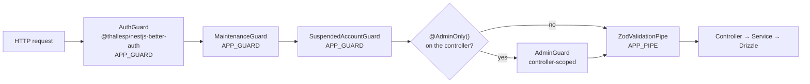

# Backend Architecture

> **Shape (from the App Profile in [`CLAUDE.md`](../../CLAUDE.md)):** Tenancy `single-tenant` ·
> Realtime `none` · Push `fcm` · SMS `msg91` · Payments `none` · Email `none`.

Written by reading `apps/api/src`. Every `path:line` below was opened. Where this contradicts
another doc — including `CLAUDE.md` — the contradiction is named rather than smoothed over.

---

## Overview

One NestJS 11 application on Express, one deployable, serving **two client surfaces and one dev
surface** from **33 controllers / 119 routes**. Drizzle ORM over a single PostgreSQL 16 database;
Redis for OTP rate limits and the dev OTP cache. No queue, no scheduler, no worker process.

The split that matters most:

| Surface | Controllers | Routes | Authentication | Gate |
|---|---|---|---|---|
| Citizen (`apps/mobile`) | 16 | 49 | better-auth session via `Authorization: Bearer` | global `AuthGuard` |
| Staff (`apps/admin`) | 15 | 69 | better-auth session cookie | `@AdminOnly()` per controller |
| Root | 1 | 1 | global `AuthGuard` | — (`GET /` is a Nest scaffold leftover) |
| Dev-only | 1 | 1 | `@AllowAnonymous()` | not registered in production |

The two surfaces never share a route. That is [ADR 0009](../decisions/0009-admin-scoped-api-surface.md),
and it is enforced by a test that walks `AdminModule`'s controller array
(`apps/api/src/admin/admin-module-guard.spec.ts:42-59`).

---

## Directory layout — what is actually on disk

**All 22 domain folders sit directly under `apps/api/src/`.** There is no wrapper directory.

```
apps/api/src/
├── main.ts                 # bootstrap: CORS, static /uploads, listen
├── app.module.ts           # the guard chain lives in the `imports` ORDER
├── app.controller.ts       # GET / — Nest scaffold, still behind the auth guard
│
├── account-status/         # global SuspendedAccountGuard + the login-time block
├── admin/                  # 15 controllers, 34 DTOs, 19 services — see below
├── alerts/                 # the per-user notification log (polled, not pushed)
├── auth/                   # better-auth instance + otp/ providers. No module, no controller
├── comments/               # public Community Comments
├── config/                 # TWO modules: PlatformConfigModule + MaintenanceModule
├── db/                     # schema/ (15 files) + seed.ts + seed-admins.ts + seed-audit.ts
├── dev/                    # conditionally registered — see below
├── devices/                # FCM token registration
├── flagged-comments/       # citizen's view of their own flags
├── impact-stories/
├── lib/                    # redis.ts — the shared connection, importable outside DI
├── missions/               # accept, confirm, progress, Mission Chat, completion
├── push/                   # FCM / dev-console provider behind one interface
├── redis/                  # @Global() module exposing REDIS_CLIENT
├── reports/                # the core loop's write side + Discover
├── saved-reports/
├── sponsors/
├── support/                # citizen half of the ticket system
├── updates/                # citizen read of staff Announcements
├── uploads/                # POST /uploads → local disk (ADR 0008)
└── users/                  # /users/me/*
```

### The `CLAUDE.md` discrepancy

**`CLAUDE.md:157` documents a directory that does not exist.** It reads:

> Modules under `apps/api/src/modules/` follow: `*.controller.ts`, `*.service.ts`, `*.module.ts`,
> `dto/` (Zod schemas), `utils/`.

`ls apps/api/src/modules` → *No such file or directory*. Nor does any module have a `utils/`
folder — what the doc calls `utils/` is loose sibling files next to the service
(`reports/report-visibility.ts`, `support/ticket-status.ts`, `sponsors/sponsor-status.ts`,
`admin/report-effective-status.ts`).

The *file-suffix* half of the convention is followed completely: every module that has a
controller has its `.module` / `.controller` / `.service` trio, and `dto/` exists in 8 modules with
real `createZodDto` schemas.

**Proposed replacement for `CLAUDE.md:157-158`** (not applied — this doc does not edit `CLAUDE.md`):

> - Domain folders sit directly under `apps/api/src/<domain>/` and follow: `*.controller.ts`,
>   `*.service.ts`, `*.module.ts`, `dto/` (Zod schemas), plus any domain rule files as loose
>   siblings (`report-visibility.ts`, `ticket-status.ts`). There is no `src/modules/` wrapper and
>   no per-module `utils/`.

Moving 22 domains to match the doc is the wrong trade: it is a 243-file rename whose only
end-to-end test is the Nest scaffold default (`apps/api/test/app.e2e-spec.ts`). Fix the doc.

### Two structural notes on `admin/`

- **`apps/api/src/admin/` is a district, not a module.** ~60 files, 34 of them DTOs, holding 19
  services registered through one `admin.module.ts:81-106`. It is roughly a quarter of the API in
  one flat folder, and it contains the four largest files in the repo
  (`admin-broadcasts.service.ts` 1119, `admin-accounts.service.ts` 1084,
  `admin-support.service.ts` 951, `admin-sponsors.service.ts` 928).
- **Four modules have no controller at all** — `AccountStatusModule` and `MaintenanceModule` exist
  only to register a global guard; `PushModule` and `RedisModule` exist only to provide.
  Three folders have no module either: `auth/`, `db/`, `lib/`.

---

## The global chain, and why registration order is load-bearing



### There is exactly one enhancer in `AppModule.providers`

`apps/api/src/app.module.ts:83`:

```ts
providers: [AppService, { provide: APP_PIPE, useClass: ZodValidationPipe }],
```

No `APP_GUARD`, no `APP_INTERCEPTOR`, no `APP_FILTER`. A repo-wide grep for `APP_INTERCEPTOR` and
`APP_FILTER` across `apps/api/src` returns zero hits — **this API has no global interceptors and no
global exception filter.** See [Error model](#error-model) for what that costs.

### The three global guards come from three imported modules, and order is the `imports` order

| # | Guard | Registered by | Import site |
|---|---|---|---|
| 1 | `AuthGuard` (library) | `AuthModule.forRoot({...})` | `app.module.ts:39-51` — **first** |
| 2 | `MaintenanceGuard` | `MaintenanceModule` | `app.module.ts:76` — second-to-last |
| 3 | `SuspendedAccountGuard` | `AccountStatusModule` | `app.module.ts:80` — **last** |

The canonical statement of the chain is a comment in the code itself,
`apps/api/src/config/maintenance.module.ts:16-17`:

> Imported immediately before AccountStatusModule in AppModule, which puts the guard order at:
> library AuthGuard -> MaintenanceGuard -> SuspendedAccountGuard.

**Why it is load-bearing, and how the project learned it.** Nest instantiates a module's *own*
providers before those of the modules it imports. `SuspendedAccountGuard` was first registered as a
line in `AppModule.providers` and did not work — it ran *ahead* of the library's `AuthGuard`, reached
a request whose session had not been resolved, and returned a 500 on the first curl
(`apps/api/src/account-status/account-status.module.ts:8-26`). Moving the registration into an
imported module puts it after the library guard in enhancer order, and importing it **last** makes
the ordering visible at the call site instead of dependent on where a future import lands
(`app.module.ts:77-79`).

**The guard keeps the assertion that caught it.** `suspended-account.guard.ts:59-65` throws
`InternalServerErrorException` with `code: 'AUTH_GUARD_ORDER'` if `request.session === undefined`.
That is deliberate: any future reordering fails loudly on the first request instead of quietly
letting suspended accounts through.

`MaintenanceGuard` does not read the session, so *its* position is not load-bearing for
correctness. It is registered the same way anyway, so there is one pattern for "global guard"
rather than two that look interchangeable (`maintenance.module.ts:8-14`). The single observable
consequence of its position: a suspended user during a pause is told `MAINTENANCE_MODE`, not
`ACCOUNT_SUSPENDED` (`maintenance.module.ts:18-20`).

### Guard-by-guard

**1. `AuthGuard`** — supplied by `@thallesp/nestjs-better-auth`, appended as an `APP_GUARD` by
`AuthModule.forRoot()`. It resolves the session from **headers**, which covers the admin cookie and
the mobile bearer token identically, and sets `request.session` / `request.user` before any opt-out
check. **Every controller in this app is authenticated by default with no decorator** — the note at
`apps/api/src/users/users.controller.ts:14-15` says so, and `GET /reports/categories` with no
credentials returns 401.

Two opt-outs exist in the whole API:

- `@AllowAnonymous()` on the dev OTP controller — `apps/api/src/dev/dev-otp.controller.ts:14`. The
  only one.
- `OptionalAuth()`, never used alone, only bundled inside `@AdminOnly()`
  (`apps/api/src/admin/admin.decorators.ts:38`).

Three controllers carry a comment recording that they are authenticated *on purpose* and must not
gain `@AllowAnonymous()`: `config/platform-config.controller.ts:7-13`,
`updates/updates.controller.ts:9-13`, `sponsors/sponsors.controller.ts:8-13`.

**2. `MaintenanceGuard`** (`apps/api/src/config/maintenance.guard.ts`) — the enforcement half of the
two platform kill switches. Blocks **mutating citizen requests** while `maintenance_mode` or
`read_only_mode` is on; returns 403 with a machine-readable code, never 503, because a 503 invites
client and proxy auto-retry (`:63-68`).

Its exemption logic is the highest-risk part of the feature and is exempted twice, independently:

- `isAdminRoute()` reads `PATH_METADATA` off the **controller class**, not the URL, so the
  exemption survives a future `setGlobalPrefix()` (`maintenance.guard.ts:83-93`, rationale `:72-82`).
- `MAINTENANCE_EXEMPT_PATH_PREFIXES = ['/admin', '/api/auth']` matched at a **segment boundary**, so
  `/administrators` is not accidentally exempt (`config/maintenance-mode.ts:63`, `:69-75`).

`PATCH /admin/settings` is the only way to switch maintenance back off and
`POST /api/auth/sign-in/email` is how the operator gets the session to call it — blocking either
would let one toggle brick the product (`maintenance.guard.ts:24-31`). The decision logic lives in
`maintenance-mode.ts` as pure functions so it is asserted directly rather than through a mocked
execution context. Precedence: `MAINTENANCE_MODE` wins over `READ_ONLY_MODE`
(`maintenance-mode.ts:118-132`); both block exactly the same requests, only the code differs.

**No opt-out decorator, deliberately** — `maintenance.guard.ts:18-22`.

**3. `SuspendedAccountGuard`** (`apps/api/src/account-status/suspended-account.guard.ts`) — 403
with `code: 'ACCOUNT_SUSPENDED'`, never 401, because a 401 is indistinguishable from an expired
session and the client must not silently re-authenticate past a suspension (`:73-74`). It gates
**reads as well as writes** (`:23-29`) and inspects only the *caller's* id, never anyone else's —
which is what lets a volunteer finish a mission for a since-suspended reporter
([ADR 0011](../decisions/0011-user-suspension-blocks-login-not-content.md)).

Suspension is enforced in exactly two places, and they return the byte-identical code/message pair:
this guard, and the login-time hook `decideSessionCreate()`
(`apps/api/src/account-status/login-block.ts:71-88`, wired at `apps/api/src/auth/auth.ts:132-143`)
which refuses to mint a session at all.

> **Known product consequence, not a doc gap.** The message is *"Contact support if you believe
> this is a mistake."* (`account-status.ts:67-68`) — and a suspended user gets 403 on
> `GET /support/categories`, `POST /support/tickets` and `GET /users/me/tickets` too, because the
> guard has no opt-out. There is no email provider ([ADR 0003](../decisions/0003-no-email-provider-at-launch.md)),
> so the copy names a channel that does not exist. Filed in [`../_audit/issues.md`](../_audit/issues.md).

**4. `AdminGuard`** (`apps/api/src/admin/admin.guard.ts`) — **not global, by design.**
`admin.module.ts:77-80`: registering it as an `APP_GUARD` would put every mobile endpoint behind an
admin check. It attaches per controller through `@AdminOnly()`.

- Reads **only** `request.session?.user?.id` (`:48`) — never a query string. This is the direct
  inverse of the prototype's `?role=super` fail-open pattern that `CLAUDE.md:162-163` bans.
- Resolves the role and permissions **from the database** (`admin_users` → `admin_roles` →
  `admin_role_permissions`), never from the TypeScript catalogue in `admin-rbac.ts`.
- Required permissions are **ANDed**, with **no super-admin bypass** (`:70-85`). `super_admin`
  passes because the seed grants it all six as real rows, so revoking one in the DB actually
  revokes it (`:71-75`).
- Every exit is `true` or a throw. There is no fallthrough.

Three failure codes, **all 403** — the code is the only thing that separates them, so a prober
cannot use the status to discover admin routes:

| Code | Meaning | Line |
|---|---|---|
| `ADMIN_NO_SESSION` | no signed-in session at all | `admin.guard.ts:50-54` |
| `ADMIN_NOT_AN_ADMIN` | signed in, but no `admin_users` row | `:56-63` |
| `ADMIN_MISSING_PERMISSION` | admin, but lacks a required key (message names it) | `:80-84` |

**5. `ZodValidationPipe`** — `app.module.ts:83`. **Validation coverage is 100%:** all 53 `dto/`
files use `createZodDto`, and every `@Body()` is typed to a `*Dto`. The only unvalidated input in
the codebase is the dev OTP controller's raw `@Query('phone')`, in a module not registered in
production.

---

## Admin RBAC

Two roles, six permissions, defined once in `apps/api/src/admin/admin-rbac.ts` so the seed, the
guard and the tests cannot drift (`:41-45`, `:54-61`, `:74-79`):

| Role | Permissions |
|---|---|
| `super_admin` | all six |
| `ops_admin` | `users:manage`, `reports:manage`, `comments:manage` |

The six keys: `users:manage`, `reports:manage`, `comments:manage`, `analytics:view`,
`platform:manage`, `data:delete_all`.

**"No admin access" is the absence of an `admin_users` row**, not a `role` column with a default.
There is no `role` column on `user` at all, so no default value could ever mean "admin"
(`apps/api/src/db/schema/admin-schema.ts:11-17`). Absence of a row is absence of access, and it is
the only default that fails closed.

`@RequireAdminPermissions()` is applied class-level on four controllers (broadcasts, categories,
community-updates, settings, support — all `platform:manage`) and method-level on the rest, where
the split is load-bearing: `PATCH /admin/me` and `POST /admin/me/change-password` are deliberately
ungated so an ops admin can self-serve without seeing the admin directory
(`apps/api/src/admin/admin-accounts.controller.ts:44-51`, `:191`, `:203-209`).

`@AdminOnly()` bundles `OptionalAuth()` + `UseGuards(AdminGuard)` in one decorator **specifically so
the two can never be applied separately** — `OptionalAuth()` alone would publish an admin controller
to the world (`admin.decorators.ts:13-38`).

---

## Module map

### Citizen surface (16 controllers, 49 routes)

| Module | Base path(s) | Owns |
|---|---|---|
| `reports` | `/reports`, `/users/me/reports` | Create/edit/close a report, Discover by radius, categories, summary, community stats, save/unsave |
| `missions` | `/reports/:id/*`, `/users/me/missions` | Accept, 15-min confirm, leave, progress milestones, roster, **Mission Chat**, completion |
| `comments` | `/reports/:id/comments` | Public Community Comments + flagging |
| `users` | `/users/me/*` | Profile, radius, locale, privacy, stats, invite code, account deletion |
| `alerts` | `/users/me/alerts` | The polled notification log |
| `support` | `/support/*`, `/users/me/tickets` | Ticket creation + the citizen half of the two-way thread |
| `impact-stories` | `/users/me/impact-stories` | The union of your completed reports and missions |
| `saved-reports` | `/users/me/saved-reports` | Read side of saving (writes live on `ReportsController`) |
| `flagged-comments` | `/users/me/flagged-comments` | Your own flags and their status |
| `devices` | `/devices` | FCM token registration |
| `uploads` | `/uploads` | `POST` only — local disk, ADR 0008 |
| `updates` | `/updates` | Citizen read of staff Announcements |
| `sponsors` | `/sponsors?placement=` | Active sponsor creative for a placement |
| `config` | `/config` | Platform settings the mobile app reads at launch |

The `users/me/*` pattern is deliberate: `alerts`, `saved-reports`, `flagged-comments`,
`impact-stories`, `my-reports` and `my-missions` each get a dedicated controller rather than routes
bolted onto a parent, so work on one module touches only that module's files
(`saved-reports/saved-reports.controller.ts:6-9`).

### Staff surface (15 controllers, 69 routes)

All under `/admin`, all `@AdminOnly()`, all asserted by `admin-module-guard.spec.ts`.

| Controller | Base path | Permission |
|---|---|---|
| `AdminController` | `/admin` (`/me`, `/dashboard`) | none — any admin |
| `AdminAccountsController` | `/admin/admins`, `/admin/me` | `platform:manage`, except the two `/admin/me` self-service routes |
| `AdminUsersController` | `/admin/users` | `users:manage` |
| `AdminReportsController` | `/admin/reports` | `reports:manage` |
| `AdminCommentsController` | `/admin/comments`, `/admin/flagged-comments` | `comments:manage` |
| `AdminImpactStoriesController` | `/admin/impact-stories` | `reports:manage` |
| `AdminSupportController` | `/admin/support-tickets` | `platform:manage` (class) |
| `AdminCategoriesController` | `/admin/report-categories` | `platform:manage` (class) |
| `AdminCommunityUpdatesController` | `/admin/community-updates` | `platform:manage` (class) |
| `AdminBroadcastsController` | `/admin/broadcasts` | `platform:manage` (class) |
| `AdminSponsorsController` | `/admin/sponsors` | `platform:manage` (class) |
| `AdminSettingsController` | `/admin/settings` | `platform:manage` (class) |
| `AdminAnalyticsController` | `/admin/analytics`, `/admin/system-health` | `analytics:view` / `platform:manage` |
| `AdminAuditController` | `/admin/audit-logs` | `platform:manage` — **read-only by construction** (`admin-audit.controller.ts:9-13`) |
| `AdminActivityController` | `/admin/activity` | none — scoping happens in the service |

The API uses **PATCH exclusively** — there are zero `@Put()` routes anywhere.

### Cross-module dependency edges

`AlertsModule` ← `MissionsModule`, `ReportsModule`, `AdminModule`.
`PushModule` ← `AlertsModule`, `AdminModule` — **never `AppModule`**, deliberately (see
[integrations.md](./integrations.md#push--fcm)).
`ReportsModule` ← `SavedReportsModule`, `ImpactStoriesModule`. `MissionsModule` ← `ReportsModule`,
`ImpactStoriesModule`. `CommentsModule` ← `FlaggedCommentsModule`. `RedisModule` is `@Global()`.

**No service cycles and no `forwardRef` anywhere in the codebase.**

### The conditional module

`DevModule` is registered only when the dev OTP fallback is active
(`app.module.ts:68`): `...(devOtpFallbackActive ? [DevModule] : [])`, where
`devOtpFallbackActive = !hasMsg91Credentials && process.env.NODE_ENV !== 'production'`
(`app.module.ts:31-35`). It mirrors `auth.ts`'s own guard exactly, so `GET /dev/otp` cannot exist in
production.

---

## Bootstrap

`apps/api/src/main.ts` — 53 lines, and every one of them is a decision.

- **`bodyParser: false`** on `NestFactory.create` (`:12`). The better-auth module needs the raw body
  for its own routes and re-adds JSON/urlencoded parsing at a 2 MB limit
  (`app.module.ts:47-50`). Do not add `express.json()` separately (`main.ts:9-11`).
- **CORS is owned here, not by the auth library** (`:41-45`). Exact-origin allowlist built from
  `ADMIN_URL` (`:38-40`) — never `*`, because every admin request carries a session cookie and a
  browser refuses to pair `Access-Control-Allow-Credentials: true` with a wildcard. An unset
  `ADMIN_URL` refuses every cross-origin caller, which is the right way to fail. The method list
  explicitly includes **`PATCH`** (`:44`), which the library's derived list omits.
  `disableTrustedOriginsCors: true` (`app.module.ts:46`) prevents a second CORS middleware emitting
  a duplicate `Access-Control-Allow-Origin`. Mobile is unaffected either way — React Native's
  `fetch` sends no `Origin`.
- **Static assets:** `app.useStaticAssets(UPLOADS_DIR, { prefix: '/uploads/' })` (`:50`). This
  middleware runs *outside* Nest's router, so `/uploads/*` is **not** behind the global auth guard —
  deliberate, and documented at `:46-49`. Only `POST /uploads` requires a session.
- **No `setGlobalPrefix()`.** Routes are exactly as written on the controllers, and
  `maintenance-mode.ts:59-61` records this as a live assumption its exempt-prefix strings depend on.
- Port: `process.env.PORT ?? 3000` (`:51`). In Docker it is published on 3001.

---

## Conventions

**Controllers are thin, and it is verified rather than asserted.** Grepping `if (` / `for (` /
`.map(` / `.filter(` / `drizzle-orm` / `db/schema` across all 33 `*.controller.ts` returns **two**
hits: `uploads.controller.ts:24` (a `!file` check) and `dev-otp.controller.ts:18,20` (the one
controller that touches a datastore directly, dev-only). No controller builds a query; none does
inline authorization.

**No service reads the request or sets headers** — zero `@Req` / `@Res` / `setHeader` in any
service.

**DB access is confined.** `db` is imported by 30 services plus exactly three plain-function
helpers, each with a written reason (callers on both sides of the DI boundary):
`account-status/account-status.ts`, `config/platform-settings.ts`, `lib/redis.ts`. No guard has an
inline query.

**Cross-field validation lives in the DTO.** Two service-side checks look like exceptions and are
not: `admin-sponsors.service.ts:289` (`END_BEFORE_START`) and `admin-broadcasts.service.ts:299,445`
(`BROADCAST_AUDIENCE_MISMATCH`). Both DTOs carry the `.refine()`; the service check exists because a
PATCH compares one submitted field against the **stored** other — work no DTO can do.

**Shared rules get their own file when two surfaces need them.** Five of these exist and they are
the most load-bearing files in the API:

| File | Rule it owns |
|---|---|
| `reports/report-visibility.ts` | the `deleted_at IS NULL` predicate every citizen query over `reports` must carry |
| `admin/report-effective-status.ts` | derived report status — [ADR 0014](../decisions/0014-derived-status-over-stored-status.md) |
| `sponsors/sponsor-status.ts` | the same shape for sponsor campaign windows |
| `support/ticket-status.ts` | the ticket lifecycle, imported by **both** `SupportService` and `AdminSupportService` |
| `admin/admin-rbac.ts` | roles → permissions, shared by seed, guard and tests |

---

## Background jobs / queues

**There are none.** No `@nestjs/schedule`, no BullMQ, no cron, no `setInterval` anywhere in
`apps/api/src`. The only reference to BullMQ is a comment saying it is not installed
(`apps/api/src/db/schema/broadcasts-schema.ts:149`).

| Time-based behaviour | How it actually works |
|---|---|
| Report expiry | derived at read time from `reports.expiry_at`; the `expired` status is never written ([ADR 0014](../decisions/0014-derived-status-over-stored-status.md)) |
| Sponsor `scheduled` / `expired` | derived from the campaign window (`sponsors/sponsor-status.ts:40-47`) |
| Volunteer 15-minute confirm deadline | expired lazily on read by `expireStaleAndListVolunteers()` (`missions/missions.service.ts:195-238`) |
| Announcement `publish_at` | query-driven — the citizen read filters on the publish window (`updates/updates.service.ts:60-70`) |
| **Broadcast `scheduled_at`** | **nothing sweeps it.** `scheduled` is a reachable state that the create/update path writes (`admin/admin-broadcasts.service.ts:230-232`), and only the manual `POST /admin/broadcasts/:id/send` moves it. A scheduled broadcast never sends. |

That last row is a live S1 defect, not a design choice — the schema comment at
`broadcasts-schema.ts:147-155` says so itself. Filed in [`../_audit/issues.md`](../_audit/issues.md).

---

## Error model

**Three shapes, because there is no global exception filter.** `app.module.ts:83` registers
`APP_PIPE` only.

| Shape | Where | Live example |
|---|---|---|
| `{ code, message }` | ~80 sites — all `/admin/*`, plus the platform and suspension guards | `{"code":"ADMIN_MISSING_PERMISSION","message":"Missing admin permission: platform:manage"}` |
| Nest default `{ message, error, statusCode }` | **19 sites, all citizen-facing** | `{"message":"Not your report","error":"Forbidden","statusCode":403}` |
| nestjs-zod `{ statusCode, message, errors[] }` | every DTO rejection | `{"statusCode":400,"message":"Validation failed","errors":[…]}` |

**The 19 code-less sites are all on the core loop**, which is what makes this a product bug rather
than a tidiness issue: `missions/missions.service.ts:325,333,340,343,477,518,540`,
`reports/reports.service.ts:171,174,494,742,744,751,770`, `comments/comments.service.ts:132,139`.

`ApiError.code` is `null` for all 19, so neither client can branch on them and the mobile app falls
through to rendering the server's raw English to a Tamil user
(`apps/mobile/src/screens/request-details/RosterSection.tsx:39`). `libs-common/src/error-codes.ts`
exists precisely to prevent this and currently holds 6 codes; ~44 more are spelled as string
literals independently on both sides.

**Neither client prose-matches on errors** — zero hits for `message.includes` or
`error.message ===` in `apps/admin` or `apps/mobile`. Both branch on `code`, which is exactly why
the 19 missing codes bite.

The `{ code, message }` codes that *are* shared live in `@uthavu/libs-common` and are re-exported at
their point of use — e.g. `account-status/account-status.ts:65` re-exports `ACCOUNT_SUSPENDED` as
`ACCOUNT_SUSPENDED_CODE` so the guard and the login block cannot drift.

> A global exception filter that normalises all three into one envelope is the obvious fix and does
> not exist. Whether the citizen envelope should change shape (breaking both clients) or only gain a
> `code` field is **an open question** — see [`../_audit/open-questions.md`](../_audit/open-questions.md).

---

## Tenancy

**`single-tenant`.** There is no `org` table, no `org_id` / `organization_id` / `tenant_id` column
anywhere (case-insensitive grep over `apps/api/src` and `apps/api/drizzle`: zero matches), and no
`forOrg()` helper. `apps/api/src/db/index.ts:39` exports one bare `db` that every service imports
directly.

> One false positive to know about: `auth-schema.ts:42` has `organization: text('organization')` on
> `user`. That is a free-text profile field — the citizen's employer, shown beside `profession`. No
> FK, no index, no scoping.

Scoping is therefore **per-user, per-query, written by hand in each service** — e.g.
`eq(reports.reporterId, requestingUserId)`. Stated honestly: **nothing structural stops a service
from forgetting that filter.** There is no RLS and no query wrapper. That is what makes the
citizen/admin route split a security boundary rather than a UI convenience
([ADR 0009](../decisions/0009-admin-scoped-api-surface.md)). Detail in [`data.md`](./data.md#tenancy).

---

## Testing posture

**45 co-located `.spec.ts` files in `apps/api`** — genuinely good coverage of the rule-heavy
services, including a real-Postgres harness for the admin suites
(`apps/api/src/admin/testing/admin-spec-db.ts`).

Gaps, stated plainly:

- Six modules have no spec at all: `dev/`, `devices/`, `flagged-comments/`, `lib/`, `redis/`,
  `saved-reports/`. `uploads/` has `stored-upload.spec.ts` and `upload-url.spec.ts` but no
  controller spec — the MIME filter and the 5 MB limit are untested.
- `admin/` has 18 specs against ~60 source files; `admin-users.service.ts` (709 lines),
  `admin-analytics.service.ts`, `admin-categories.service.ts` and `admin-system-health.service.ts`
  are untested.
- **E2E is one file: the Nest scaffold default** (`apps/api/test/app.e2e-spec.ts`).
- Root `pnpm test` runs `pnpm -r run test`, and only `apps/api` defines a `test` script — so the
  monorepo-wide command exercises exactly one package.

Against the App Profile's `Testing: full` bar, the Supertest-integration and Playwright halves do
not exist. See [`frontend.md`](./frontend.md#testing-posture) and [`mobile.md`](./mobile.md#testing-posture).

---

## Related docs

- System map: [`system.md`](./system.md)
- Data: [`data.md`](./data.md)
- Admin console client: [`frontend.md`](./frontend.md) · integration map: [`admin-console-integration.md`](./admin-console-integration.md)
- External services: [`integrations.md`](./integrations.md)
- [ADR 0009](../decisions/0009-admin-scoped-api-surface.md) — why `/admin/*` is its own surface
- [ADR 0014](../decisions/0014-derived-status-over-stored-status.md) — derived status over stored status
- [ADR 0015](../decisions/0015-has-accepted-is-the-single-access-gate.md) — the `hasActiveAccess` gate
- [ADR 0016](../decisions/0016-lookup-tables-over-database-enums.md) — lookup tables, not enums

---

_Last verified against commit `96f6386`._
