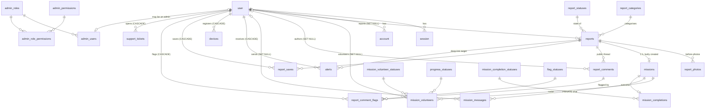

# Data Architecture

Read from `apps/api/src/db/schema/` and cross-checked against the live `uthavu_dev` database.
Table inventory and invariants 1–6 first written 2026-08-27; **re-verified against the code and the
database 2026-08-28** (see the correction notices below — several 2026-08-27 numbers had gone stale).

---

## Overview

One PostgreSQL 16 database (`uthavu_dev`), one Drizzle client, **33 tables live** (counted from
`information_schema`, 2026-08-28). Schema lives in **eleven** files under
`apps/api/src/db/schema/`, composed into a single `db` export at `apps/api/src/db/index.ts:29-31`
(the schema object it is built from is `:15-27`). Migrations: **20** committed under
`apps/api/drizzle/`, head `0019_motionless_invaders`.

> **Correction, 2026-08-28.** This paragraph previously said **28 tables, nine schema files and 18
> migrations**, and cited `db/index.ts:13-27` for the `db` export. All four were wrong. The counts
> were taken on 2026-08-27, before migration 0018 (three `admin_audit_*` tables) and 0019
> (`user_statuses`, `user_account_status`) landed — but the sections describing those very tables
> were added to this document on 2026-08-28 without the overview being recounted. And
> `db/index.ts:13-27` is the *schema object*; the `db` export is at `:31`.

Tables by origin: 4 better-auth (`user`, `session`, `account`, `verification`), 4 admin RBAC
(migration `0017_gigantic_marvel_zombies.sql`, 2026-08-25), 3 admin audit (`0018`, 2026-08-27), 2
account status (`0019`, 2026-08-28). The remaining 20 are the citizen product.

## Schema conventions (as actually followed)

- **Primary keys:** UUIDv7 generated in application code via `uuidv7()` at every insert — *not* a
  Drizzle `$defaultFn`. E.g. `apps/api/src/reports/reports.service.ts:81`. The exception is
  better-auth's own tables, whose ids are `text` and generated by better-auth
  (`apps/api/src/db/schema/auth-schema.ts:21`).
- **Timestamps:** `created_at` / `updated_at` **with timezone** on product tables
  (`reports-schema.ts:84-85`). Better-auth's tables use timestamps **without** timezone
  (`auth-schema.ts:26-30`) — a real inconsistency, inherited from `auth generate`. Don't "fix" it
  by hand; better-auth owns those tables.
- **Statuses / enums:** lookup tables joined by FK. **Eight** on the citizen side, seeded by
  `apps/api/src/db/seed.ts`: `report_categories`, `report_statuses`,
  `mission_volunteer_statuses`, `progress_statuses`, `mission_completion_statuses`, `flag_statuses`,
  `ticket_categories`, `ticket_statuses`. **Five more on the staff side**: `admin_roles`,
  `admin_permissions` (`0017`), `admin_audit_actions`, `admin_audit_target_types` (`0018`, seeded by
  `apps/api/src/db/seed-audit.ts`) and `user_statuses` (`0019`).
  Two deliberate exceptions, each documented at its column: `alerts.type`
  (`alerts-schema.ts:1-6`) and `mission_volunteers.release_reason`
  (`missions-schema.ts:65-71`).

  > **Correction, 2026-08-28.** This bullet said "**Seven** of them" and then listed **eight** — an
  > arithmetic error present since 2026-08-27 — and it omitted the five staff-side lookups entirely.

- **Soft delete:** **two** tables have it — `reports.deleted_at` / `deleted_by`
  (`reports-schema.ts:67-83`) and `report_comments.deleted_at` / `deleted_by`
  (`comments-schema.ts:50, 55`, added by migration 0018 for `comment.remove`). Nothing else does,
  on purpose.

  > **Correction, 2026-08-28.** This previously said "exactly one table has it". Migration 0018 added
  > the second. Verified against `information_schema.columns`: `deleted_at` / `deleted_by` exist on
  > `reports` and `report_comments`, and on nothing else.

- **Migrations only:** **20** committed migrations in `apps/api/drizzle/` (was stated as 18 —
  0018 and 0019 have since landed). `db:push` is banned.

## Tenancy

**`single-tenant`.** There is no `org` table, no `org_id` column anywhere, and no `forOrg()` helper.
`apps/api/src/db/index.ts:29-31` exports a bare `db` that every service imports directly.
(Corrected 2026-08-28 — this cited `:25-27`, which is part of the schema object, not the export.)

Scoping is therefore **per-user, per-query, written by hand in each service** — e.g.
`eq(reports.reporterId, requestingUserId)` at `reports.service.ts:194`,
`eq(alerts.userId, userId)` at `alerts.service.ts:39`. State honestly: **nothing structural stops a
service from forgetting that filter.** There is no RLS and no query wrapper. The admin console is
the first consumer that *legitimately* reads across all users, which makes the distinction between
"admin route" and "citizen route" a security boundary rather than a UI convenience — see
[`admin-console-integration.md`](./admin-console-integration.md).

---

## Entity overview

### Identity (better-auth owns these — extend, never rename)

| Table | Holds | Source |
|---|---|---|
| `user` | One person. Phone is the login identity; `email` is a synthesized `@phone.uthavu.local` placeholder, `contact_email` is the real one the user typed. Location (`last_lat`/`last_lng`), `preferred_radius`, `locale` (`en`/`ta`), privacy defaults, `invite_code`. **No `role` column, deliberately.** | `auth-schema.ts:20-56` |
| `session` | better-auth sessions. Serves both surfaces: mobile reads the token via the `bearer()` plugin, admin via cookie. | `auth-schema.ts:58-75` |
| `account` | Credential rows; password hashes live here, never on `user`. | `auth-schema.ts:77-106` |
| `verification` | OTP verification identifiers. | `auth-schema.ts:108-122` |

`lastLat`/`lastLng` are hand-patched to `doublePrecision` after every `auth generate` — see the
warning at `auth-schema.ts:1-7`. Regenerating without redoing it truncates GPS to whole degrees.

### The core loop

| Table | Holds | Source |
|---|---|---|
| `report_categories` | The 9 categories. `default_expiry_minutes` is the **server-side** source of BR-2; `citizen_selectable=false` hides Disaster Relief from citizens. | `reports-schema.ts:10-23` |
| `report_statuses` | `open` · `closed` · `expired` · `completed`. See the warning below about `expired`. | `reports-schema.ts:25-31`, `seed.ts:30-35` |
| `reports` | A help request. `reporter_id` is nullable + `ON DELETE SET NULL` — deleting an account anonymizes a claimed report, never destroys it. `anonymous` / `phone_visible` are the citizen privacy switches. Soft-deletable. | `reports-schema.ts:33-92` |
| `report_photos` | 1–4 before-photos. `captured_live` is always `true` and **nothing server-side verifies it** (`reports-schema.ts:102-105`). | `reports-schema.ts:94-109` |
| `missions` | Created lazily on the first volunteer accept; `report_id` is `UNIQUE` so it is 1:1 with a report. Deliberately thin — it has no status column. | `missions-schema.ts:11-18` |
| `mission_volunteers` | One row per accept. `status` = `joined` → `active` → `released`; `confirm_deadline` = joinedAt + 15 min, enforced **lazily on read**, never by a cron job (`missions.service.ts:195-238`). Progress (`on_the_way`/`reached_location`/`helping_now`) is a *separate* FK with three write-once milestone timestamps. | `missions-schema.ts:44-87` |
| `mission_messages` | **Private Mission Chat.** Gated server-side, not by UI. | `missions-schema.ts:89-104` |
| `mission_completions` | 1:1 with a mission. After-photo + note. Modelled as a real verification state even though `complete()` resolves it to `verified` synchronously. | `missions-schema.ts:106-135` |

### Community & engagement

| Table | Holds | Source |
|---|---|---|
| `report_comments` | **Public** Community Comments — any authenticated user, no `hasActiveAccess` gate. This is the deliberate counterpart to Mission Chat. Soft-deletable since 0018 (`deleted_at` / `deleted_by`) for `comment.remove`. | `comments-schema.ts:22-59` |
| `flag_statuses` | `submitted` → `under_review` → `action_taken` → `dismissed`. The admin console is now writing to it — see the correction below. | `comments-schema.ts:61-74` |
| `report_comment_flags` | A user flagging **a comment**. Unique on `(comment_id, flagged_by_id)` — re-flagging is a no-op. | `comments-schema.ts:76-100` |
| `report_saves` | Save an Impact Story. Unique on `(report_id, user_id)`. | `saves-schema.ts:9-26` |
| `alerts` | Append-only per-user notification log. `params` (jsonb) + `type` let the client re-render in the user's current language; `title`/`body` hold the English rendering as a fallback. | `alerts-schema.ts:12-38` |
| `devices` | FCM push tokens, upserted on `push_token`. **Registration only — there is no send path in this repo.** | `devices-schema.ts:9-21` |
| `support_tickets` + `ticket_categories` + `ticket_statuses` | Profile → Help & Support. Status starts at `new` and, like flags, **nothing moves it** today. | `tickets-schema.ts:11-42` |

### Admin RBAC — landed 2026-08-27

| Table | Holds | Source |
|---|---|---|
| `admin_roles` | `super_admin` \| `ops_admin` | `admin-schema.ts:29-35` |
| `admin_permissions` | Six `module:action` keys | `admin-schema.ts:39-45` |
| `admin_role_permissions` | Which role holds which permission — data, not code | `admin-schema.ts:47-63` |
| `admin_users` | **The admin roster.** `user_id` is the PK, so at most one role per person, and *absence of a row is absence of access*. | `admin-schema.ts:75-88` |

The design note at `admin-schema.ts:11-17` is worth reading: there is no `role` column on `user`
precisely so no default value can ever mean "admin". **"No admin access" is modelled as the absence
of an `admin_users` row**, not as a `role` column holding `'none'` — the inverse of the prototype's
`isSuperAdmin = roleParam !== 'ops'`, where every value except one literal string granted Super
Admin. Absence of a row is the only default that fails closed.

Live values, verified 2026-08-28: `admin_roles` → `super_admin`, `ops_admin`; `admin_permissions` →
`analytics:view`, `comments:manage`, `data:delete_all`, `platform:manage`, `reports:manage`,
`users:manage`; `admin_users` → 2 rows.

### Admin audit trail — landed 2026-08-28 (migration 0018)

| Table | Holds | Source |
|---|---|---|
| `admin_audit_actions` | Lookup — **thirteen** `target.verb` keys (`report.hide`, `comment.remove`, …), each carrying `target_type_key` + `sort_order`. Defined at `admin-audit-catalogue.ts:32-114` | `audit-schema.ts:37-58` |
| `admin_audit_target_types` | Lookup — **six**: `report`, `comment`, `comment_flag`, `report_category`, `support_ticket`, **`user`**. Defined at `admin-audit-catalogue.ts:15-22` | `audit-schema.ts:60-71` |
| `admin_audit_logs` | The append-only trail: actor (id **+ email/name/role snapshot**), action, target, `before`/`after` jsonb, `reason`, `ip_address`, `user_agent` | `audit-schema.ts:79-150` |

Three schema facts that are decisions, not details:

- **No `updated_at`, no `deleted_at` on `admin_audit_logs`** (`audit-schema.ts:73-78`). A record that
  can be edited or hidden is not an audit trail; the absent columns say so.
- **`actor_user_id` is `ON DELETE SET NULL`**, never CASCADE (`audit-schema.ts:84-90`) — deleting an
  admin's account must not erase the evidence of what they did. The `actor_email` / `actor_name` /
  `actor_role_key` snapshots (`:96-98`) keep the row readable afterwards, and also stop a role change
  retroactively relabelling past actions.
- **`target_id` is `text` and deliberately not an FK** (`audit-schema.ts:107-117`) — most targets are
  uuid-keyed but `user.id` is text, and an FK would either block a later hard delete or null the
  reference, both of which destroy the record of what was acted on. `target_label` is the snapshot
  that keeps the row meaningful when the target is gone.

> **Correction, 2026-08-28 (second pass).** These two rows said **eleven** actions across **five**
> target types. Both were already stale when written: ADR 0011's suspension work added the `user`
> target type and the `user.suspend` / `user.reactivate` actions in the same afternoon. Counted from
> `admin-audit-catalogue.ts` and confirmed against the live database (`select count(*)` → 13 and 6).
> This list grows with the endpoint surface — **re-read the catalogue rather than quoting this
> table.**

Full reasoning in [ADR 0012](../decisions/0012-admin-audit-log-before-the-first-mutating-endpoint.md).

### Platform settings — landed 2026-08-29 (migration 0021)

`platform_settings` is a **singleton row** holding the configuration the admin console edits and the
mobile app reads at launch via `GET /config`.

Three properties that are decisions, not details:

- **The singleton is enforced by the database, not by convention.** A
  `singleton boolean NOT NULL DEFAULT true UNIQUE` plus `CHECK (singleton)`: the check forbids
  `false`, the unique index permits exactly one `true`. A second insert fails with `23505`. This is
  stronger than a fixed UUID, which any writer could ignore.
- **Bounds are DB `CHECK` constraints built from the same constant the Zod DTO reads**
  (`PLATFORM_SETTINGS_BOUNDS`), so the API and the database cannot disagree about what is valid.
  Verified: `default_radius_km = 7` → `23514`, `max_photos_per_report = 99` → `23514`.
- **The seed uses `onConflictDoNothing`, uniquely in `db/seed.ts`.** Every other block upserts. Here
  an upsert would switch `maintenance_mode` back **off** on every deploy — re-seeding must never
  silently un-pause a platform an operator deliberately froze.

**Not cached, deliberately.** `getPlatformConfig()` reads the row per call, for the same reason
`isUserSuspended()` does: an in-process cache cannot be invalidated across processes, which is
exactly the stale kill-switch failure `docs/webadmin/07-platform-settings.md` §5A.3 describes — *"a
switch that looks like a stop button and isn't one is worse than no switch."* The upgrade path, if
it is ever needed, is Redis pub/sub invalidation, **not** a TTL.

**The lockout exemption is the highest-risk part of the schema's consumers.** `maintenance_mode` and
`read_only_mode` block citizen writes through a global guard, and `/admin/*` and `/api/auth` are
exempted **twice, independently** (controller path metadata *and* a segment-boundary prefix check) so
an operator cannot freeze themselves out of the console they need to unfreeze it. Admin routes do not
even read the settings row, so a database problem cannot lock the console during the incident it
exists for.

**Known derivation, not a stored fact:** `updatedByDeleted` is computed as
`updated_by IS NULL AND updated_at > created_at`, because `updated_by` is `SET NULL` and cannot
distinguish "never changed" from "changed by a since-deleted admin". It is sound only because the
seed never updates the row. `admin_audit_logs` is the authoritative answer to who changed what.

### Announcements — landed 2026-08-29 (migration 0020)

> **Naming warning.** The tables are called `community_updates` / `community_update_statuses` and the
> endpoints `/admin/community-updates`, but this is the **Announcements** feature — admin-authored
> broadcasts. It is **not** "Community Updates", which is the per-report public feed backed by
> `report_comments`. The names were fixed before the distinction was understood; renaming them would
> cost a migration plus a rewrite of seeded `community_update.*` audit rows, so it is deliberate,
> recorded debt. See [ADR 0013](../decisions/0013-community-updates-vs-announcements.md).

| Table | Holds | Source |
|---|---|---|
| `community_update_statuses` | Lookup — `draft`, `published`, `archived` | `updates-schema.ts` |
| `community_updates` | Staff-authored bilingual announcements: `title_en`/`body_en` (NOT NULL), `title_ta`/`body_ta` (nullable), `status_id` FK, `publish_at`/`expires_at`, `author_admin_user_id`, `deleted_at` | `updates-schema.ts` |

Three properties worth knowing:

- **Bilingual with per-field fallback.** English is required, Tamil optional — so an announcement is
  publishable before it has been translated, and the citizen read resolves each field independently
  from the caller's `user.locale`. This is the same locale pattern as `alerts/alert-templates.ts`.
- **`author_admin_user_id` is `ON DELETE SET NULL`** — an announcement outlives the admin who wrote
  it, the same reasoning as `admin_audit_logs.actor_user_id`.
- **Scheduling is by timestamp, not status.** `publish` sets the status; it deliberately does **not**
  stamp `publish_at = now()`, because overwriting a future schedule would ship a notice early. The
  citizen query decides visibility from `publish_at`/`expires_at`.

Indexes: `(status_id, publish_at)` for the citizen feed, `(created_at)` for the console list.

**Invariant, and where it is enforced:** `expires_at` must be after `publish_at`. There is **no DB
CHECK constraint** (this schema has none anywhere) — it is guarded in exactly two places: the DTO
`.refine()`, and again in the service against the **merged** values, because a `PATCH` sending only
`expires_at` sails past any DTO-level check. Both are tested. Soft-delete filtering
(`deleted_at IS NULL`) is applied in every read path on both surfaces, and **there is no restore
endpoint**.

### Account status — landed 2026-08-28 (migration 0019)

| Table | Holds | Source |
|---|---|---|
| `user_statuses` | Lookup — `active`, `suspended` | `user-status-schema.ts:42-53` |
| `user_account_status` | One row per user who has ever had a non-default status. PK on `user_id`, FK to `user_statuses`, plus `reason` (staff-only), `suspended_at`, `suspended_by` | `user-status-schema.ts:65-94` |

`user_account_status` is a separate table rather than a column on `user` for two reasons stated in
its own header (`user-status-schema.ts:20-28`): better-auth owns `user` and CLAUDE.md says extend
rather than modify it, and **absence of a row means `active`** — no backfill, no default that has to
be right. Same honest default as `admin_users`.

`suspended_by` is `SET NULL` (`:83-85`): deleting an admin's account must not silently un-suspend
everyone they actioned.

**This table never affects a *citizen* read path.** Nothing filters reports, missions, comments or
impact stories on it — verified 2026-08-28 by grepping every citizen module for
`userAccountStatus` / `userStatuses` / `isUserSuspended` (zero hits) and confirming the API never
uses Drizzle's relational `db.query.*` API, so no `with:` traversal can reach it implicitly.

**One admin query does filter on it, legitimately:** `AdminUsersService.list()` supports a
`?status=` filter over the admin user directory (`apps/api/src/admin/admin-users.service.ts:89-91`),
defaulting to `all` (`apps/api/src/admin/dto/list-admin-users.dto.ts:27`) so suspended users appear
in the default staff view. That is a staff directory filter, not a content filter — no citizen's
view of anyone's reports, missions or comments changes. See
[ADR 0011](../decisions/0011-user-suspension-blocks-login-not-content.md) and invariant 7 below.

---

## Entity–relationship diagram

---

## Invariants a new feature must not break

1. **A report is never hard-deleted.** Only `deleted_at` is set (`reports.service.ts:454-457`). Any
   new listing must add `isNull(reports.deletedAt)` — including admin listings, unless the admin
   view deliberately shows deleted rows (a product decision, not a default).
2. **Community content survives account deletion; identity does not.** `reports.reporter_id`,
   `mission_volunteers.volunteer_id`, `mission_messages.sender_id`, `report_comments.author_id` and
   `mission_completions.completed_by_id` are all `SET NULL`. Everything personal
   (`session`, `account`, `report_saves`, `report_comment_flags`, `devices`, `support_tickets`)
   is `CASCADE`. See the full policy at `users.service.ts:65-96`.
3. **`reporter === null` and `anonymous === true` are different facts** and must stay
   distinguishable. The API carries both: `reporter: null` plus a separate `reporterDeleted` flag
   (`reports.service.ts:546-555`). "Deleted User" and "Posted anonymously" must never be conflated
   in any UI, admin included.
4. **The reporter's phone number is a server-side gate, not a column you may project.** See
   `reports.service.ts:559-562` and the [privacy boundary](./admin-console-integration.md#4-the-privacypermission-boundary).
5. **The 15-minute confirm deadline is evaluated lazily on read.** `mission_volunteers.status`
   in the database can be stale (`joined` past its deadline) until something calls
   `expireStaleAndListVolunteers()` (`missions.service.ts:195-238`). **A raw SQL count of "joined"
   volunteers is wrong.** Any admin dashboard counter must either go through the service or add
   `AND confirm_deadline > now()` itself.
6. **A mission is created lazily.** A report with no volunteers has no `missions` row at all — join
   with `LEFT JOIN`, never `INNER JOIN`, or open reports vanish from the result.
7. **Suspension gates access, never content.** No listing, projection or counter may hide or filter
   *content* rows because their author is suspended. Enforcement is exactly two places, both gating
   on the *caller's* id: the login hook (`apps/api/src/account-status/login-block.ts:73-87` (wired at `apps/api/src/auth/auth.ts:132-140`)) and the global request
   guard (`apps/api/src/account-status/suspended-account.guard.ts:39-82`). A volunteer must be able
   to finish a mission for a reporter who has since been suspended
   ([ADR 0011](../decisions/0011-user-suspension-blocks-login-not-content.md)).

   > **Correction, 2026-08-28.** This invariant originally read "`user_account_status` must not
   > appear in **any** read path". That absolute is now false and was too strong to begin with: the
   > admin Users directory both projects the status (`admin-users.service.ts:186-189`) and offers an
   > opt-in `?status=` filter over it (`:89-91`). The invariant that actually matters is the one
   > above — **no *content* read path filters on it**, which still holds with no exceptions.
8. **`mission_messages` is invisible to admins.** No admin endpoint, projection or join may include
   it. `hasActiveAccess()` (`missions.service.ts:241-256`) is the sole authority on who reads
   Mission Chat, and it must stay free of an admin branch
   ([ADR 0010](../decisions/0010-mission-chat-is-not-readable-by-admins.md)).
9. **`admin_audit_logs` is append-only.** Never `UPDATE` or `DELETE` a row, and do not add
   `updated_at` / `deleted_at` to the table. Every mutating admin route writes one, in the same
   transaction as the change
   ([ADR 0012](../decisions/0012-admin-audit-log-before-the-first-mutating-endpoint.md)).

---

## Known data-truth traps

### `expired` is a status nothing ever writes

`report_statuses` seeds an `expired` key (`seed.ts:33`), but a repo-wide grep finds **no code that
assigns it**. Expiry is derived from `reports.expiry_at` at read time; `ReportsService.list()`
filters on `status = 'open'` only (`reports.service.ts:306, 324`).

Re-verified against `uthavu_dev` on 2026-08-28 — **`expired` is still 0, and so is `closed`**:

| `report_statuses.key` | rows |
|---|---|
| `open` | 78 |
| `completed` | 40 |
| `closed` | **0** |
| `expired` | **0** |

…and **33 of the 38 live (non-soft-deleted) `open` reports are already past `expiry_at`.**

> **Numbers, not the finding, went stale.** The 2026-08-27 table above read `open` 20 / `completed`
> 11 / "18 of 20 past expiry". The dev database is now churned continuously by the backend lane's
> integration suite, so **treat any absolute row count in this document as indicative only** — it
> moved by three reports during the ten minutes this correction took to write. The durable facts
> are the two zeroes: nothing writes `expired`, and nothing had written `closed` either at the time
> of checking, even though `POST /admin/reports/:id/close` exists and had been exercised (three
> `report.close` rows in `admin_audit_logs`, each followed by a `report.reopen`).

Consequence for the admin console: a "Status = Expired" filter would always return zero rows and
the Reports list would count reports as active long past their expiry. The correct predicate is
`status = 'open' AND expiry_at > now()` for active, `status = 'open' AND expiry_at <= now()` for
expired. Tracked as gap **R-3** in the integration map.

### `report_likes` does not exist

Three code comments reference `report_likes` as if it were a peer of `report_saves`
(`comments-schema.ts:96`, `users.service.ts:90`, `comments.service.ts:71`). **There is no such
table** — not in
`apps/api/src/db/schema/` and not in the database (`\dt` verified). Only `report_saves` exists
(`saves-schema.ts:9-26`). Don't build an admin "likes" metric on it.

### Flagging is comment-only

There is no report-level flag table. `report_comment_flags` flags a **comment**
(`comments-schema.ts:76-100`).

> **Correction, 2026-08-28.** This previously said the admin nav has a **"Flagged Reports"** tab
> "with nothing behind it", citing `apps/admin/src/config/nav.ts:71`. Both halves are now wrong.
> The console renamed the entry to **"Flagged Comments"** (`apps/admin/src/config/nav.ts:75`,
> with the rename explained in the comment at `:71-74`), and it is wired to a real endpoint,
> `GET /admin/flagged-comments`. There is no "Flagged Reports" label anywhere in `apps/admin/src`.
> The underlying data point still stands: report-level flagging has no table and does not exist.

---

## Live dataset (dev, 2026-08-28)

`user` 8 · `reports` 118 (78 not soft-deleted) · `missions` 78 · `mission_volunteers` 79 ·
`report_comments` 14 · `report_comment_flags` 7 · `alerts` 8 · `devices` 0 · `support_tickets` 0 ·
`report_saves` 1 · `admin_audit_logs` 26 · `mission_messages` 0.

> **Correction, 2026-08-28.** The 2026-08-27 snapshot (`user` 4 · `reports` 31 · `missions` 20 ·
> `mission_volunteers` 21 · `report_comments` 2 · `report_comment_flags` **0**) is superseded, and
> so is the advice under it. **"The moderation tables are empty" is no longer true** — there are 14
> comments and 7 flags, and all 7 flags are `dismissed`, not `submitted`. **These counts move
> constantly**: the backend lane's integration suite writes into this same database, and the report
> count rose by three while this section was being corrected. Re-query before relying on any number
> here; the shapes are what this document is for, not the totals.

Still worth knowing for the admin build: `devices` and `support_tickets` are genuinely empty, so the
Support queue and anything push-related will look broken until someone exercises those flows.

---

### Master data can be applied-but-unseeded — but right now it is seeded

**Correction, 2026-08-28 (second pass): this section previously reported the lookup tables as
holding 0 rows. That is no longer true.** `pnpm db:seed` has since run. Re-verified against
`uthavu_dev`:

| Table | Rows | Expected |
|---|---|---|
| `admin_audit_actions` | **13** | 13 (`admin-audit-catalogue.ts:32-114`) |
| `admin_audit_target_types` | **6** | 6 (`admin-audit-catalogue.ts:15-22`) |
| `user_statuses` | **2** | 2 (`seed.ts:92-95`) |

Migrations 0018 and 0019 remain applied (20 rows in `drizzle.__drizzle_migrations`, head
`0019_motionless_invaders`). `admin_audit_logs` holds 26 real rows across nine distinct actions, so
the audit trail is demonstrably being written, not just wired.

The *failure mode* the original note described is still real and still worth knowing, because it
recurs on every fresh database and after every new audit action is added to the catalogue: until
`pnpm db:seed` runs, nothing can be suspended (no `suspended` row to reference) and the first
mutating admin endpoint throws `admin_audit_actions row missing for key "…" — did db:seed run?`
(`apps/api/src/admin/admin-audit.service.ts:104-108`) rather than write the change unlogged. Both
are the designed behaviour. Tracked as [`../_audit/issues.md`](../_audit/issues.md) issue 9.

---

_Last verified against commit `d60e276`, 2026-08-28, and the live `uthavu_dev` database._

_History: table inventory and invariants 1–6 first written against `84a20d3` (2026-08-27); the Admin
RBAC, audit-trail and account-status sections and invariants 7–9 added against `d035cfd` and
committed in `98aae67`. **Adversarially re-checked against `d60e276` on 2026-08-28**, after the admin
API (`177100c`) and admin console (`0227403`) were committed. That pass found and corrected: the
table/schema-file/migration counts, the lookup-table arithmetic, the soft-delete count, the audit
action and target-type counts, invariant 7's over-broad wording, the `report_likes` and
comments-schema citations, the "Flagged Reports" nav claim, the live dataset, and the
"applied-but-unseeded" state. Each correction is marked inline rather than silently applied._
