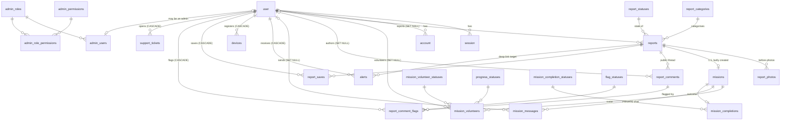

# Data Architecture

Read from `apps/api/src/db/schema/` and cross-checked against the live `uthavu_dev` database on
2026-08-27. Every citation below was opened.

---

## Overview

One PostgreSQL 16 database (`uthavu_dev`), one Drizzle client, **28 tables live**. Schema lives in
nine files under `apps/api/src/db/schema/`, composed into a single `db` export at
`apps/api/src/db/index.ts:13-27`. Migrations: 18 committed under `apps/api/drizzle/`.

The four `admin_*` tables landed mid-pass (migration `0017_gigantic_marvel_zombies.sql`) and are
seeded — 2 roles, 6 permissions, 2 admin users as of 2026-08-27. The other 24 tables are the
citizen product.

## Schema conventions (as actually followed)

- **Primary keys:** UUIDv7 generated in application code via `uuidv7()` at every insert — *not* a
  Drizzle `$defaultFn`. E.g. `apps/api/src/reports/reports.service.ts:81`. The exception is
  better-auth's own tables, whose ids are `text` and generated by better-auth
  (`apps/api/src/db/schema/auth-schema.ts:21`).
- **Timestamps:** `created_at` / `updated_at` **with timezone** on product tables
  (`reports-schema.ts:84-85`). Better-auth's tables use timestamps **without** timezone
  (`auth-schema.ts:26-30`) — a real inconsistency, inherited from `auth generate`. Don't "fix" it
  by hand; better-auth owns those tables.
- **Statuses / enums:** lookup tables joined by FK, seeded by `apps/api/src/db/seed.ts`. Seven of
  them: `report_categories`, `report_statuses`, `mission_volunteer_statuses`, `progress_statuses`,
  `mission_completion_statuses`, `flag_statuses`, `ticket_categories`, `ticket_statuses`.
  Two deliberate exceptions, each documented at its column: `alerts.type`
  (`alerts-schema.ts:1-6`) and `mission_volunteers.release_reason`
  (`missions-schema.ts:65-71`).
- **Soft delete:** exactly one table has it — `reports.deleted_at` / `deleted_by`
  (`reports-schema.ts:67-83`). Nothing else does, on purpose.
- **Migrations only:** 18 committed migrations in `apps/api/drizzle/`. `db:push` is banned.

## Tenancy

**`single-tenant`.** There is no `org` table, no `org_id` column anywhere, and no `forOrg()` helper.
`apps/api/src/db/index.ts:25-27` exports a bare `db` that every service imports directly.

Scoping is therefore **per-user, per-query, written by hand in each service** — e.g.
`eq(reports.reporterId, requestingUserId)` at `reports.service.ts:194`,
`eq(alerts.userId, userId)` at `alerts.service.ts:39`. State honestly: **nothing structural stops a
service from forgetting that filter.** There is no RLS and no query wrapper. The admin console is
the first consumer that *legitimately* reads across all users, which makes the distinction between
"admin route" and "citizen route" a security boundary rather than a UI convenience — see
[`admin-console-integration.md`](./admin-console-integration.md).

---

## Entity overview

### Identity (better-auth owns these — extend, never rename)

| Table | Holds | Source |
|---|---|---|
| `user` | One person. Phone is the login identity; `email` is a synthesized `@phone.uthavu.local` placeholder, `contact_email` is the real one the user typed. Location (`last_lat`/`last_lng`), `preferred_radius`, `locale` (`en`/`ta`), privacy defaults, `invite_code`. **No `role` column, deliberately.** | `auth-schema.ts:20-56` |
| `session` | better-auth sessions. Serves both surfaces: mobile reads the token via the `bearer()` plugin, admin via cookie. | `auth-schema.ts:58-75` |
| `account` | Credential rows; password hashes live here, never on `user`. | `auth-schema.ts:77-106` |
| `verification` | OTP verification identifiers. | `auth-schema.ts:108-122` |

`lastLat`/`lastLng` are hand-patched to `doublePrecision` after every `auth generate` — see the
warning at `auth-schema.ts:1-7`. Regenerating without redoing it truncates GPS to whole degrees.

### The core loop

| Table | Holds | Source |
|---|---|---|
| `report_categories` | The 9 categories. `default_expiry_minutes` is the **server-side** source of BR-2; `citizen_selectable=false` hides Disaster Relief from citizens. | `reports-schema.ts:10-23` |
| `report_statuses` | `open` · `closed` · `expired` · `completed`. See the warning below about `expired`. | `reports-schema.ts:25-31`, `seed.ts:30-35` |
| `reports` | A help request. `reporter_id` is nullable + `ON DELETE SET NULL` — deleting an account anonymizes a claimed report, never destroys it. `anonymous` / `phone_visible` are the citizen privacy switches. Soft-deletable. | `reports-schema.ts:33-92` |
| `report_photos` | 1–4 before-photos. `captured_live` is always `true` and **nothing server-side verifies it** (`reports-schema.ts:102-105`). | `reports-schema.ts:94-109` |
| `missions` | Created lazily on the first volunteer accept; `report_id` is `UNIQUE` so it is 1:1 with a report. Deliberately thin — it has no status column. | `missions-schema.ts:11-18` |
| `mission_volunteers` | One row per accept. `status` = `joined` → `active` → `released`; `confirm_deadline` = joinedAt + 15 min, enforced **lazily on read**, never by a cron job (`missions.service.ts:195-238`). Progress (`on_the_way`/`reached_location`/`helping_now`) is a *separate* FK with three write-once milestone timestamps. | `missions-schema.ts:44-87` |
| `mission_messages` | **Private Mission Chat.** Gated server-side, not by UI. | `missions-schema.ts:89-104` |
| `mission_completions` | 1:1 with a mission. After-photo + note. Modelled as a real verification state even though `complete()` resolves it to `verified` synchronously. | `missions-schema.ts:106-135` |

### Community & engagement

| Table | Holds | Source |
|---|---|---|
| `report_comments` | **Public** Community Comments — any authenticated user, no `hasActiveAccess` gate. This is the deliberate counterpart to Mission Chat. | `comments-schema.ts:22-37` |
| `flag_statuses` | `submitted` → `under_review` → `action_taken` → `dismissed`. **Every row in the DB is `submitted`; nothing moves it.** The lifecycle exists so an admin console has somewhere real to write (`comments-schema.ts:39-45`). |
| `report_comment_flags` | A user flagging **a comment**. Unique on `(comment_id, flagged_by_id)` — re-flagging is a no-op. | `comments-schema.ts:54-78` |
| `report_saves` | Save an Impact Story. Unique on `(report_id, user_id)`. | `saves-schema.ts:9-26` |
| `alerts` | Append-only per-user notification log. `params` (jsonb) + `type` let the client re-render in the user's current language; `title`/`body` hold the English rendering as a fallback. | `alerts-schema.ts:12-38` |
| `devices` | FCM push tokens, upserted on `push_token`. **Registration only — there is no send path in this repo.** | `devices-schema.ts:9-21` |
| `support_tickets` + `ticket_categories` + `ticket_statuses` | Profile → Help & Support. Status starts at `new` and, like flags, **nothing moves it** today. | `tickets-schema.ts:11-42` |

### Admin RBAC — landed 2026-08-27

| Table | Holds | Source |
|---|---|---|
| `admin_roles` | `super_admin` \| `ops_admin` | `admin-schema.ts:29-35` |
| `admin_permissions` | Six `module:action` keys | `admin-schema.ts:39-45` |
| `admin_role_permissions` | Which role holds which permission — data, not code | `admin-schema.ts:47-63` |
| `admin_users` | **The admin roster.** `user_id` is the PK, so at most one role per person, and *absence of a row is absence of access*. | `admin-schema.ts:75-88` |

The design note at `admin-schema.ts:11-17` is worth reading: there is no `role` column on `user`
precisely so no default value can ever mean "admin". **"No admin access" is modelled as the absence
of an `admin_users` row**, not as a `role` column holding `'none'` — the inverse of the prototype's
`isSuperAdmin = roleParam !== 'ops'`, where every value except one literal string granted Super
Admin. Absence of a row is the only default that fails closed.

Live values, verified 2026-08-28: `admin_roles` → `super_admin`, `ops_admin`; `admin_permissions` →
`analytics:view`, `comments:manage`, `data:delete_all`, `platform:manage`, `reports:manage`,
`users:manage`; `admin_users` → 2 rows.

### Admin audit trail — landed 2026-08-28 (migration 0018)

| Table | Holds | Source |
|---|---|---|
| `admin_audit_actions` | Lookup — eleven `target.verb` keys (`report.hide`, `comment.remove`, …), each carrying `target_type_key` + `sort_order` | `audit-schema.ts:37-58` |
| `admin_audit_target_types` | Lookup — `report`, `comment`, `comment_flag`, `report_category`, `support_ticket` | `audit-schema.ts:60-71` |
| `admin_audit_logs` | The append-only trail: actor (id **+ email/name/role snapshot**), action, target, `before`/`after` jsonb, `reason`, `ip_address`, `user_agent` | `audit-schema.ts:79-150` |

Three schema facts that are decisions, not details:

- **No `updated_at`, no `deleted_at` on `admin_audit_logs`** (`audit-schema.ts:73-78`). A record that
  can be edited or hidden is not an audit trail; the absent columns say so.
- **`actor_user_id` is `ON DELETE SET NULL`**, never CASCADE (`audit-schema.ts:84-90`) — deleting an
  admin's account must not erase the evidence of what they did. The `actor_email` / `actor_name` /
  `actor_role_key` snapshots (`:96-98`) keep the row readable afterwards, and also stop a role change
  retroactively relabelling past actions.
- **`target_id` is `text` and deliberately not an FK** (`audit-schema.ts:107-117`) — most targets are
  uuid-keyed but `user.id` is text, and an FK would either block a later hard delete or null the
  reference, both of which destroy the record of what was acted on. `target_label` is the snapshot
  that keeps the row meaningful when the target is gone.

Full reasoning in [ADR 0012](../decisions/0012-admin-audit-log-before-the-first-mutating-endpoint.md).

### Account status — landed 2026-08-28 (migration 0019)

| Table | Holds | Source |
|---|---|---|
| `user_statuses` | Lookup — `active`, `suspended` | `user-status-schema.ts:42-53` |
| `user_account_status` | One row per user who has ever had a non-default status. PK on `user_id`, FK to `user_statuses`, plus `reason` (staff-only), `suspended_at`, `suspended_by` | `user-status-schema.ts:65-94` |

`user_account_status` is a separate table rather than a column on `user` for two reasons stated in
its own header (`user-status-schema.ts:20-28`): better-auth owns `user` and CLAUDE.md says extend
rather than modify it, and **absence of a row means `active`** — no backfill, no default that has to
be right. Same honest default as `admin_users`.

`suspended_by` is `SET NULL` (`:83-85`): deleting an admin's account must not silently un-suspend
everyone they actioned.

**This table never affects a read path.** Nothing filters reports, missions, comments or impact
stories on it. See [ADR 0011](../decisions/0011-user-suspension-blocks-login-not-content.md) and
invariant 7 below.

---

## Entity–relationship diagram

---

## Invariants a new feature must not break

1. **A report is never hard-deleted.** Only `deleted_at` is set (`reports.service.ts:454-457`). Any
   new listing must add `isNull(reports.deletedAt)` — including admin listings, unless the admin
   view deliberately shows deleted rows (a product decision, not a default).
2. **Community content survives account deletion; identity does not.** `reports.reporter_id`,
   `mission_volunteers.volunteer_id`, `mission_messages.sender_id`, `report_comments.author_id` and
   `mission_completions.completed_by_id` are all `SET NULL`. Everything personal
   (`session`, `account`, `report_saves`, `report_comment_flags`, `devices`, `support_tickets`)
   is `CASCADE`. See the full policy at `users.service.ts:65-96`.
3. **`reporter === null` and `anonymous === true` are different facts** and must stay
   distinguishable. The API carries both: `reporter: null` plus a separate `reporterDeleted` flag
   (`reports.service.ts:546-555`). "Deleted User" and "Posted anonymously" must never be conflated
   in any UI, admin included.
4. **The reporter's phone number is a server-side gate, not a column you may project.** See
   `reports.service.ts:559-562` and the [privacy boundary](./admin-console-integration.md#4-the-privacypermission-boundary).
5. **The 15-minute confirm deadline is evaluated lazily on read.** `mission_volunteers.status`
   in the database can be stale (`joined` past its deadline) until something calls
   `expireStaleAndListVolunteers()` (`missions.service.ts:195-238`). **A raw SQL count of "joined"
   volunteers is wrong.** Any admin dashboard counter must either go through the service or add
   `AND confirm_deadline > now()` itself.
6. **A mission is created lazily.** A report with no volunteers has no `missions` row at all — join
   with `LEFT JOIN`, never `INNER JOIN`, or open reports vanish from the result.
7. **Suspension gates access, never content.** `user_account_status` must not appear in any read
   path — no listing, projection or counter may filter or hide rows because their author is
   suspended. It is consulted in exactly two places, both gating on the *caller's* id: the login
   hook (`apps/api/src/auth/auth.ts:128-141`) and the global request guard
   (`apps/api/src/account-status/suspended-account.guard.ts:39-82`). A volunteer must be able to
   finish a mission for a reporter who has since been suspended
   ([ADR 0011](../decisions/0011-user-suspension-blocks-login-not-content.md)).
8. **`mission_messages` is invisible to admins.** No admin endpoint, projection or join may include
   it. `hasActiveAccess()` (`missions.service.ts:241-256`) is the sole authority on who reads
   Mission Chat, and it must stay free of an admin branch
   ([ADR 0010](../decisions/0010-mission-chat-is-not-readable-by-admins.md)).
9. **`admin_audit_logs` is append-only.** Never `UPDATE` or `DELETE` a row, and do not add
   `updated_at` / `deleted_at` to the table. Every mutating admin route writes one, in the same
   transaction as the change
   ([ADR 0012](../decisions/0012-admin-audit-log-before-the-first-mutating-endpoint.md)).

---

## Known data-truth traps

### `expired` is a status nothing ever writes

`report_statuses` seeds an `expired` key (`seed.ts:33`), but a repo-wide grep finds **no code that
assigns it**. Expiry is derived from `reports.expiry_at` at read time; `ReportsService.list()`
filters on `status = 'open'` only (`reports.service.ts:306, 324`).

Verified against `uthavu_dev` on 2026-08-27:

| `report_statuses.key` | rows |
|---|---|
| `open` | 20 |
| `completed` | 11 |
| `closed` | 0 |
| `expired` | **0** |

…and **18 of those 20 `open` reports are already past `expiry_at`.**

Consequence for the admin console: a "Status = Expired" filter would always return zero rows and
the Reports list would show 20 items as active when only 2 really are. The correct predicate is
`status = 'open' AND expiry_at > now()` for active, `status = 'open' AND expiry_at <= now()` for
expired. Tracked as gap **R-3** in the integration map.

### `report_likes` does not exist

Several code comments reference `report_likes` as if it were a peer of `report_saves`
(`comments-schema.ts:74`, `users.service.ts:90`). **There is no such table** — not in
`apps/api/src/db/schema/` and not in the database (`\dt` verified). Only `report_saves` exists
(`saves-schema.ts:9-26`). Don't build an admin "likes" metric on it.

### Flagging is comment-only

There is no report-level flag table. `report_comment_flags` flags a **comment**
(`comments-schema.ts:54-78`). The admin nav has a "Flagged Reports" tab
(`apps/admin/src/config/nav.ts:71`) with nothing behind it. See gap **R-2**.

---

## Live dataset (dev, 2026-08-27)

`user` 4 · `reports` 31 · `missions` 20 · `mission_volunteers` 21 · `report_comments` 2 ·
`report_comment_flags` 0 · `alerts` 8 · `devices` 0 · `support_tickets` 0 · `report_saves` 1.

Useful context for the admin build: **the moderation tables are empty**, so a moderation queue
built against them will look broken until someone flags something. Seed or exercise the mobile
flows before judging a screen "not working".

---

### Master data can be applied-but-unseeded

Verified against `uthavu_dev` on 2026-08-28: migrations 0018 and 0019 are applied (20 rows in
`drizzle.__drizzle_migrations`, head `0019_motionless_invaders`) but their lookup rows are **not**
present — `admin_audit_actions` 0, `admin_audit_target_types` 0, `user_statuses` 0. `pnpm db:seed`
has not run since they landed.

Nothing can be suspended until it does (there is no `suspended` row to reference), and the first
mutating admin endpoint will throw `admin_audit_actions row missing for key "…" — did db:seed run?`
(`apps/api/src/admin/admin-audit.service.ts:104-108`) rather than write the change unlogged. Both are
the designed behaviour. Tracked as [`../_audit/issues.md`](../_audit/issues.md) issue 9.

---

_Table inventory and invariants 1–6 verified against commit `84a20d3`. The Admin RBAC, audit-trail
and account-status sections, invariants 7–9 and the seeding note verified against the working tree at
commit `d035cfd` and the live `uthavu_dev` database, 2026-08-28._
