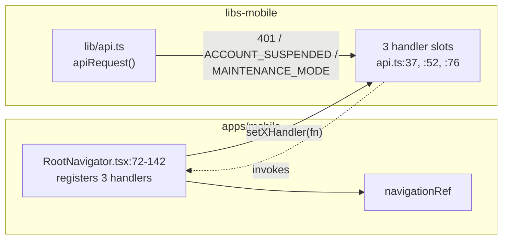

# Mobile Architecture — `apps/mobile`

> **Shape (from the App Profile in [`CLAUDE.md`](../../CLAUDE.md)):** Audience `consumer` ·
> Localisation **`i18n` — English + Tamil** · Realtime `none` · Push `fcm` · Auth: phone + OTP.
>
> **This is the only interactive citizen surface.** There is no consumer web app to mirror. The
> admin console (`apps/admin`) is a separate tool for a different audience — they share the API
> contract, not UI patterns.

Written by reading `apps/mobile` and `libs-mobile`. Every `path:line` below was opened. **The app
itself was never run** during this pass — no simulator, no Metro, no device — so rendering,
navigation timing and gesture behaviour are unverified. Everything below is source-level truth.

---

## Overview

Expo SDK **57**, React Native **0.86.2**, React **19.2.3**, TypeScript strict. **47 files /
~11,500 lines** in `apps/mobile/src`, plus **~5,700 lines** in `libs-mobile`. Server state is
TanStack Query; the bearer token lives in `expo-secure-store`; i18n is **i18next**, not next-intl.

Navigation is **React Navigation, not Expo Router.** There is no `app/` directory anywhere in
`apps/mobile`, and no `expo-router` dependency — `@react-navigation/native ^7.3.16` +
`native-stack` + `bottom-tabs` (`apps/mobile/package.json:6-8`).

> `CLAUDE.md:210` says i18n is wired *"via next-intl (or the RN equivalent message-catalog
> pattern)"*. The RN equivalent is what shipped, and the reason is written into the source:
> `libs-mobile/i18n/index.ts:1-4` records that next-intl is Next.js-only and does not run in React
> Native. Not a drift — the parenthetical outcome.

---

## Entry chain

`apps/mobile/package.json:4` sets `"main": "index.ts"`. Two modules run before React does:

**`apps/mobile/index.ts`** (13 lines):

1. `:3` — `import 'intl-pluralrules'`. Hermes has no `Intl.PluralRules`, and i18next v24+ ships no
   fallback. Without this, every pluralised string throws.
2. `:4` — `import '@uthavu/libs-mobile/i18n'` → **i18next `.init()` runs synchronously at module
   scope**, before the root component is registered. There is no loading state for translations.
3. `:13` — `registerRootComponent(App)`.

**`apps/mobile/App.tsx`** (42 lines) — the whole provider stack:

```
:32  <GestureHandlerRootView style={{ flex: 1 }}>
:33    <SafeAreaProvider>
:34      <QueryClientProvider client={queryClient}>
:35        <ThemeProvider>              ← @uthavu/libs-mobile/theme/ThemeProvider
:36          <AppShell />               ← RootNavigator + StatusBar
```

`AppShell` (`:12-28`) reads `useTheme()` for `isDark`, drives `<StatusBar>` from it (`:25`), and runs
one effect: `loadPersistedLocale()` (`:15-20`). The comment there is precise — i18next was already
initialised with the *device* locale in `index.ts`; this effect only applies an explicit user
override.

**There is no AuthProvider, no error boundary and no query persister.** Compare the admin console,
which has all three.

> **`const queryClient = new QueryClient();` at `App.tsx:10` — zero options.** No `defaultOptions`,
> no `staleTime`, no retry policy. Library defaults therefore apply app-wide: `staleTime: 0`, so
> every screen refetches on every mount and `['me']` is fetched independently by six screens; and
> `retry: 3` with exponential backoff, so a deterministic 403/404 holds a screen in loading→error
> for ~7 seconds across four round trips. The admin console sets `staleTime: 30_000, retry: 1`
> (`apps/admin/src/components/providers/query-provider.tsx:16-26`). Only two mobile hooks override
> anything, ad hoc (`src/hooks/useAds.ts:39-48`, `useConfig.ts:37-39`). Filed in
> [`../_audit/issues.md`](../_audit/issues.md).

---

## Navigation

Two navigators under `apps/mobile/src/navigation/`:

| File | Lines | Role |
|---|---|---|
| `RootNavigator.tsx` | 248 | native-stack + `NavigationContainer` + deep linking + the three API error handlers |
| `MainTabs.tsx` | 151 | bottom-tab navigator |
| `types.ts` | 41 | `RootStackParamList` |
| `tabTypes.ts` | 7 | `MainTabParamList` |

**25 registered screens** on the root stack (`RootNavigator.tsx:147-245`),
`initialRouteName="Splash"`, `screenOptions={{ headerShown: false }}` — the app has no native header
anywhere; every screen draws its own.

**5 bottom tabs** (`MainTabs.tsx:68-129`): Dashboard, My Helps, **Report (a FAB)**, Alerts, Profile.

The Report tab is a **press interceptor, not a screen**: its component returns `null`
(`MainTabs.tsx:25-27`) and the `tabPress` listener calls `e.preventDefault()` then
`rootNav.navigate('ReportFlow', {})` on the root stack (`:91-97`). The unread badge reuses
AlertsScreen's `['alerts']` query key so the cache is shared (`:48-49`, rendered `:113-114`), and
push registration fires on MainTabs mount — i.e. "the user is logged in" (`:41-43`).

**Deep linking** (`RootNavigator.tsx:47-62`): prefix `uthavu://`, mapping `requests/:reportId`,
`support/tickets/:ticketId`, and six more. A known limitation is documented at `:42-46` — a
signed-out recipient lands on RequestDetails and gets the ErrorState, not a login redirect.

### The auth gate — four distinct mechanisms

**1. Cold start is gated by `SplashScreen`,** not by a provider.
`src/screens/SplashScreen.tsx:41-63` awaits `hasSession()`, `hasSeenOnboarding()`,
`Linking.getInitialURL()` and an 800 ms floor (`MIN_DISPLAY_MS`, `:17`) in parallel, then:

```
sessionExists   → replace('RequestDetails', {reportId})  if a deep link is pending  (:54)
                → replace('MainTabs')                                               (:57)
onboardingSeen  → replace('Login')                                                  (:59)
otherwise       → replace('Onboarding')                                             (:61)
```

**2. A runtime 401 forces logout.** `RootNavigator.tsx:72-77` registers `setUnauthorizedHandler`
once at mount; it resets the stack to `Login`. It fires **only when `options.auth` is true**
(`libs-mobile/lib/api.ts:139-142`), so a wrong OTP on the unauthenticated send/verify calls does not
bounce the user.

**3. `403 ACCOUNT_SUSPENDED` is its own path** — `RootNavigator.tsx:95-111`: alert first, then
`clearToken()`, then reset to `Login`. Deliberately not the 401 path (`api.ts:44-49`), because the
user needs to be told *why*. A `suspendedShown` flag (`:85`) de-dupes parallel failures.

**4. `403 MAINTENANCE_MODE` / `READ_ONLY_MODE` is alert-only** — `RootNavigator.tsx:125-142`. **No
navigation, no token clear**: the platform is paused, the user is not in trouble.

All three handlers call `i18n.t(...)` imperatively at alert time rather than capturing a `t` from a
hook, because the registering effect has an empty dep array (`:86-88`, `:122-124`).

### The inversion this solves — worth copying

`libs-mobile` must not import from `apps/mobile`, and navigation lives in the app. So
`libs-mobile/lib/api.ts:30-34` exposes three **setter** functions — `setUnauthorizedHandler` (`:37`),
`setSuspendedHandler` (`:52`), `setPlatformBlockedHandler` (`:76`) — and `RootNavigator` registers
implementations into them at mount.



The library never imports the app; the arrow only ever points one way. This is the single most
architecturally interesting thing in the mobile codebase.

---

## Screens

40 files under `src/screens/**` — 37 `.tsx`, 3 `.ts`.

| Folder | Files | Notable |
|---|---|---|
| `screens/` | 15 | Splash, Onboarding, Login, Otp, Permissions, ProfileSetup (395), Settings, EditProfile, MissionJournal, InviteFriends, SavedStories, FlaggedComments, MyImpactStories, DeleteAccount, Legal |
| `screens/tabs/` | 4 | **`DashboardScreen.tsx` 768 — the largest file in the app**, `ProfileScreen` 494, `MyHelpsScreen` 458, `AlertsScreen` 286 |
| `screens/report/` | 5 (+2 steps) | `ReportFlowScreen` 497 (wizard host), `MyReportsScreen` 335, `EditReportScreen` 225, `reportDraft.ts`, `steps/ReportDetailsPage` 487, `steps/ReportLocationPage` 329 |
| `screens/discover/` | 1 | `CategoryListScreen` 565 |
| `screens/request-details/` | 8 | `VolunteerJourneyScreen` 518, `RequestDetailsScreen` 453, plus 6 section components |
| `screens/support/` | 6 | `SubmitTicketScreen` 405, `TicketDetailScreen` 404, `SupportHomeScreen` 379 |

**`screens/` also holds ten things that are not screens** — `CommunityComments.tsx`,
`RosterSection.tsx`, `MissionChat.tsx`, `ImpactStorySection.tsx`, `CompleteMissionSheet.tsx`,
`RequestDetailsSkeleton.tsx`, `TicketStatusPill.tsx`, plus pure logic (`report/reportDraft.ts`,
`support/support-faq.ts`, `support/ticket-display.ts`) and the two wizard step pages. There is no
`src/components/` convention to hold them; the app has exactly one app-level component,
`src/components/SponsorAd.tsx` (207 lines).

**There is effectively no hook layer.** `src/hooks/` holds two files (108 lines) while **25 of 47
screen files call `useQuery`/`useMutation` directly**. Worst: `DashboardScreen` (5 queries),
`VolunteerJourneyScreen` (5), `ProfileScreen` (4), `CommunityComments` (4). Compare the admin
console's `use-list-query.ts`.

### File naming is mixed here and nowhere else

`apps/api` is consistently kebab-case + Nest suffixes; `apps/admin` is consistently kebab-case.
`apps/mobile` runs three conventions at once: PascalCase screens (`DashboardScreen.tsx`), camelCase
logic (`reportDraft.ts`, `navigation/tabTypes.ts`) and kebab-case logic
(`support/support-faq.ts`, `support/ticket-display.ts`). `libs-mobile/api/` is single-word lowercase
except `impactStories.ts`.

---

## `libs-mobile/theme/` — the single source of truth

Three files, and **the split is legitimate**, not a second source of truth. There is exactly one way
to get a theme-aware colour and exactly one way to get a static value.

| File | Lines | Role | Importers |
|---|---|---|---|
| `theme/tokens.ts` | 192 | static palette + scales — **not** theme-aware | **64 files** |
| `theme/ThemeProvider.tsx` | 48 | resolves light/dark at runtime | **63 files** use `useTheme()` |
| `theme/colors.ts` | 47 | the two `ColorScheme`s the provider picks between | 59 imports, **all `import type`** — the only value-import in the entire repo is `ThemeProvider.tsx:4` |

**`tokens.ts` exports 9 consts:** `COLORS` (40 keys, `:8-66`), `CATEGORY_COLORS` (8 categories,
`:70-79`), `TONES` (9 `{fg, fill, border}` triplets, `:83-98`), `SIZES` (`:100-106`), `SPACING`
(`xxs:4 … xxxl:40`, `:111-120`), `RADIUS` (`sm:8 … round:27`, `:124-132`), `ICON_SIZE` (`:138-144`),
`BORDER_WIDTH` (`:149-152`), `TOUCH_TARGET` (`min:44`, `:159-161`), `TYPE` (a 19-step ramp,
`:169-192`).

**`colors.ts`** defines `ColorScheme` (10 fields, `:7-21`), `lightColors` (`:23-34`) and `darkColors`
(`:36-47`). `textOnTint` is `#FFFFFF` in **both** schemes by design (`:17-20`) — text on a green
button must never use `bg`.

**`ThemeProvider.tsx`** defaults to `'system'` (`:21`), reconciles against RN's `useColorScheme()`
(`:20`), persists the mode to `expo-secure-store` under `uthavu_theme_mode` (`:8`, `:24`, `:33`), and
`useTheme()` throws if used outside the provider (`:46`).

**The universal consumption pattern**, in every screen:

```ts
const { colors } = useTheme();                                 // ThemeProvider.tsx:44
const styles = useMemo(() => createStyles(colors), [colors]);
// …
const createStyles = (colors: ColorScheme) => StyleSheet.create({ … });
```

Live example: `MainTabs.tsx:34,36` with the factory at `:134-151`. Static tokens are imported
directly and mixed into the same stylesheet where a value does not vary by theme.

### Two coexisting text palettes — deliberate, and a trap for refactors

`tokens.ts:27-29` and `:35-40` record that `COLORS` carries **two** parallel text families: a gray
family (`bgWhite`, `textPrimary #111827`, `textSecondary #6B7280`) used by the auth-era screens
(Splash / Onboarding / Login / OTP / Permissions / ProfileSetup), and a slate family used by the
product-era screens. The comment explicitly says do not retrofit.

**This is why a naive "use `colors.textPrimary` everywhere" pass would regress the auth flow.**

### What the theme does *not* have

| Scale | Status |
|---|---|
| `lineHeight` | **no scale** — 28 distinct literals in use (15–30) |
| `borderWidth` | `BORDER_WIDTH` exists, but bare `1` appears ~120× across 40 files |
| shadow / elevation | **no scale** — only `MainTabs.tsx:144-150` uses shadows; the app is deliberately flat |
| opacity | **no scale** — "disabled" alone is spelled five ways: 0.45 / 0.5 / 0.55 / 0.6 / 0.7 |
| z-index, duration, easing | **no scale** |
| width / height in `SIZES` | **none** — `SIZES` is padding + 4 radii only; every box dimension is a raw number (`36` appears 18×) |

Font sizes `8.5 · 9 · 9.5 · 10.5 · 11.5 · 13.5 · 14.5 · 18 · 24` are absent from `TYPE`, as is weight
`'900'`. Spacing `1 2 3 5 6 10 14` and radii `2 4 5 6 9 13 18 19 20 22 23 26 32` are absent from
`SPACING` / `RADIUS`.

**Consequence, and it is the important one:** ~103 colour literals, 135+ typography literals and
hundreds of numeric literals **cannot be tokenised by find-and-replace** — the values must first be
added to `tokens.ts` at their exact current numbers. Snapping any of them to a near token changes
pixels.

**74 hardcoded hex colours remain in `apps/mobile/src`**, concentrated in `DashboardScreen` (13),
`ReportDetailsPage` (10), `MyReportsScreen` (10), `ProfileScreen` (8), `ReportFlowScreen` (8). These
bypass the theme entirely, so they do not respond to dark mode. A GitHub board card claiming this
work was done is closed and the work is not done — see the audit's Addendum E.

Two live duplications worth naming: `CAT_ACCENT` is defined **twice with byte-identical values**
(`screens/report/ReportFlowScreen.tsx:44-53` and `steps/ReportDetailsPage.tsx:37-45`), neither in the
theme, competing with `CATEGORY_COLORS`; and `colors.ts` restates 12 hex values that already live in
`COLORS` rather than referencing them.

---

## `libs-mobile` structure

```
libs-mobile/
├── api/          10 files, 1,223 lines   # one module per API domain
├── components/   26 components + barrel, 2,120 lines
├── data/          2 files                # CATEGORIES, PROFESSIONS
├── i18n/          index.ts + useAppLocale.ts + locales/{en,ta}/*.json
├── lib/           7 files                # api.ts, session.ts, push.ts, time.ts, geocode.ts…
└── theme/         3 files                # above
```

**`libs-mobile/package.json` has no `main` and no `exports` map**, so consumers deep-import source
paths through the pnpm workspace symlink: 40 imports of `@uthavu/libs-mobile/theme/tokens`, 39 of
`…/theme/ThemeProvider`, 38 of `…/theme/colors` — **~117 deep imports total**. Every internal file
move in the lib is a breaking change across the app. The components barrel
(`components/index.ts:4-10`) states this is deliberate for now.

### `lib/api.ts` — the HTTP client (165 lines)

- **Base URL** read once at module scope: `const BASE_URL = process.env.EXPO_PUBLIC_API_URL;` (`:8`).
  A guard at `:81-83` throws a clear `ApiError(0, 'EXPO_PUBLIC_API_URL is not set — see
  apps/mobile/.env.example')` rather than silently fetching `undefined/...`.
- **`ApiError`** (`:13-22`) carries `status: number` and `code?: string`, thrown at `:161` as
  `new ApiError(res.status, data?.message ?? …, data?.code)`.
- **Bearer attach is opt-in** (`:89-92`): `if (options.auth) { const token = await getToken(); … }`.
  The default is *unauthenticated*, and `auth: true` is written 45× — so a new endpoint added
  without the flag 401s silently. Attached in exactly one place, which is right; opt-in is the
  hazard.
- **`credentials: 'omit'`** (`:112`) with a 9-line rationale (`:104-111`): RN's fetch otherwise
  stores better-auth's `Set-Cookie` in the OS cookie jar, which then trips better-auth's origin
  check, since native fetch never sends `Origin`.
- **Network failure is distinguishable** — a fetch rejection is re-thrown as
  `ApiError(0, …, 'NETWORK_UNREACHABLE')` (`:114-126`), so "server is down" is not confused with
  "request rejected".
- FormData bodies get no manual `Content-Type` so fetch can set the multipart boundary (`:87-88`).
  `204`/`202` return `undefined` (`:128-130`).

### `libs-mobile/api/*` — response validation is split

`config.ts:117`, `ads.ts:176` and `tickets.ts:311,318,331,338,355` fetch `unknown` and run a
`normalize*()` validator before returning. The other six (`reports`, `missions`, `users`, `alerts`,
`comments`, `impactStories`) cast straight to a hand-written interface. **A server field rename is a
graceful default in three modules and a runtime `undefined` in six.**

`tickets.ts` (363 lines) is the counter-example done right: it exports the server's caps
(`TICKET_SUBJECT_MAX=150`, `TICKET_DESCRIPTION_MAX=2000`, `TICKET_MESSAGE_MAX=2000`, `:149-152`) and
both screens apply them as `maxLength`. Four other flows do not mirror the server cap at all —
comment body (server 1000), mission chat (2000), edit-report description (server min 20), completion
note (1000) — so the user hits a 400 they could not have predicted.

### `libs-mobile` restates four `libs-common` constants locally

`lib/api.ts:42,62,63,65` redeclares `ACCOUNT_SUSPENDED`, `MAINTENANCE_MODE`, `READ_ONLY_MODE` and
`PlatformBlockCode`, all of which `libs-common/src/index.ts:14-24` already exports and both
`apps/api` and `apps/admin` already import. **`libs-mobile/package.json` declares
`@uthavu/libs-common: workspace:*` and never imports it.** A rename in `libs-common` type-checks
clean and silently kills the mobile suspension banner.

---

## Auth token storage

**`expo-secure-store`. One file, one key.** `libs-mobile/lib/session.ts` (45 lines):

| Item | Line | Value |
|---|---|---|
| Token key | `:7` | `uthavu_session_token` |
| Onboarding key | `:8` | `uthavu_onboarding_seen` |
| `getToken` / `setToken` / `clearToken` | `:10-20` | SecureStore get/set/delete |
| `hasSession()` | `:22-25` | `token != null` — the boolean the Splash gate reads |
| `clearAllForTesting()` | `:40-45` | dev escape hatch; iOS Keychain survives reinstall (`:37-39`) |

Sessions are long-lived (60-day sliding, `docs/features/auth.md` BR-6). **There is no refresh-token
flow on the client** — the client stores the raw token only; expiry and rotation are the server's job
via better-auth's `session` table (`session.ts:1-3`).

Two other SecureStore keys exist, owned elsewhere: `uthavu_theme_mode`
(`theme/ThemeProvider.tsx:8`) and `uthavu_locale` (`i18n/index.ts:59`).

---

## i18n — English + Tamil

**Library: i18next `^26.3.6` + react-i18next `^17.0.11` + expo-localization**
(`apps/mobile/package.json:22,26,17`), plus `intl-pluralrules` (`:23`) — required, not optional.

**Catalogs:** `libs-mobile/i18n/locales/{en,ta}/*.json` — **13 namespaces × 2 locales = 26 files**,
statically imported (`index.ts:15-40`) and bundled into `resources` (`:82-113`). Namespaces: `auth`,
`common`, `deleteAccount`, `flaggedComments`, `impactStories`, `invite`, `legal`, `missionJournal`,
`report`, `requestDetails`, `sponsor`, `tabs`, `tickets`.

**Key parity: 577 / 577 — exact, zero missing Tamil keys.** Independently recounted against the tree
at commit `96f6386`; a symmetric-difference check of every key path per namespace returned empty for
all 13.

> **Correction to the 2026-09-02 audit.** That audit reported **523/523**
> (`../_audit/2026-09-02-end-to-end-product-audit.md:1073`). The *claim* — full parity, 13
> namespaces — holds; the *number* was taken before commit `fae8d6c` added the `sponsor` namespace
> and the maintenance / read-only / suspension strings. 577 is the current figure.

### The qualifier that belongs on every "Tamil is complete" statement

`libs-mobile/i18n/index.ts:6-9` states that **every `ta/*.json` string is machine-generated, not
human-translated**, and asks that a native-speaker review precede production. Key parity is not
translation quality. This is an [open question](../_audit/open-questions.md) with a real ship date
attached.

### Init and persistence

`i18next.init()` runs at module scope (`index.ts:81-122`) with `lng: detectDeviceLocale()` (`:114`),
`fallbackLng: 'en'` (`:115`), `defaultNS: 'common'` (`:116`). `detectDeviceLocale()` (`:61-79`) reads
`Localization.getLocales()[0].languageCode` and maps `'ta' → 'ta'`, else `'en'` — wrapped in
try/catch with a 12-line comment (`:62-72`) explaining that a throw here aborts the entry module and
kills the app with `"main" has not been registered`.

`:119-121` deliberately does **not** set `compatibilityJSON` — modern CLDR pluralisation is the v24+
default.

Locale is persisted to `expo-secure-store` under `uthavu_locale` (`:59`), read at startup by
`loadPersistedLocale()` (`:129-134`, called from `App.tsx:19`) and written by `setAppLocale()`
(`:136-139`).

**The switcher** is `src/screens/SettingsScreen.tsx:45-65`: two options (`English`, `தமிழ்`), and
`onSelectLocale` calls `setLocale(next)` **then** best-effort syncs to the server with
`updateLocale` (`libs-mobile/api/users.ts:59` → `PATCH /users/me/locale`). Local first; the server
copy is what the *backend* uses to pick a language for alerts and announcements.

`libs-mobile/i18n/useAppLocale.ts` (19 lines) mirrors `ThemeProvider`'s `{mode, setMode}` shape and
subscribes to i18next's `languageChanged` event (`:12-15`) so components re-render. **There is no
i18n React context** — i18next owns the state.

### Coverage gaps

Of the 37 `.tsx` screen files, **exactly one has a real translation gap**:
`src/screens/report/MyReportsScreen.tsx` (335 lines) never calls `useTranslation` and builds a
visible tab label from raw English at `:111`
(`const label = tab.charAt(0).toUpperCase() + tab.slice(1);`).
`request-details/RequestDetailsSkeleton.tsx` also has no hook, but renders only grey boxes and zero
text — not a gap.

> **Second correction to the audit,** which reported *"4 of 37 screens never call
> `useTranslation`"* (`../_audit/2026-09-02-end-to-end-product-audit.md:1073`, listed at `:1102-1104`).
> Two of those four have since been translated, and one was `RequestDetailsSkeleton`. The real count
> is **one**.

**A gap the audit did not record, on the most-seen surface in the app:** the tab bar itself is
untranslated. `MainTabs.tsx:72,82,112,124` hardcode `'Home'`, `'My Helps'`, `'Alerts'`, `'Profile'`,
plus the a11y label `'Report a help request'` at `:100` — despite a fully populated `tabs` namespace
of 136 keys.

Three components in `libs-mobile` are themselves localised (`SearchField.tsx:55`,
`TextField.tsx:84`, `CloseButton.tsx:30`); the rest take copy as props.

Imperative `t()` outside React render is legitimate in two places: the API error handlers
(`RootNavigator.tsx:98,131,132,135`) and `libs-mobile/lib/time.ts:10-36`, whose eight calls all pass
`{ count }` — which is precisely why `intl-pluralrules` is a hard requirement.

---

## Known correctness issue on the edit path

`src/screens/report/EditReportScreen.tsx:30-50` fills four `useState`s from the
`['report', reportId]` query **inside a `useEffect`**. Because the QueryClient sets no `staleTime`,
any refetch — reconnect, remount, or the sibling `invalidateQueries(['report', reportId])` at `:62` —
yields a new `report` identity and **overwrites whatever the user is currently typing**. The
locked-report guard sits in the same effect and re-fires on every refetch.

This is the exact anti-pattern `CLAUDE.md:199-200` bans for admin forms. It is also an *internal*
inconsistency, not an unknown pattern: `src/screens/EditProfileScreen.tsx:52-58,74-86` already does
it correctly — split child, seeded from props at mount, no effect.

The same file carries the loosest client validation in the app and renders three untranslated
English strings (`:45,46,64,69`). **Three independent findings converge on one file**, which makes it
the highest-value single fix in the mobile app.

---

## Platform config, sponsors, push

- **`src/hooks/useConfig.ts`** (43 lines) reads `GET /config` and returns `PlatformConfig`, with
  `DEFAULT_PLATFORM_CONFIG` (`libs-mobile/api/config.ts:41`) as the fallback. The report flow sizes
  its UI from it — `ReportFlowScreen.tsx:153`, `steps/ReportDetailsPage.tsx:119` renders `maxPhotos`
  slots and `:237-244` clamps the volunteer stepper.
- **`src/hooks/useAds.ts`** (65 lines) + `src/components/SponsorAd.tsx` (207) render sponsor
  creative. Mobile declares four placements (`libs-mobile/api/ads.ts:61`) and renders **three** —
  `home`, `category_list`, `impact_stories`. `community_impact` has no renderer.
- **Push registration** — `libs-mobile/lib/push.ts:20` `registerForPushNotifications()`, called from
  `MainTabs.tsx:41-43`; permission plumbing in `libs-mobile/lib/notifications.ts`, where
  `isPushSupported = !isRunningInExpoGo()` (`:28`). Token goes to `POST /devices`
  (`libs-mobile/api/users.ts:63`). See [`integrations.md`](./integrations.md#push--fcm).

---

## Testing posture

**Zero unit tests. Maestro E2E is real and well organised.**

`apps/mobile/.maestro/` — 12 files, 618 lines: `config.yaml` plus four numbered flows covering
exactly the critical journeys the App Profile names, and six shared utils.

| Flow | Lines | Journey |
|---|---|---|
| `01-otp-login.yaml` | 20 | OTP login → first-time signup → Profile Setup → Home |
| `02-report-a-request.yaml` | 57 | category → photo → details → location → privacy → review → publish |
| `03-accept-and-volunteer.yaml` | 61 | accept + confirm inside the 15-minute window |
| `04-complete-mission.yaml` | 76 | proof photo + note, report closes |

Flows 03 and 04 seed their fixtures over HTTP (`utils/seed-user.js`, `seed-report.js`,
`accept-and-confirm.js`) so they test only the leg they are named for. `config.yaml:7-8` deliberately
excludes `flows/utils/` from discovery — sub-flows need caller-supplied env vars and are not
independently runnable. Each flow provisions its own users, so the declared order
(`config.yaml:14-19`) is for report readability only, not dependency.

**Maestro depends on the dev-OTP fallback** ([ADR 0007](../decisions/0007-temporary-dev-otp-fallback.md)):
`utils/get-otp.js:10` polls `GET /dev/otp?phone=…`. With real msg91 credentials set, every flow fails
at login **by design** — recorded at `.maestro/README.md:17-30`.

> Two operational notes for whoever runs these: `EXPO_DEV_URL` has no default (`README.md:34-36`) —
> silently testing another project's bundle is judged worse than failing loudly. And `/dev/otp`
> needs the `+` percent-encoded (`?phone=%2B91…`); a literal `+` decodes to a space and misses the
> Redis key at `apps/api/src/dev/dev-otp.controller.ts:19`.

**`apps/mobile/package.json` has no `lint`, `build` or unit-`test` script** — only `dev`/`start`,
the platform variants, and `test:e2e` (`maestro test .maestro`). Maestro is an external binary, not a
declared dependency. The root `pnpm -r run lint/build/test` is a no-op for this package.

---

## Config

- **`app.json`** — scheme `uthavu` (`:5`), `userInterfaceStyle: "automatic"` (`:9`), iOS bundle
  `com.uthavu.app` (`:15`), Android permissions `ACCESS_COARSE_LOCATION`, `ACCESS_FINE_LOCATION`,
  `CAMERA`, `POST_NOTIFICATIONS` (`:29-34`), plugins `expo-secure-store`, `expo-location`,
  `expo-camera`, `expo-notifications`, `expo-localization` (`:39-55`).
- **`eas.json`** — `appVersionSource: "remote"` (`:4`); `development` profile with
  `developmentClient: true` + Android `apk` + internal distribution (`:7-14`); `production` with
  `autoIncrement` only. Submit profiles are empty.
- **`tsconfig.json`** — extends `expo/tsconfig.base`, `strict: true`, **no `paths` aliases**;
  `@uthavu/libs-mobile/*` resolves through the pnpm workspace symlink and Metro.
- **`.env.example`** — one variable: `EXPO_PUBLIC_API_URL=http://localhost:3001`.

---

## Related docs

- System map: [`system.md`](./system.md) · the API it calls: [`backend.md`](./backend.md)
- The other client: [`frontend.md`](./frontend.md)
- Push, OTP and uploads: [`integrations.md`](./integrations.md)
- [ADR 0015](../decisions/0015-has-accepted-is-the-single-access-gate.md) — why Mission Chat and the
  phone reveal are gated server-side, not by this app

---

_Last verified against commit `96f6386`._
