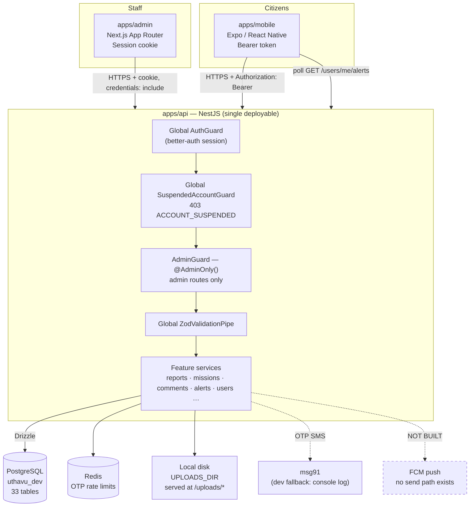
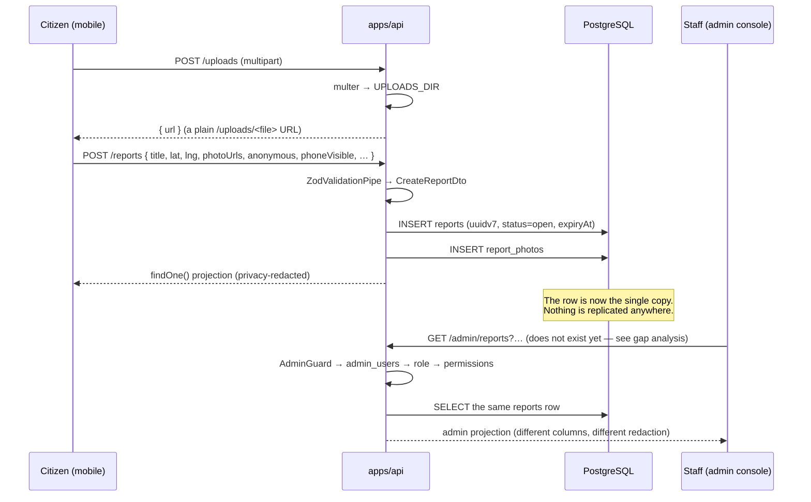

# System Architecture

> **Shape (from the App Profile in [`CLAUDE.md`](../../CLAUDE.md)):** Surfaces `mobile` · `admin` ·
> `marketing` (not scaffolded) — Form factor `desktop-first` (admin only) — Tenancy `single-tenant`
> — Localisation `i18n` (en + ta, mobile only) — Realtime `none`.

This document was written by reading the code, not the older `docs/` spec. Every `path:line` below
was opened and confirmed. Where it contradicts an older doc, the code wins and the contradiction is
named.

---

## The one-sentence answer

**There is one PostgreSQL database and one NestJS API. The mobile app writes rows; the admin console
reads and mutates the same rows through the same API. No second database, no ETL, no sync job, no
message bus, no realtime channel.**

The admin console is not a mirror of mobile data — it is a second *client* of the same service.

---

## Stack at a glance

| Layer | Technology | Evidence |
|---|---|---|
| API | NestJS 11 on Express | `apps/api/src/main.ts:8-13` |
| ORM / DB | Drizzle → PostgreSQL 16 | `apps/api/src/db/index.ts:25-27`, `docker-compose.yml:2-20` |
| Auth | better-auth via `@thallesp/nestjs-better-auth` | `apps/api/src/auth/auth.ts:49-56`, `apps/api/src/app.module.ts:30-36` |
| Validation | Zod DTOs through a global `ZodValidationPipe` | `apps/api/src/app.module.ts:52` |
| Cache / rate-limit | Redis | `apps/api/src/redis/redis.module.ts`, `apps/api/src/auth/otp/otp-rate-limiter.ts` |
| Object storage | Local disk (deliberate — [ADR 0008](../decisions/0008-local-disk-photo-storage.md)) | `apps/api/src/main.ts:18` |
| Mobile | Expo / React Native, bearer token | `libs-mobile/lib/api.ts:41-53` |
| Admin | Next.js 16 App Router, cookie session | `apps/admin/package.json`, `apps/admin/.env.example:3-6` |

## Runtime topology (local dev, verified 2026-08-27)

| Container | Host port | Notes |
|---|---|---|
| `uthavu-api` | `3001` | `docker-compose.yml:37-59`. `NODE_ENV` deliberately unset so the dev OTP fallback stays active ([ADR 0007](../decisions/0007-temporary-dev-otp-fallback.md)). |
| `uthavu-postgres` | `5433` → 5432 | db `uthavu_dev`, user `uthavu` (`docker-compose.yml:6-13`) |
| `uthavu-redis` | `6380` → 6379 | `docker-compose.yml:26-28` |
| `apps/admin` (dev) | `3002` | `next dev -p 3002` (`apps/admin/package.json`) |

---

## System diagram



**What is deliberately absent from that diagram:** an admin-side database, a read replica, a
reporting warehouse, a queue between mobile and admin, and any websocket/SSE channel. The App
Profile pins `realtime: none`; the alerts table is an append-only log polled over HTTP
(`apps/api/src/db/schema/alerts-schema.ts:1-6`, `apps/api/src/alerts/alerts.controller.ts:12-15`).

---

## How a row travels: mobile write → admin read

Trace one report end to end. Every step is a real code path.



1. **Upload.** `POST /uploads` writes the file to `UPLOADS_DIR` and returns a URL
   (`apps/api/src/uploads/uploads.controller.ts:18`, ADR 0008). The URL is served back statically
   *outside* the auth guard by design — `apps/api/src/main.ts:14-18`.
2. **Create.** `ReportsService.create()` inserts one `reports` row plus its `report_photos`
   (`apps/api/src/reports/reports.service.ts:66-106`). Primary keys are UUIDv7 generated in
   application code (`uuidv7()`), not by the database.
3. **Persist.** That is the only copy of the row. `apps/api/src/db/index.ts:25-27` constructs a
   single `db` client with no tenant wrapper — single-tenant, so no `org_id` and no `forOrg()`
   anywhere.
4. **Admin read.** An admin route resolves the caller through `AdminGuard`
   (`apps/api/src/admin/admin.guard.ts:29-77`) and then queries the same table. The projection is
   the admin's own — it is **not** `ReportsService.toResponse()`, which is built for citizens and
   redacts (see [`admin-console-integration.md`](./admin-console-integration.md)).

> **Correcting the older docs.** `docs/USER-JOURNEYS.md:127` claims publishing a report saves
> nothing ("No API, no context, no storage"). That is false against the code as it stands:
> `ReportsService.create()` persists a `reports` row and its photos, and the live dev database
> currently holds 31 report rows. That line described a prototype that never existed in this repo.

---

## Service boundaries

- **`apps/api`** owns *all* persistence, *all* business rules, and *all* authorization. Both
  clients are thin. There is no business rule that lives only in a client — the ones that used to
  be duplicated (expiry defaults, edit-lock) were moved server-side deliberately
  (`apps/api/src/db/schema/reports-schema.ts:15-17`, `apps/api/src/reports/reports.service.ts:566`).
- **`apps/mobile`** owns citizen UX and i18n (en/ta). It holds a bearer token in secure storage and
  sends `Authorization: Bearer` (`libs-mobile/lib/api.ts:50-53`).
- **`apps/admin`** owns staff UX. It authenticates with a **session cookie**, not a bearer token
  (`apps/admin/.env.example:3-6`), which is why CORS matters for it and not for mobile.
- **Nothing** owns a second copy of the data.

---

## Request lifecycle (an authenticated route)

1. Express receives the request. `bodyParser: false` at the Nest level; the better-auth module
   re-adds JSON/urlencoded parsing for non-auth routes (`apps/api/src/main.ts:9-13`,
   `apps/api/src/app.module.ts:30-36`).
2. If the path is under `/api/auth`, better-auth's own handler serves it and Nest never sees it.
3. `@thallesp/nestjs-better-auth` registers a **global `AuthGuard`**. Every controller in this app
   is authenticated by default with no decorator — see the note at
   `apps/api/src/users/users.controller.ts:14-15`. Verified live: `GET /reports/categories` with no
   credentials returns `401`.
3a. A second global guard, `SuspendedAccountGuard`, runs immediately after
   (`apps/api/src/account-status/account-status.module.ts:28`). If the caller's account is suspended it throws `403` with
   `code: 'ACCOUNT_SUSPENDED'` — never `401`, because a `401` is indistinguishable from an expired
   session and the client must not silently re-authenticate its way past a suspension
   (`apps/api/src/account-status/account-status.ts:49-62`). It gates on the *caller's* id only and
   never looks at anyone else's status, which is what lets a volunteer keep helping a suspended
   reporter — [ADR 0011](../decisions/0011-user-suspension-blocks-login-not-content.md).
4. On admin routes only, `@AdminOnly()` swaps the global auth guard's 401 for
   `OptionalAuth() + AdminGuard` (`apps/api/src/admin/admin.decorators.ts:37-38`) so every rejection is
   a uniform `403` with a machine-readable `code` (`ADMIN_NO_SESSION` / `ADMIN_NOT_AN_ADMIN` /
   `ADMIN_MISSING_PERMISSION`).
5. The global `ZodValidationPipe` validates params/query/body against the route's DTO
   (`apps/api/src/app.module.ts:52`).
6. The service runs the rule and hits Postgres through Drizzle.
7. The controller returns a plain object. **There is no global response envelope and no global
   exception filter** — errors are whatever Nest's default `HttpException` serialiser emits
   (`{"message":"Unauthorized","statusCode":401}`, verified live). Both clients must parse that
   shape, not a `{ data, error }` wrapper.

---

## Cross-cutting concerns

| Concern | Where | Note |
|---|---|---|
| Auth / sessions | `apps/api/src/auth/auth.ts:49-56`; global guard via `apps/api/src/app.module.ts:30-36` | Bearer plugin for mobile (`auth.ts:171`), cookies for admin |
| Admin authorization | `apps/api/src/admin/admin.guard.ts:29-79` | Shipped. Session-derived identity, DB-resolved role, ANDed permissions, no super-admin bypass |
| Validation | `apps/api/src/app.module.ts:52` + `*/dto/*.ts` | `z.coerce.*` on query params |
| Rate limiting | `apps/api/src/auth/otp/otp-rate-limiter.ts` (Redis) | **OTP send only.** No global throttler on any other route. |
| Error shaping | none | Nest defaults; no interceptor, no filter |
| Logging / request id | none | No correlation id, no structured logger |
| Account suspension | `apps/api/src/account-status/suspended-account.guard.ts:39-82`, registered globally at `apps/api/src/account-status/account-status.module.ts:28` | Blocks authenticated requests from a suspended caller; login is blocked separately at `auth.ts:128-141`. [ADR 0011](../decisions/0011-user-suspension-blocks-login-not-content.md) |
| Admin audit trail | `apps/api/src/admin/admin-audit.service.ts:56-89` | Explicit `record()` calls, transaction-aware. [ADR 0012](../decisions/0012-admin-audit-log-before-the-first-mutating-endpoint.md) |
| CORS | `apps/api/src/main.ts:41-45` | Exact-origin allowlist from `ADMIN_URL`, `credentials: true`, `PATCH` included |

### CORS — configured, and a correction to an earlier claim in this document

> **This section previously said CORS was not configured, that the browser blocked every call from
> `apps/admin`, and that nothing was testable until it was fixed. That was wrong**, and the
> correction is more useful than the original claim.
>
> CORS was in fact working, via better-auth's `trustedOrigins`-derived middleware. The real fault
> was that `ADMIN_URL` pointed at port **3000** — a stale prototype address — while the console runs
> on **3002** (`apps/admin/package.json:7`). An origin that is not on the allowlist looks
> identical, from the browser, to CORS not being configured at all.

**The trap.** An untrusted origin still receives a `204` preflight carrying
`Access-Control-Allow-Credentials`, `Access-Control-Allow-Methods` and
`Access-Control-Allow-Headers`. Only `Access-Control-Allow-Origin` is withheld. So **"the preflight
returned 204" is not evidence that CORS works**, and neither is the presence of the other
`Access-Control-*` headers. Read `Access-Control-Allow-Origin`, for the specific origin you care
about, or you will reach the wrong conclusion — as this document did.

Verified live, 2026-08-28:

```
$ curl -si -X OPTIONS http://localhost:3001/reports/categories \
    -H 'Origin: http://localhost:3002' -H 'Access-Control-Request-Method: PATCH'
HTTP/1.1 204 No Content
Access-Control-Allow-Origin: http://localhost:3002        ← present
Access-Control-Allow-Credentials: true
Access-Control-Allow-Methods: GET,HEAD,POST,PATCH,PUT,DELETE,OPTIONS

$ curl -si -X OPTIONS http://localhost:3001/reports/categories \
    -H 'Origin: http://evil.example' -H 'Access-Control-Request-Method: GET'
HTTP/1.1 204 No Content
Access-Control-Allow-Credentials: true                    ← still sent
Access-Control-Allow-Methods: GET,HEAD,POST,PATCH,PUT,DELETE,OPTIONS
        ← Access-Control-Allow-Origin withheld: this is the refusal
```

**How it is configured now.** `apps/api/src/main.ts:41-45` owns CORS explicitly:

- `origin` is an exact-match allowlist built from `ADMIN_URL` (`main.ts:38-40`), never `*` — every
  admin request carries a session cookie, so responses set
  `Access-Control-Allow-Credentials: true`, and a browser refuses to pair that with a wildcard.
  An unset `ADMIN_URL` leaves the list empty, refusing every cross-origin caller, which is the right
  way to fail.
- The method list explicitly includes **`PATCH`** (`main.ts:44`). The library's derived list is
  `GET/POST/PUT/DELETE` with no `PATCH`, and the console's moderation actions are PATCHes — that
  omission would have surfaced later as a second mystifying CORS failure (`main.ts:20-23`).
- `apps/api/src/app.module.ts:39` sets `disableTrustedOriginsCors: true`, because running both this
  and the library's middleware emits `Access-Control-Allow-Origin` twice, which browsers reject
  outright. better-auth's `trustedOrigins` check itself stays in force (`auth.ts:58-61`) — that is a
  cross-site request defence on the auth routes, not a CORS setting.

Mobile is unaffected either way: React Native's `fetch` sends no `Origin` header and is not subject
to CORS.

### What has actually shipped (state at 2026-08-28)

Several lanes have landed work since this document was first written. Re-verified against the code
and the live database on 2026-08-28.

**Admin identity and RBAC — shipped.**

- `admin_roles` / `admin_permissions` / `admin_role_permissions` / `admin_users`
  (`apps/api/drizzle/0017_gigantic_marvel_zombies.sql`, applied). Live DB: roles `super_admin`,
  `ops_admin`; six permissions `analytics:view`, `comments:manage`, `data:delete_all`,
  `platform:manage`, `reports:manage`, `users:manage`; 2 admin users.
- **"No admin access" is modelled as the *absence* of an `admin_users` row**, not a `role` column
  with a default. There is no `role` column on `user` at all, so there is no default value that
  could ever mean "admin" — the reasoning is written into the schema at
  `apps/api/src/db/schema/admin-schema.ts:11-17`. This is the exact inverse of the prototype's
  fail-open `isSuperAdmin = roleParam !== 'ops'`, where every value except one literal string
  granted Super Admin. Absence of a row is absence of access, and it is the only default that fails
  closed.
- `AdminGuard` (`apps/api/src/admin/admin.guard.ts:29-79`) reads **only** the user id off the
  verified session and resolves the role from the database. Every exit is `true` or a throw; there
  is no fallthrough. Required permissions are ANDed (`:66-68`), with no super-admin bypass —
  `super_admin` passes because the seed grants it all six as real rows (`:60-65`).
- Registered as a **provider, not an `APP_GUARD`** (`apps/api/src/admin/admin.module.ts:9-13`),
  deliberately opt-in per controller so it can never run on the citizen API.
- Three routes on `apps/api/src/admin/admin.controller.ts`: `GET /admin/me` (`:38-41`),
  `GET /admin/dashboard` (`:44-47`), `GET /admin/admins` gated on `platform:manage` (`:57-61`).
  Verified live 2026-08-28: an unauthenticated `GET /admin/me` returns
  `403 {"code":"ADMIN_NO_SESSION"}` — the container is running this code.

**Admin sign-in — shipped.** better-auth `emailAndPassword` is enabled with
**`disableSignUp: true`** (`apps/api/src/auth/auth.ts:85-89`). That flag is load-bearing: enabling
email+password without it would publish `POST /api/auth/sign-up/email` to the internet and let
anyone mint a `user` row on a product where the only route to becoming a user is verifying a real
phone number over real SMS. It would not grant admin access — an admin is a row in `admin_users`,
and nothing self-service writes one — but it would be an open registration endpoint. Admin accounts
are provisioned by `pnpm db:seed`. Existing phone users are unaffected: sign-up-on-verify creates
them with a synthetic `@phone.uthavu.local` address and no credential account, so `/sign-in/email`
finds no password to check and refuses them.

There is deliberately **no password reset**: `/forget-password` returns `400
RESET_PASSWORD_DISABLED` because `sendResetPassword` is unset, and it is unset because this project
has no email provider ([ADR 0003](../decisions/0003-no-email-provider-at-launch.md)). Rotate a
seeded admin's password with `SEED_ADMIN_FORCE_PASSWORD_RESET=true pnpm db:seed`
(`auth.ts:80-84`). A production-only rate limit caps `/sign-in/email` at 5/minute
(`auth.ts:103-107`).

**Admin audit trail — shipped** (migration 0018, applied). Three tables plus `AdminAuditService`,
built *before* the first mutating admin endpoint rather than after. See
[ADR 0012](../decisions/0012-admin-audit-log-before-the-first-mutating-endpoint.md).

**Account suspension — shipped end to end** (migration 0019, applied). Blocks login
(`apps/api/src/auth/auth.ts:128-141`) and authenticated requests (global guard,
`apps/api/src/account-status/account-status.module.ts:28`); never touches content. Driven by
`POST /admin/users/:id/suspend` and `POST /admin/users/:id/reactivate`
(`apps/api/src/admin/admin-users.controller.ts:63-76`). See
[ADR 0011](../decisions/0011-user-suspension-blocks-login-not-content.md).

**The `/admin` surface has grown well past the three routes described above.** As of 2026-08-28 it
is **eight controllers**: `admin` (root), `admin/reports`, `admin/users`, `admin/report-categories`,
`admin/support-tickets`, `admin/audit-logs`, `admin/analytics`, and the comments routes. This
document does not enumerate them — see
[`admin-console-integration.md`](./admin-console-integration.md) and the per-module API docs, and
re-grep `@Controller(` under `apps/api/src/admin/` before relying on any list, including that one.

**`apps/admin` is a real Next.js application, not an empty scaffold.** Next.js 16 App Router on
port **3002** (`apps/admin/package.json:7`), Tailwind v4 CSS-first (no `tailwind.config.js`),
TanStack Query, a hand-rolled UI kit (no shadcn registry). Two route groups: `(auth)` for login and
`(console)` for everything behind the session guard
(`apps/admin/src/app/(console)/layout.tsx:23-34`). All eight sections exist with
`page.tsx` + `loading.tsx` + `error.tsx` per segment. Sign-in, sign-out, the session guard, the
Dashboard counters and the Admins list are **wired to the real API**; the remaining sections render
an explicit "Not built yet" placeholder rather than fabricated data
(`apps/admin/src/components/layout/section-placeholder.tsx:37-41`).

**Resolved since the first pass:** the `ops_admin` / `moderator` role-key mismatch between the two
lanes. The console now takes both key and label from `GET /admin/me` and keeps no local label map
(`apps/admin/src/lib/roles.ts:12-27`, `apps/admin/src/lib/session.ts:82`). See
[`../_audit/issues.md`](../_audit/issues.md) issue 1 for the full correction.

---

## Related docs

- **[Admin ↔ mobile integration map](./admin-console-integration.md)** — the entity → section
  matrix, gap analysis, privacy boundary, and moderation write paths. Start there if you are
  building the admin console.
- [Data architecture](./data.md) — tables, relations, invariants.
- [ADR 0009](../decisions/0009-admin-scoped-api-surface.md) — why admin endpoints get their own
  `/admin/*` controllers.
- [ADR 0010](../decisions/0010-mission-chat-is-not-readable-by-admins.md) — why no admin endpoint
  may return Mission Chat messages.
- [ADR 0011](../decisions/0011-user-suspension-blocks-login-not-content.md) — what suspension does,
  and the volunteer scenario it exists to protect.
- [ADR 0012](../decisions/0012-admin-audit-log-before-the-first-mutating-endpoint.md) — the audit
  trail, and why it shipped first.
- [ADR 0005](../decisions/0005-no-realtime-transport-yet.md) — why there is no realtime channel.

---

_Last verified against working tree at commit `d035cfd`, 2026-08-28. The `apps/api/src/admin/`,
`apps/api/src/account-status/` and `apps/admin/` code described above was uncommitted in the shared
working copy at verification time; the live `uthavu-api` container was serving it._
