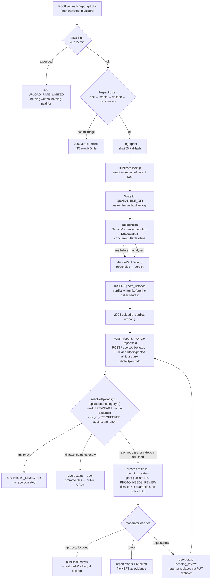

# Feature: `photo-verification`

- **Status:** building — the server-side feature is complete and tested; **real AWS validation is
  BLOCKED**, the **admin browser runtime is NOT PROVEN**, the **mobile runtime is only PARTIALLY
  PROVEN — the capture step is blocked by the simulator** — and **production readiness is NOT YET**.
  Every capability below carries exactly one of *Implemented / Partially Implemented /
  Not Implemented / Blocked / Planned*.
- **Milestone:** v0.1
- **Owner:** TBD

> **⚠️ Written after the code, not before it.** Feature docs in this folder are normally the *input*
> to a plan ([`README.md`](./README.md)). This one was written against a shipped implementation,
> read line by line, because the pipeline was built inside the report-a-request work rather than
> specced separately. Every claim below cites the code it came from. The *decision* behind it is
> [ADR 0014](../decisions/0014-photo-verification-publication-gate.md).

> **⚠️ `HEAD = 15136b5`, and this feature is 0 commits.** Every `path:line` in this document points
> at **uncommitted working-tree state**. Checking out that commit reproduces none of it. Line
> numbers were re-verified on 2026-09-05; a substantial number had drifted since the first draft.

## Problem

A report's photo is the product's primary trust signal (BR-1 of
[`report-a-request.md`](./report-a-request.md)) — a volunteer looks at it and decides whether to
walk towards a stranger's emergency. Until 2026-09-04 **nothing had ever looked at that photo**,
and three properties of the old pipeline made that worse than it sounds:

- the client declared what the file was (multer branched on `file.mimetype`, which the client
  writes), so a `.mp4` announced as `image/png` was stored and served as an image;
- anything written landed in `UPLOADS_DIR`, mounted as Express static at `main.ts:50` outside every
  Nest guard, so it was world-readable instantly and **could not be un-published** — deleting the
  row does not delete the bytes;
- report create/update took a **URL** from the client, which proved this API had once served those
  bytes and nothing more.

Meanwhile the product cannot afford a review queue in front of an ambulance. Both things are true
at once, which is why the answer is an asymmetric gate rather than a moderation step.

## Users & roles

| Role | What they can do here |
|---|---|
| Citizen (reporter) | Upload a report photo and receive a verdict; view **their own** quarantined photo; retake after a rejection; replace a held photo a moderator asked them to retake (**API only — no mobile UI, see below**) |
| Citizen (anyone else) | Nothing. A held or rejected report is invisible to them on reads **and** writes, including `GET /reports/:id` |
| Moderator / Admin | Decide a held photo: approve, reject, or ask the reporter for a replacement |
| The system | Inspect, fingerprint, quarantine, analyse, decide, persist — in that order |

## Where each capability actually stands

Nothing in this table is described as working unless the code demonstrates it.

### The pipeline

| Capability | Status | Where |
|---|---|---|
| Byte-level inspection (magic bytes → decode → dimensions) | **Implemented** | `apps/api/src/uploads/image-inspection.ts:86-124` |
| SHA-256 + dHash fingerprinting | **Implemented** | `image-inspection.ts:121`; `apps/api/src/uploads/perceptual-hash.ts:1-33` |
| Private quarantine outside the served directory | **Implemented** | `apps/api/src/uploads/quarantine-storage.ts:27-36` |
| Boot refusal if quarantine is misconfigured | **Implemented** | `quarantine-storage.ts:47-63` |
| Per-account upload rate limit (20 / 15 min) | **Implemented** | `apps/api/src/uploads/upload-rate-limiter.ts:26-27,52-63` |
| Rekognition **adapter** (2 calls, concurrent, one deadline) | **Implemented** | `apps/api/src/moderation/rekognition-moderation.provider.ts:64-156` |
| **Real AWS provider validation** | **BLOCKED** | No `AWS_REGION`, no credentials (`apps/api/.env.example:207,213-214`). **No call has ever reached AWS.** A unit-tested adapter is **not** a validated integration |
| Decision engine PASS / REVIEW / REJECT | **Implemented** | `apps/api/src/moderation/verification-decision.ts:143-314` |
| Env-configurable thresholds | **Implemented** | `apps/api/src/moderation/moderation-thresholds.ts:119-171` |
| `Blood & Gore` emergency carve-out | **Implemented** | `moderation-thresholds.ts:54-72`; `verification-decision.ts:205-232` |
| Category relevance from seeded `expected_labels` | **Implemented** | `apps/api/src/db/seed.ts:49-180` |
| Unanalysed photos carry `risk_level = NULL`, not `medium` | **Implemented** | `verification-decision.ts:149-151` — a band is a measurement, and there was none |
| Duplicate detection (exact whole-table; near over recent 500) | **Implemented, bounded** | `apps/api/src/moderation/photo-verification.service.ts:185-224` |
| Production hard-block when unconfigured | **Implemented** | `apps/api/src/moderation/moderation-provider.factory.ts:33-52` |

### The gate

| Capability | Status | Where |
|---|---|---|
| Publication gate on create (`pending_review`) | **Implemented** | `apps/api/src/reports/reports.service.ts:200-264` |
| Post-publish gate (edit / add-photo: passed only) | **Implemented** | `apps/api/src/reports/report-photo-attachment.ts:174-182` |
| **Category binding on all four attach paths** | **Implemented** | `resolveUploads(..., expectedCategoryId)` — `report-photo-attachment.ts:52-75,152-159`; called at `reports.service.ts:204-208`, `:687-691`, `:736-740`, `:901-905`. **Closed a real, exploitable bypass** — see PV-18 |
| An already-adjudicated upload can never be recycled | **Implemented** | `report-photo-attachment.ts:114-132` |
| Held reports hidden from other citizens, reads **and** writes | **Implemented** | `apps/api/src/reports/report-visibility.ts:33-49,75,139` |
| `GET /reports/:id` on a held report — reporter only | **Implemented** | `reports.service.ts:281-296` |
| Reporter can view their own quarantined photo | **Implemented** | `apps/api/src/uploads/report-photo.controller.ts:125-158` |

### The human half

| Capability | Status | Where |
|---|---|---|
| Admin review queue + approve / reject / request-new | **Implemented** | `apps/api/src/admin/admin-report-photos.controller.ts:48-155` |
| Queue's resting filter covers `review_required` **and** `failed` | **Implemented** *(fixed 2026-09-05)* | `apps/api/src/admin/dto/list-report-photos.dto.ts:69-72`; used at `admin-report-photos.service.ts:145-147`. With no provider configured every photo is `failed`, so the old `review_required`-only default showed an **empty queue over a full backlog** |
| Summary / sidebar badge count the same population | **Implemented** *(fixed 2026-09-05)* | `admin-report-photos.service.ts:316`; `apps/admin/src/config/nav-badges.ts:93-100`. Same defect in a second place: `summary` returned `pendingReview: 0` while `list()` returned rows |
| Human decision recorded **beside** the machine verdict, never over it | **Implemented** | `claim()` at `admin-report-photos.service.ts:663-697` never writes `decision`; columns at `photo-verification-schema.ts:98-100` (machine) and `:133-137` (human) |
| Releasing a held report once every photo is resolved | **Implemented** | `apps/api/src/moderation/photo-moderation.service.ts:149-214` — under a caller-held row lock |
| Approval restores an expired window (PV-17) | **Implemented** *(moderator path only)* | `restoredWindow()` at `photo-moderation.service.ts:358-399`, applied at `:209`. **Not** applied on the citizen replacement path — see PV-17 |
| Cross-filesystem promotion (`EXDEV` fallback) | **Implemented** *(fixed 2026-09-05)* | `quarantine-storage.ts:141-164`. Caused a **500 on every approval** in Docker until a live run found it |
| Audit rows for `report_photo.*` — seeded **and emitted** | **Implemented** | `apps/api/src/admin/admin-audit-catalogue.ts:37,381-396`; written in-transaction at `admin-report-photos.service.ts:517-534`, `:584-594`, `:621-636` |
| Quarantine retention + sweep | **Implemented** | `apps/api/src/uploads/quarantine-retention.ts:79-84,96,138-183`; `quarantine-sweep.ts:92-125` — 30-day default, batch 200, filesystem-driven, Redis-throttled |
| Held photos are never deleted while awaiting a human | **Implemented** | `quarantine-retention.ts:145-152` — at any age. Clock starts at `reviewed_at` (`:169`) |
| The DB moderation record always outlives the file | **Implemented** | Nothing in `quarantine-retention.ts` writes to `photo_uploads` (`:15-20`) |
| Reporter alerts on a moderator's decision (EN + TA) | **Implemented** | `apps/api/src/alerts/alert-templates.ts:42-44,99-160`; sent at `admin-report-photos.service.ts:802-821` |

### The clients

| Capability | Status | Where |
|---|---|---|
| Mobile client sending `photoUploadIds` | **Implemented** *(code)* | `apps/mobile/src/screens/report/ReportFlowScreen.tsx:348`; `libs-mobile/api/reportPhotos.ts`; verdict copy in `apps/mobile/src/screens/report/photoVerdictCopy.ts` |
| Mobile `pending_review` / `rejected` tabs on My Reports | **Implemented** *(code)* | `apps/mobile/src/screens/report/MyReportsScreen.tsx:27-74,237-247` |
| **Mobile runtime** | **Partially Proven — capture step blocked by simulator** | Typechecks, and now runs: iOS simulator `iPhone 16 Pro` (iOS 18.5) with Maestro 2.9.0. Flow 01 passes. Seeding and `-e` multi-word substitution are **measured** — a 40-char multi-word title with Tamil and punctuation survives intact, DB-verified `open`. **The capture step cannot execute**: a simulator has no camera, so the one path this feature exists for is unexercised. In progress, incomplete. `apps/mobile` still has **no unit test runner** — `package.json` has no `test` script |
| **Citizen UI for "send a new photo"** (`PUT /reports/:id/photos`) | **Not Implemented** | The endpoint, its gate and its tests exist. **Nothing in `apps/mobile` or `libs-mobile` calls it** — a reporter receives `report_photo_replacement_requested` and cannot act on it. Issue 29 |
| Admin console review UI | **Implemented** *(code)* | `apps/admin/src/features/report-photos/` — queue table, detail, review actions, private-photo, reason copy, summary cards |
| Admin console `pending_review` / `rejected` badges | **Implemented** *(code)* | `apps/admin/src/features/reports/report-status-badge.tsx` |
| **Admin browser runtime** | **NOT PROVEN** | Units pass and it typechecks. **No page has been driven in a browser against live data** |
| Maestro E2E flows | **Partially run — not green end to end** | Flow 01 passes; `scripts/seed-fixture.mjs` and `-e` substitution are measured working. Flows 02–04 have **not completed**: 02 needs a camera the simulator cannot provide, 03/04 depend on seeded reports whose full run has not been observed. Treat the suite as **unrun end to end** |

### Permanently or deliberately out

| Capability | Status | Where |
|---|---|---|
| A second AI provider (OpenAI / Gemini / Claude Vision / ensemble) | **Not Implemented — settled scope decision** | Rekognition is the only external provider for v1. One provider key in the factory (`moderation-provider.factory.ts:31,40-41`) |
| Manipulation / AI-generated image detection | **Not Implemented** | Rekognition has no such capability. `ContentTypes` is a *"this is not a photograph"* signal — see "Out of scope" |
| OCR / text-in-image (`DetectText`) | **Not Implemented — deferred by choice** | Not called anywhere. Extra cost and a real privacy surface for no v1 benefit |
| `captured_live` provenance verification | **Not Implemented** | Still an unread client assertion (`apps/api/src/reports/report-photos.ts:25`) |
| **Production readiness** | **NOT YET** | Provider validation blocked; admin browser runtime unproven; mobile runtime partially proven with the capture step unexercised; Maestro not green end to end; two open gaps (issues 28 and 29) |

## The pipeline, in order

The order **is** the security model, and each step is cheaper than the next
(`photo-verification.service.ts:1-23`):



**The photo is never in the public directory during any of this.** Promotion is a separate, later
act performed only for a verdict that allows it, and only after the `reports` row exists
(`reports.service.ts:250-264`).

## User stories

*Written retroactively from the implemented behaviour. US-1 to US-5 are **Implemented**; US-6 is
**Partially Implemented** — the API exists, the mobile UI does not.*

### US-1 — Upload a report photo and hear a verdict

As a **citizen**, I can **upload a photo while building my report** so that **I find out
immediately whether it can be used**.

- **AC1:** Given I upload a JPEG or PNG under 4 MB, when verification finishes, then I receive
  `{ uploadId, verdict, reason }` with HTTP **200 for every verdict, including reject** — the
  request succeeded; the photo is what did not (`report-photo.controller.ts:107-111`). **Implemented.**
- **AC2:** Given the file is not really an image, when I upload it, then it is refused on its
  **bytes**, not its declared type, and **no row and no file are created**
  (`photo-verification.service.ts:84-91`). **Implemented.**
- **AC3:** Given a verdict is returned, when I inspect the response, then it contains **no**
  confidence score, provider name, model version or label name — a citizen who learns that
  "Explicit at 79 passes" has learned how to tune a photograph until it does
  (`photo-verification.service.ts:19-23`). **Implemented.**
- **AC4:** Given I have uploaded 20 photos in 15 minutes, when I upload a 21st, then I get **429**
  with `retryAfterSeconds`, **before** anything is written or any paid call is made
  (`upload-rate-limiter.ts:52-63`). **Implemented.**

### US-2 — Submit a report whose photos passed

As a **citizen**, I can **submit a report with verified photos** so that **it publishes with no
human step, exactly as fast as before**.

- **AC1:** Given every photo passed, when I submit, then the report is `open` and its photos are
  promoted to public URLs (`reports.service.ts:245-259`); test `report-photo-gate.spec.ts:132`.
  **Implemented.**
- **AC2:** Given I pass an upload id that is not mine, does not exist, or is already attached to a
  report, when I submit, then I get one indistinguishable `PHOTO_NOT_VERIFIED` error — the
  distinction is only useful to someone probing for other people's ids
  (`report-photo-attachment.ts:78-86`); tests `report-photo-gate.spec.ts:210,222,232`.
  **Implemented.**
- **AC3:** Given I try to assert a verdict in the request, when the API handles it, then the
  assertion is ignored — the verdict is re-read from `photo_uploads`
  (`report-photo-attachment.ts:63-76`). **Implemented.**

### US-3 — Have a questionable photo held without losing my report

As a **citizen**, I can **still submit when a photo needs checking** so that **my report isn't
thrown away while a moderator looks**.

- **AC1:** Given any photo did not explicitly pass, when I submit, then the report is created with
  status `pending_review` and **nothing publishes** — not even the photos that did pass
  (`reports.service.ts:212-218`); test `report-photo-gate.spec.ts:173`. **Implemented.**
- **AC2:** Given my report is `pending_review`, when I open it, then **I** can see it and **no other
  citizen** can, on reads or writes (`report-visibility.ts:139-157`); tests
  `report-photo-gate.spec.ts:306,319`. **Implemented.**
- **AC3:** Given my photo is quarantined, when I view it, then it streams from an authenticated
  endpoint with `Cache-Control: private, no-store`, and a stranger holding the id gets a 404 —
  the same 404 as an id that never existed (`report-photo.controller.ts:125-158`). **Implemented.**
- **AC4:** Given a photo was rejected, when I try to attach it, then **no report is created at all**
  and I'm told in language that accuses me of nothing
  (`report-photo-attachment.ts:88-95`); test `report-photo-gate.spec.ts:268`. **Implemented.**

### US-4 — Decide a held photo

As a **moderator**, I can **see held photos and approve, reject, or ask for a replacement** so that
**a held report can move**.

**Status: Implemented.** Verified over live HTTP (Journey B, 20/20 with Journey C) against the
running container on 2026-09-05.

- **AC1:** Given a photo is held, when I approve it, then the human decision is recorded **beside**
  the machine verdict, never over it — `reviewed_by_id` / `reviewed_at` / `review_reason` are
  separate columns so *"the model said review, a human approved it"* stays legible afterwards
  (`photo-verification-schema.ts:98-100` for the machine's, `:133-137` for the human's;
  `claim()` at `admin-report-photos.service.ts:663-697` never writes `decision`). Test
  `admin-report-photos.service.spec.ts:341`. See PV-19.
- **AC2:** Given I approve the **last** outstanding photo on a report and none was refused, when the
  transaction commits, then the report is released to `open` and its photos are promoted
  (`photo-moderation.service.ts:173-214`). Given any photo is still awaiting review or was refused,
  then **nothing publishes** — approving one photo is not approving a report. Tests
  `admin-report-photos.service.spec.ts:192,360,378`.
- **AC3:** Given two moderators approve the last two photos concurrently, when both commit, then the
  report is released exactly once — the caller holds a `SELECT ... FOR UPDATE` row lock, without
  which under READ COMMITTED each would read the other's photo as still pending and the report would
  be released by **neither** (`photo-moderation.service.ts:166-171`, lock at
  `admin-report-photos.service.ts:699-708`). Test `admin-report-photos.service.spec.ts:738`.
- **AC4:** Given I reject a photo, when it commits, then the report moves to `rejected` and **the
  file is deliberately kept** — a rejection is the decision most likely to be appealed and the bytes
  are the evidence. The retention sweep owns removal, on its own schedule
  (`admin-report-photos.service.ts:550-598`). Test `:477`.
- **AC5:** Given I take any of the three actions, when it commits, then an audit row is written **in
  the same transaction**, and an approval records `reportReleased` — two identical-looking approvals
  differ entirely in consequence (`admin-report-photos.service.ts:517-534`, `:584-594`, `:621-636`).
  Test `admin-report-photos.service.spec.ts:422`.

### US-5 — Be told when my held report is decided

As a **reporter**, I can **be notified when a moderator decides** so that **I don't have to keep
reopening the app**.

**Status: Implemented** on the API. **The mobile app can display these alerts but cannot act on the
replacement request** — see US-6.

- **AC1:** Given a moderator decides, when it commits, then I receive `report_photo_approved`,
  `report_photo_rejected` or `report_photo_replacement_requested`, in English or Tamil
  (`apps/api/src/alerts/alert-templates.ts:42-44,99-160`), through the single `AlertsService.create()`
  chokepoint that also fans out to FCM.
- **AC2:** Given the approval did **not** release the report (other photos still outstanding), when
  the transaction commits, then **no alert is sent** — telling a reporter their report is live when
  it is not would be worse than silence (`admin-report-photos.service.ts:537-545`). Test
  `admin-report-photos.service.spec.ts:399`.
- **AC3:** Given the alert is a rejection or a replacement request, when I receive it, then it
  carries **no `reportId`** — only the approval does, because it is the only one whose report I can
  actually open (`admin-report-photos.service.ts:793-794,802-821`).

### US-6 — Send a new photo when a moderator asks for one

As a **reporter**, I can **replace the photo on my held report** so that **"please send a different
photo" is something I can actually do**.

**Status: Partially Implemented.** The API is complete; **there is no mobile UI**.

- **AC1:** Given my report is `pending_review`, when I `PUT /reports/:id/photos` with a new set of
  upload ids, then the whole photo set is replaced and the superseded uploads are **detached**
  (`reports.service.ts:872-936`; `detachUploadsFrom()` at `report-photo-attachment.ts:237-242`).
  **Implemented.** Detaching is a correctness requirement, not tidiness: `requestNew` leaves the old
  upload `rejected`, `standingFor()` counts that as `refused`
  (`photo-moderation.service.ts:137`), and `refused > 0` blocks `publishIfReady()` **permanently**
  (`:195`) — so leaving it attached means the reporter satisfies the request, passes verification,
  and still never publishes. Test `report-photo-gate.spec.ts:590`.
- **AC2:** Given every replacement passes and matches the report's category, when it commits, then
  the report publishes without going back to a moderator — they asked for a usable photo and got
  one (`reports.service.ts:910-932`). Test `report-photo-gate.spec.ts:573`. **Implemented.**
- **AC3:** Given I try to re-submit the very photo the moderator refused, when I send it, then it is
  refused rather than merely held again — a detached row is re-resolvable and its *machine* verdict
  may still read `review`, so `reviewed_at IS NOT NULL` is checked explicitly
  (`report-photo-attachment.ts:114-132`). Test `report-photo-gate.spec.ts:631`. **Implemented.**
- **AC4:** Given the report is not `pending_review`, or is not mine, when I call it, then I get
  `REPORT_NOT_AWAITING_PHOTO` or a 403 (`reports.service.ts:884-896`). Tests
  `report-photo-gate.spec.ts:649,668`. **Implemented.**
- **AC5:** Given I open the app after a replacement request, when I look at my held report, then I
  can start a replacement. **NOT IMPLEMENTED.** Nothing in `apps/mobile` or `libs-mobile` issues
  this request — `libs-mobile/api/reports.ts` has no `PUT` to `/reports/:id/photos`. Issue 29.

## Business rules

- **PV-1:** **The backend is the only thing that decides.** The client submits upload ids, never
  URLs and never verdicts, and the verdict is re-read from the database on every attach.
  `apps/api/src/reports/dto/create-report.dto.ts:41`; `report-photo-attachment.ts:87-102`.
- **PV-2:** **A missing or null verdict is never a pass.** Anything that is not an explicit `'pass'`
  holds the report — including `null`, which means verification never completed.
  `report-photo-attachment.ts:143-159`; test `report-photo-gate.spec.ts:269`.
- **PV-3:** **Every failure to analyse routes to REVIEW.** All six unavailable reasons —
  `not-configured`, `timeout`, `throttled`, `rejected-image`, `provider-error`, `invalid-response` —
  produce REVIEW. There is no path where "we could not check" yields PASS.
  `verification-decision.ts:146-168`; tests `verification-decision.spec.ts:314-338,340`.
- **PV-4:** **One held photo holds the entire report.** No partial publication: a report is one
  artefact, and publishing three of four photos puts a partially-moderated emergency in front of
  volunteers. `reports.service.ts:217-224`; test `report-photo-gate.spec.ts:191`.
- **PV-5:** **A held or rejected photo has no public URL, ever.** Quarantine is a *sibling* of the
  served directory, never a child, and the API refuses to boot if that is violated.
  `quarantine-storage.ts:27-36,47-63`.
- **PV-6:** **Files become public strictly after the database says they may.** Promotion is
  `rename` first — atomic within one filesystem, so no window exists where a still-refusable photo
  has a public copy. `quarantine-storage.ts:130-166`; `reports.service.ts:250-264`. **`EXDEV`
  falls back to copy-then-delete**, in this direction only — see PV-20.
- **PV-7:** **A post-publish photo must already have passed.** Edit and add-photo refuse anything
  held: a live report volunteers may already be travelling to is never un-published by a new photo.
  `report-photo-attachment.ts:174-182`; tests `report-photo-gate.spec.ts:530,683`.
- **PV-8:** **An upload is single-use and owner-bound.** Ownership and `report_id IS NULL` are in
  the `WHERE` clause, so another citizen's row and an already-used row are never fetched at all.
  `report-photo-attachment.ts:96-102`.
- **PV-9:** **Expected emergency imagery must not be rejected for being emergency imagery.** When
  the only child label fired under `Graphic Violence` is `Blood & Gore`, a higher bar applies (92
  vs 80) — because Rekognition returns the whole ancestor chain, so blood at 95 also reports
  `Graphic Violence` at 95, and a naive parent-confidence rule would hold every injury photograph
  the product exists to carry. `moderation-thresholds.ts:54-72`; `verification-decision.ts:205-232`;
  tests `verification-decision.spec.ts:78,89,97,107`.
- **PV-10:** **A duplicate is a signal, never a verdict, and never a sanction.** Two genuine reports
  of the same junction can hash close together. `perceptual-hash.ts:30-32`; test
  `verification-decision.spec.ts:308`.
- **PV-11:** **Drugs never cause a REJECT at any confidence.** Rekognition's taxonomy bottoms out at
  "Pills" and "Smoking", which cannot tell prescription medication at a crash site from anything
  illicit. `moderation-thresholds.ts:156-159`; test `verification-decision.spec.ts:196`.
- **PV-12:** **Quality rejection needs both axes bad.** A dark-but-sharp night photo publishes;
  night is when help is needed. `verification-decision.ts:185-193`; tests
  `verification-decision.spec.ts:158,166`.
- **PV-13:** **Reasons are stored as codes, never prose.** Admin renders its own wording and mobile
  renders its own in two languages; a stored sentence would be a third copy that drifts from both.
  `verification-decision.ts:39-59`.
- **PV-14:** **Only the summary is persisted, never the raw provider response.** Hundreds of labels
  plus incidental detail about people in the photograph would be a privacy liability with no
  operational use. `photo-verification-schema.ts:103-111`.
- **PV-15:** **The system judges image safety and rough category suitability — never whether the
  reported incident is real.** Nothing in the stored signals expresses truthfulness and no surface
  may present it as such. `verification-decision.ts:19-22`.
- **PV-16:** **Unconfigured is not permitted in production.** The API refuses to boot without a
  provider when `NODE_ENV=production`, because the alternative is an app that quietly stops
  publishing and looks broken with nothing naming the cause.
  `moderation-provider.factory.ts:43-50`; tests `moderation-provider.factory.spec.ts:44,53,63`.
- **PV-18:** **A verdict binds to the category it was judged against — on all four attach paths.**
  This closed a **real, exploitable bypass**, not a theoretical one. Relevance is judged at *capture*
  time against whichever category the client named, and `communityHelp` deliberately has **no**
  expected labels (`seed.ts:160-165`), so relevance is skipped there and any safe photo earns a
  **genuine `pass`**. A reporter could therefore upload under Community Help, collect that honest
  pass, and file — or PATCH-replace — under Animal Rescue, which *does* have expected labels. Nothing
  was forged; the verdict was a truthful answer to a **different question** than the report asks.
  `resolveUploads()` now takes the report's real category and sets `holdForReview` on a mismatch
  (`report-photo-attachment.ts:52-75,152-159`), and **all four** call sites pass it —
  `reports.service.ts:204-208` (create), `:687-691` (update), `:736-740` (addPhoto), `:901-905`
  (replaceHeldPhotos). **A fifth write path that does not is reopening this bypass.** Tests
  `report-photo-gate.spec.ts:324,374,396,423,448`. Approval deliberately does **not** re-derive
  relevance (`admin-report-photos.service.ts:477-486`; test
  `admin-report-photos.service.spec.ts:817`) — the response to a category hold is a human looking at
  the image, which is a stronger check than the label heuristic.
- **PV-19:** **A human approval never rewrites the machine verdict.** Three concepts, three columns,
  and none of them overwrites another:

  ```
  AI verdict      = REVIEW      photo_uploads.decision        — NEVER overwritten
  Human decision  = APPROVED    reviewed_by_id / reviewed_at / review_reason
  Publication     = OPEN        reports.status
  ```

  `claim()` (`admin-report-photos.service.ts:663-697`) writes the status and the three human columns
  and **never** `decision` — the omission is the feature. Release therefore reads
  `photo_verification_statuses.key`, not `decision` (`photo-moderation.service.ts:100-147`): reading
  `decision` would hold a report forever on a photo a human cleared, and overwriting it would destroy
  the record. *"The model was uncertain and a person approved it"* has to stay readable years later.
  `decision` will look stale on a decided row. It is not stale — it is the answer to a question that
  was asked once. Test `admin-report-photos.service.spec.ts:341`.
- **PV-20:** **Promotion may cross a filesystem boundary, and the fallback is one-directional.**
  `rename(2)` cannot cross devices, and in Docker it always has to: `UPLOADS_DIR` is the named volume
  `uthavu_api_uploads` while `QUARANTINE_DIR` sits on the container's writable layer, so **every
  approval raised `EXDEV` and returned a 500** until a live run found it. Unit tests could not have
  caught it — on a developer's machine both paths are one disk. The `EXDEV` fallback is
  copy-then-delete (`quarantine-storage.ts:141-164`), which is **not atomic**; that is acceptable
  **only in this direction**, because the database has already committed that this photo may be
  public, so a destination appearing slightly before the source vanishes is *early*, not *wrong*.
  **The reverse operation must never be implemented this way.** Any non-`EXDEV` error still
  propagates (`:161`). Tests `quarantine-storage.spec.ts:109,138`.
- **PV-21:** **Every "awaiting a human" query must cover `review_required` AND `failed`.** With no
  provider configured — the state of every environment today — **100% of the backlog is `failed`**.
  Counting only `review_required` failed in the most dangerous direction a work queue has: it said
  *there is nothing to do*. The queue's default filter showed an **empty screen** over a full
  backlog, and `summary` returned `pendingReview: 0` while `list()` returned rows on the same data.
  Both now read one shared constant, `AWAITING_DECISION_STATUS_KEYS`
  (`apps/api/src/admin/dto/list-report-photos.dto.ts:69-72`), at
  `admin-report-photos.service.ts:145-147` and `:316`; the sidebar badge derives from the same number
  (`apps/admin/src/config/nav-badges.ts:93-100`). The two keys stay separately *selectable* — telling
  "the model is flagging things" from "Rekognition is down" is a real diagnostic need — but the
  **default** has to be the union, or the default is a lie. Tests
  `admin-report-photos.service.spec.ts:854,870,897,975`.
- **PV-22:** **An unanalysed photo has no risk band.** `risk_level` is `NULL`, not `'medium'`, when
  nothing measured the image (`verification-decision.ts:149-151`). A band is a measurement; inventing
  one would sort unexamined photos in among genuinely mid-risk ones in a queue a moderator triages by
  risk. The queue's `risk` filter matches none of them, deliberately
  (`list-report-photos.dto.ts:79-80`).
- **PV-23:** **A held photo is never deleted while a human still owes it a decision, and the record
  always outlives the file.** Retention returns `keep` for anything awaiting a human with
  `reviewed_at IS NULL`, **at any age** (`quarantine-retention.ts:145-152`), and the clock starts at
  the **decision**, not the capture (`:169`) — a photo held three weeks and rejected yesterday is one
  day into retention, not twenty-two. Nothing in the sweep writes to `photo_uploads` at all
  (`:15-20`): the verdict, its reasons, the risk band, the moderator and the timestamps survive the
  bytes by design. Tests `quarantine-retention.spec.ts:67,84,204,221,234,253,269`.
- **PV-24:** **An upload a moderator already decided about can never be recycled.** Replacement
  detaches the superseded uploads, which leaves rows that are unattached and therefore re-resolvable
  and whose *machine* `decision` may still read `review` even though a human refused them. Without an
  explicit `reviewed_at IS NOT NULL` check a reporter could re-submit the very image a moderator
  turned down and have it merely held again — laundering a human decision into a machine one.
  `report-photo-attachment.ts:114-132`; test `report-photo-gate.spec.ts:631`.

## Limits and thresholds

| Limit | Value | Why |
|---|---|---|
| Formats | JPEG, PNG only | Rekognition reads nothing else — not WebP, HEIC or GIF (`report-photo-limits.ts:23`) |
| Max bytes | 4 MB | Under the provider's 5 MB raw-bytes ceiling, so a re-encode cannot cross it (`report-photo-limits.ts:36`) |
| Dimensions | 80 – 10,000 px both axes | Rekognition's published quotas (`report-photo-limits.ts:39,42`) |
| Uploads | 20 per 15 min per account | Two paid calls per photo; bounds the spend (`upload-rate-limiter.ts:26-27`, checked at `:52-63`) |
| Provider deadline | 8000 ms for the concurrent pair | A breach routes to REVIEW, never a failed upload (`moderation-thresholds.ts:165-169`) |
| Duplicate window | most recent 500 non-rejected uploads | dHash cannot be compared in SQL; a reused stock photo is overwhelmingly likely to be recent (`photo-verification.service.ts:202-212`). **A stock photo first seen 501 uploads ago will not be caught** — a known limit, not an oversight |

**Avatars and mission-completion photos are unaffected by every limit above.** They keep
`POST /uploads`, still accept WebP, have no verdict, and are legitimately public on arrival — which
is why report photos got a sibling route rather than a `purpose` flag on the shared one
(`report-photo-limits.ts:1-22`; `report-photo.controller.ts:1-13`).

Every threshold is env-configurable and documented in `apps/api/.env.example`; the full table with
defaults and rationale is in [ADR 0014](../decisions/0014-photo-verification-publication-gate.md)
§ Thresholds.

### PV-17 — Approval restores a window that moderation outlasted

**Implemented.** A report approved AFTER its `expiry_at` has passed has its window restarted from
the moment of approval, for the reporter's ORIGINAL duration (`expiry_at - created_at`), not the
category default.

Without this the sequence is absurd:

```
10:00  citizen submits            -> pending_review
10:30  expiry_at passes while queued
10:35  moderator approves         -> open, and instantly reads `expired`
```

The approval accomplishes nothing: no volunteer can accept it, the reporter waited on the platform
and received a dead card, and the moderator gets no signal that their decision was pointless.

Two deliberate limits:

- **Only when it had actually run out.** A report approved inside its window keeps the deadline the
  reporter chose. Extending that one would hand out time nobody asked for and quietly contradict
  BR-2 (`report-a-request.md`), which lets a reporter *shorten* the category default and never
  extend it.
- **The reporter's duration, not the category's.** Somebody who deliberately chose a two-hour
  window for a fast-moving situation gets two hours from approval, not the category's twelve.

Implemented in `restoredWindow()` (`apps/api/src/moderation/photo-moderation.service.ts:358-399`),
applied inside the release `update` at `:209` — so it fires exactly where `publishIfReady()` moves a
report to `open`, and nowhere else. The guard is `if (expiryAt.getTime() > now) return {}` (`:391`);
the restored duration is `expiry_at − created_at` (`:393`), which is why `publishIfReady()` reads
both columns (`:183-184`); a non-positive stored window clamps to one hour rather than emitting a
timestamp in the past and re-creating the exact bug (`:397`).

Covered in both directions and at the boundary by `admin-report-photos.service.spec.ts:210`
(restored when expired), `:243` (untouched when not), and three worked clock cases at `:289`
(11:00 approval of a 12:00 expiry → still 12:00), `:300` (13:00 approval of a 12:00 expiry → 15:00)
and `:312` (13:00 approval of a 10:30 expiry created at 10:00 → 13:30).

> **⚠️ This covers the moderator path only.** `replaceHeldPhotos()` sets the report to `open`
> directly (`reports.service.ts:926-932`) without calling `publishIfReady()` and therefore without
> `restoredWindow()`. A report that expired while held publishes into an **already-expired state**
> when the *reporter* resolves it with a replacement photo — the exact outcome this rule exists to
> prevent when a *moderator* resolves it. Recorded as a gap rather than resolved, because closing it
> is a code change and this document does not make those. Issue 28 in
> [`../_audit/issues.md`](../_audit/issues.md).

## Data touched

| Table | New / changed | Notes |
|---|---|---|
| `photo_verification_statuses` | new | Lookup, per CLAUDE.md § Database. Keys `verifying`, `passed`, `review_required`, `rejected`, `failed` (`seed.ts:217-221`). `failed` ≠ `review_required` on purpose: both need a human, only one means the provider never answered |
| `photo_uploads` | new | Quarantine + verdict + audit record. Survives the file it points at |
| `report_photos` | changed | `+ upload_id` (FK, **nullable** — null means the row predates verification, and backfilling would assert a check that never happened) |
| `report_categories` | changed | `+ expected_labels` (jsonb, nullable — null means "skip relevance", a real answer not a missing one) |
| `report_statuses` | changed | `+ pending_review`, `+ rejected` seed keys (`seed.ts:207-208`) |

Migration: `apps/api/drizzle/0025_faithful_wind_dancer.sql` — the current **head**
(`apps/api/drizzle/meta/_journal.json`, idx 25).

**Why a separate table rather than columns on `report_photos`:** `report_photos.report_id` is
`NOT NULL`, but verification must happen **before** the report exists or the gate is not a gate.
The verdict needs somewhere to live while there is no report to hang it on
(`photo-verification-schema.ts:1-20`).

**Invariants this introduces**, for `architecture/data.md`:

1. A `reports` row with status `pending_review` or `rejected` **must never appear on a citizen
   surface** — enforced by widening the `notRemoved` predicate every citizen query already imports,
   rather than adding a second predicate callers must also remember (`report-visibility.ts:51-75`).
   `GET /reports/:id` carries its own reporter-only exception (`reports.service.ts:281-296`).
2. A `photo_uploads` row with `report_id IS NOT NULL` **is single-use** and cannot be attached again.
   The reverse is not a licence: a row with `report_id IS NULL` **and** `reviewed_at IS NOT NULL` was
   detached after a human decided about it and must never be re-attached (PV-24).
3. A file in `QUARANTINE_DIR` **has no public URL**; a file in `UPLOADS_DIR` was promoted there
   deliberately by `promoteToPublic()`.
4. `photo_uploads.decision` is **write-once**. Nothing may update it after the verifier writes it —
   not a moderator, not a re-run, not a backfill (PV-19).
5. `photo_uploads.category_id` records the category the verdict *answered for*, not the report's
   current category. It is never corrected (`admin-report-photos.service.ts:485-486`).
6. A `photo_uploads` row **outlives its file**. A missing file is a normal end state, not corruption;
   `quarantinePathFor()` returning undefined is how the system learns it (PV-23).

## Surfaces

| Surface | Route | Status |
|---|---|---|
| Upload + verdict | `POST /uploads/report-photo` | **Implemented** |
| Own quarantined photo | `GET /uploads/report-photo/:id` | **Implemented** |
| Report create / edit / add-photo | `POST /reports`, `PATCH /reports/:id`, `POST /reports/:id/photos` | **Implemented** — all three bind the verdict to the report's category |
| Reporter replaces a held photo set | `PUT /reports/:id/photos` | **Implemented (API)** · **Not Implemented (mobile)** — `reports.controller.ts:107-128`; **no client calls it**, issue 29 |
| Mobile capture step | `apps/mobile` report flow | **Implemented (code)** · runtime **PARTIALLY PROVEN** — posts `photoUploadIds`; **the capture itself is unexercised**, a simulator has no camera |
| Mobile held/rejected report tabs | `MyReportsScreen` | **Implemented (code)** · runtime **NOT PROVEN** — not reached in any completed flow |
| Admin photo review queue | `GET /admin/report-photos`, `GET summary`, `GET :id`, `GET :id/file`, `POST :id/approve`, `POST :id/reject`, `POST :id/request-new` | **Implemented** |
| Admin console review UI | `apps/admin/src/app/(console)/reports/photo-verification/`, `apps/admin/src/features/report-photos/` | **Implemented (code)** · browser runtime **NOT PROVEN** |
| Admin sidebar badge | `nav.ts:212-215`, `nav-badges.ts:82-100` | **Implemented (code)** · browser runtime **NOT PROVEN** |
| Admin report status badges | `apps/admin` reports list/detail | **Implemented (code)** · browser runtime **NOT PROVEN** |

## Out of scope

- **Any second AI provider.** Rekognition is the only external image-moderation provider for v1 —
  no OpenAI, no Gemini, no Claude Vision, no ensemble. "AI Verification" in this product means
  Rekognition's moderation labels plus Uthavu's own decision engine, and nothing else.
- **Manipulation / AI-generated image detection.** Rekognition has none. The nearest signal is
  `ContentTypes` (animated / illustrated), which is a **"this is not a photograph"** signal and
  **must never be described as synthetic-image detection**. The field is named `notPhotographic`
  for exactly that reason (`verification-decision.ts:78-83`).
- **OCR / text extraction.** `DetectText` exists and is deliberately not called: extra cost, and a
  real privacy surface — text in an accident photograph routinely includes number plates, ID cards
  and hospital paperwork — for no v1 benefit.
- **Illegal-content detection.** AWS states the image API does not detect illegal content such as
  CSAM (`rekognition-moderation.provider.ts:19-23`). Nothing here may imply otherwise.
- **Any judgement about whether the reported incident is real.** Image safety and rough category
  suitability only.
- **Verifying `captured_live`.** No EXIF or metadata check was built; the flag stays a client
  assertion nothing reads.
- **Moderating avatars or mission-completion photos.** Explicitly unaffected.
- **Face recognition, age estimation, person identification.** Not used, not requested, not built.
- **An appeal path for a REJECT.** None exists. Mitigated by setting REJECT bars high and by making
  drugs and duplicates incapable of causing one.

## Verification status

*Recorded from the run of 2026-09-05. Nothing here is projected or rounded up.*

| Check | Result |
|---|---|
| `apps/api` — unit + integration | **921 tests, 57 suites**, passing |
| `apps/api` — typecheck / lint | clean / clean |
| `apps/admin` — tests | **94 tests, 3 files**, passing |
| `apps/admin` — typecheck / lint | clean / clean |
| `apps/mobile` — typecheck | clean |
| `apps/mobile` — tests | **no test runner exists in this package** — `package.json` has no `test` script |
| Live HTTP end-to-end against the running container | **31/31** |
| Journey B (reject) + Journey C (request-new → replacement) | **20/20** |
| Security regression | **107 assertions, 0 failures** — this run found the category bypass (PV-18), which was then fixed |
| Migration head | `0025_faithful_wind_dancer` |
| Commit state | `HEAD = 15136b5`, **0 commits** — every citation is working-tree state |

**The three live runs are not reproducible from this repository.** The HTTP E2E, journey and
security-regression scripts were written and executed against the running container and are **not
committed** — nothing under `scripts/`, `apps/api/test/` or `apps/mobile/.maestro/` corresponds to
them. The numbers record what happened on 2026-09-05; they are not a suite anybody can re-run today.

### The dev database still holds verification fixtures

`uthavu_dev` currently contains rows created by those runs — reports and uploads prefixed
`E2E-PV`, `SEC-REG` and `SEC-FU`, plus the Maestro fixture reports (`Maestro accept test`,
`Maestro complete test`, seeded by `apps/mobile/.maestro/scripts/seed-fixture.mjs`).

**A decision is needed before sign-off, and this document does not make it:** either keep them as
**permanent fixtures** — which needs a documented naming convention and an admin queue that stays
readable with them present — or **clean them before sign-off**, which needs the E2E scripts committed
first or the ability to recreate them goes with them. Doing neither leaves a moderation queue whose
contents nobody can tell apart from real citizen reports.

## Open questions

- [ ] **Every threshold is unvalidated against real traffic.** No call has ever reached AWS
      (**BLOCKED** — no `AWS_REGION`, no credentials). The defaults are reasoned, not observed.
      First production week should be spent watching what the queue actually fills with.
- [ ] **Real per-photo cost and latency are unmeasured.** Two Rekognition calls per photo, up to 20
      photos per account per 15 minutes.
- [ ] **The fast path has never been observed working.** With no provider configured, every photo is
      `failed` → REVIEW, so the only path exercised end-to-end is the one with a human in it. The
      no-human-in-the-loop publication the whole asymmetry exists to protect is untested against a
      real analysis.
- [ ] **Are the `E2E-PV` / `SEC-REG` / `SEC-FU` / Maestro rows permanent fixtures, or do they get
      cleaned before sign-off?** See "Verification status" above.
- [ ] **`PUT /reports/:id/photos` has no client** (issue 29). Does v0.1 ship the mobile replacement
      screen, or does `request_new` get disabled in the admin console until it exists? Shipping the
      action without the reply is the worse of the two.
- [ ] **The citizen replacement path does not restore an expired window** (issue 28). Should it call
      `publishIfReady()` instead of writing `open` itself, so there is one release rule rather than
      two?
- [x] ~~**What happens to a `pending_review` report that hits its `expiry_at` while held?**~~
      **RESOLVED 2026-09-05 — see PV-17 and ADR 0014.** A moderator's approval restores the
      report's window, because the delay was the platform's and not the reporter's. Approval
      inside the window changes nothing.
- [ ] **Does a held report need a moderation SLA?** The reporter is now alerted when a decision is
      *made* (US-5), but nothing bounds how long "no decision" lasts, and a held report keeps
      running down its `expiry_at` while it waits.
- [ ] **The retention sweep runs inside a citizen's upload request**, because this API has no
      scheduler (`quarantine-sweep.ts:24-40`). The batch cap and interval lock bound it, and it is
      overlapped with the provider round-trip (`report-photo.controller.ts:99-105`) so it usually
      costs nothing — but its worst case is somebody's latency during an emergency. Revisit if a
      scheduler ever exists.

## Related docs

- Decision: [`../decisions/0014-photo-verification-publication-gate.md`](../decisions/0014-photo-verification-publication-gate.md)
- Amended feature: [`report-a-request.md`](./report-a-request.md) — BR-5 and the resolved
  "live-captured" enforcement gap
- Related decision: [`../decisions/0008-local-disk-photo-storage.md`](../decisions/0008-local-disk-photo-storage.md)
  — why photos are on local disk at all, which is what makes quarantine a directory question
- Related decision: [`../decisions/0012-admin-audit-log-before-the-first-mutating-endpoint.md`](../decisions/0012-admin-audit-log-before-the-first-mutating-endpoint.md)
  — why the `report_photo.*` audit actions are seeded before the endpoints exist
- Data: [`../architecture/data.md`](../architecture/data.md)

---

_Last verified 2026-09-05 against `HEAD = 15136b5`. **The implementation is uncommitted
working-tree state and the feature is 0 commits**; every line citation is against that working tree,
not against the commit's contents, and checking out `15136b5` reproduces none of it._

_This pass re-read every citation in the document. A substantial number had drifted — most of
`report-photo-attachment.ts`, all of `report-photo-gate.spec.ts`, and much of `reports.service.ts`
and `admin-report-photos.service.ts` — and were corrected in place. Seven capabilities that landed
after the first draft were added: category binding on all four attach paths (PV-18),
`PUT /reports/:id/photos` (US-6), the `EXDEV` promotion fallback (PV-20), the `review_required` +
`failed` queue filter (PV-21), `risk_level = NULL` (PV-22), quarantine retention's hold-forever rule
(PV-23), and the no-recycling guard (PV-24). Two gaps were found and **recorded rather than
resolved** — issues 28 and 29 in [`../_audit/issues.md`](../_audit/issues.md)._

_Corrected later on 2026-09-05: the API suite is **921** tests, not 915, and an iOS simulator
(`iPhone 16 Pro`, iOS 18.5) with Maestro 2.9.0 **is** available — mobile runtime is therefore
**Partially Proven**, not "Not Proven". The capture step remains unexercised because a simulator
has no camera. A green flow 01 is not a proven photo pipeline._
